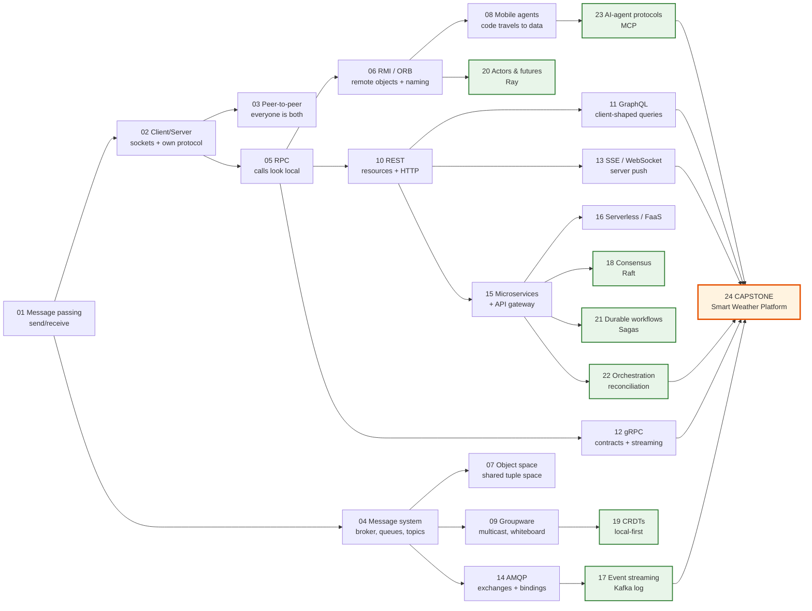
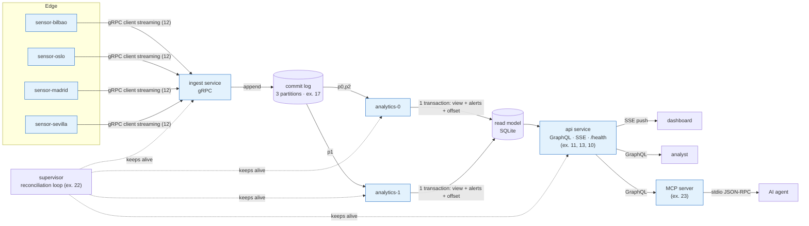

# Distributed Computing by Example — from sockets to AI agents

Companion code for **Unit 0 – Introducción a la Computación Distribuida**
(*from C/S socket apps to RESTful APIs and microservice-based distributed apps*),
Máster Universitario en Computación y Sistemas Inteligentes, Cloud Computing.

There are 23 small, runnable Python programs, each demonstrating one distributed-computing paradigm, plus a **capstone (24)** that combines several of them into one realistic platform.
They build on each other and all use the same simple domain, a network of **weather stations**.
The business logic stays the same throughout; what changes is how it is distributed. By the end you can
compare, with working code, what each paradigm gives you and what it costs.

* **01–16** implement the paradigms in the slides: message passing, client/server, P2P, message
  systems, RPC, RMI/ORB, object spaces, mobile agents, groupware, REST, GraphQL, gRPC, real-time web,
  AMQP, microservices + API gateway, serverless.
* **17–23**. They cover current: event streaming (Kafka),
  consensus (Raft), CRDTs / local-first, actors & distributed futures (Ray), durable workflows & Sagas
  (Temporal), orchestration via reconciliation loops (Kubernetes), and AI-agent protocols (MCP).
* **24** is the **capstone**: an event-driven *Smart Weather Alert Platform*. It runs as about ten cooperating processes
  and combines gRPC ingestion, a partitioned commit log, a consumer group with CQRS projections, **GraphQL** and SSE APIs,
  a self-healing supervisor, and an AI agent that works through MCP (see §6, example 24).
  The folder **`deploy/capstone/`** packages it with **Docker** (Compose) and deploys it to **AWS ECS Fargate**
  with CloudFormation (see §6, *Deploying the capstone*).

Every demo is **self-contained**: it starts its own servers, processes or brokers on `localhost`, runs a scripted story,
prints a colour-coded, time-stamped log of who does what, and ends with **key takeaways**.
Nothing needs Docker or cloud accounts.

---

## Table of contents

1. [Quick start](#1-quick-start)
2. [Repository layout](#2-repository-layout)
3. [Running the examples](#3-running-the-examples)
4. [The learning path](#4-the-learning-path)
5. [Slide ↔ example map](#5-slide--example-map)
6. [The examples one by one](#6-the-examples-one-by-one)
7. [What the slides are missing (and why 17–23 were added)](#7-what-the-slides-are-missing-and-why-1723-were-added)
8. [Comparison cheat-sheet](#8-comparison-cheat-sheet)
9. [Suggested exercises](#9-suggested-exercises)
10. [Troubleshooting](#10-troubleshooting)
11. [Conventions & tests](#11-conventions--tests)
12. [Tutorials, references & installing external tools](#12-tutorials-references--installing-external-tools)
13. [References](#13-references)

---

## 1. Quick start

```bash
# Python 3.10+ (tested with 3.11)
python -m venv .venv
source .venv/bin/activate            # Windows: .venv\Scripts\activate
pip install -r requirements.txt      # optional, but enables examples 10-13 and 15

python run_all.py                    # run all 24 demos, one after another
python examples/18_consensus_raft/demo.py   # or run any single one
```

**Only the standard library is needed for 18 of the 24 examples.** The six examples that need a package
(10, 11, 12, 13, 15, 24) are **skipped with an install hint** when it is missing, so they never fail for that reason.

---

## 2. Repository layout

```
distributed-computing-examples/
├── README.md                  ← you are here
├── requirements.txt           ← optional deps (FastAPI, Strawberry, gRPC, websockets, pika, mcp)
├── run_all.py                 ← runs every example (or a selection) and prints a summary
├── common/
│   ├── domain.py              ← the shared business logic: WeatherService / Station
│   └── utils.py               ← logging, free ports, optional imports, uvicorn-in-a-thread
├── examples/                  ← every folder: demo.py + README.md (teaching guide)
│   ├── 01_message_passing/demo.py
│   ├── 02_client_server_sockets/demo.py
│   ├── 03_peer_to_peer/demo.py
│   ├── 04_message_system/demo.py
│   ├── 05_rpc/demo.py
│   ├── 06_distributed_objects_rmi/demo.py
│   ├── 07_object_space/demo.py
│   ├── 08_mobile_agents/demo.py
│   ├── 09_collaborative_groupware/demo.py
│   ├── 10_rest_api/demo.py
│   ├── 11_graphql/demo.py
│   ├── 12_grpc/{demo.py, protos/weather.proto}
│   ├── 13_realtime_web/demo.py
│   ├── 14_amqp/{demo.py, rabbitmq_send.py, rabbitmq_receive.py}
│   ├── 15_microservices_gateway/demo.py
│   ├── 16_serverless_faas/demo.py
│   ├── 17_event_streaming/demo.py            (NEW)
│   ├── 18_consensus_raft/demo.py             (NEW)
│   ├── 19_crdt_local_first/demo.py           (NEW)
│   ├── 20_actor_model/demo.py                (NEW)
│   ├── 21_durable_workflows_saga/demo.py     (NEW)
│   ├── 22_orchestration_reconciliation/demo.py (NEW)
│   ├── 23_ai_agent_protocols_mcp/{demo.py, fastmcp_server.py} (NEW)
│   └── 24_capstone_smart_weather_platform/   (CAPSTONE)
│       ├── demo.py                ← supervisor + scenario (deploy, traffic, chaos, queries, agent)
│       ├── store.py               ← commit log + SQLite read model (views, alerts, offsets)
│       ├── proto_stubs.py         ← compiles the SAME .proto as example 12
│       ├── ingest_service.py      ← gRPC server, single writer of the log
│       ├── sensor.py              ← edge device, gRPC client streaming
│       ├── analytics_worker.py    ← consumer-group member, transactional projector
│       ├── api_service.py         ← GraphQL + SSE + /health (FastAPI + Strawberry)
│       └── mcp_weather_server.py  ← MCP tools that call the GraphQL API
├── deploy/capstone/           ← the capstone in containers and on AWS
│   ├── Dockerfile             one image, the command selects the component
│   ├── docker-compose.yml     ingest + api + 2 workers + shared volume (+ "sensors" profile)
│   ├── smoke_test.py          end-to-end test against any host (localhost or AWS)
│   ├── chaos.py               kill a component inside its container
│   ├── aws/ecs-fargate.yaml   CloudFormation: ECS cluster, task definition, service, SG, logs
│   ├── aws/deploy.py          up | status | chaos | down  (AWS CLI + Docker, any OS)
│   └── README.md              step-by-step guide (own account and AWS Academy Learner Lab)
└── tests/test_examples.py     ← pytest smoke test: every demo must pass or skip
```

---

## 3. Running the examples

### Everything at once

```bash
python run_all.py                 # full output of every demo + summary table
python run_all.py --quiet         # only the summary table (good for CI / a quick check)
python run_all.py --list          # list the examples
```

Example summary:

```
==============================================================================
 SUMMARY
==============================================================================
  PASS        0.1s  01_message_passing
  PASS        0.1s  02_client_server_sockets
  ...
  SKIP        0.0s  12_grpc
                    SKIPPED: optional dependency 'grpc' not installed. Run: pip install grpcio grpcio-tools
  ...
  PASS        0.1s  23_ai_agent_protocols_mcp
------------------------------------------------------------------------------
  PASS=22  SKIP=1  FAIL=0  TIMEOUT=0
```

### A selection

```bash
python run_all.py 02 05 10        # by number
python run_all.py raft crdt       # by name fragment
python run_all.py --classic       # only the paradigms in the slides (01-16)
python run_all.py --new           # only the cutting-edge additions (17-23)
python run_all.py --capstone      # only the integrated platform (24)
python run_all.py --skip 13 15    # everything except the two slowest
python run_all.py --fail-fast --timeout 60
```

### One example

```bash
python examples/03_peer_to_peer/demo.py
```

### Two terminals (for live classroom demos)

Some examples can run the server and the client separately, so students can see that they really are
separate processes:

| Example | Terminal 1 (server) | Terminal 2 (client) |
|---|---|---|
| 02 sockets | `python examples/02_client_server_sockets/demo.py --role server --port 5000` | `... --role client --port 5000` |
| 05 RPC | `python examples/05_rpc/demo.py --role server --port 8000` | `... --role client --port 8000` |
| 10 REST | `python examples/10_rest_api/demo.py --role server --port 8000` | open <http://127.0.0.1:8000/docs> (Swagger UI) |
| 11 GraphQL | `python examples/11_graphql/demo.py --role server --port 8001` | open <http://127.0.0.1:8001/graphql> (GraphiQL) |
| 14 AMQP | `python examples/14_amqp/rabbitmq_receive.py` | `python examples/14_amqp/rabbitmq_send.py hola` (needs RabbitMQ) |
| 23 MCP | — | Add `fastmcp_server.py` as a local stdio server in any MCP host (e.g. Claude Desktop) |

Exit codes: `0` = passed, `77` = skipped (missing optional dependency), anything else = failure.
Set `NO_COLOR=1` to turn off coloured output.

---

## 4. The learning path

The numbering follows a historical and conceptual progression. Each step fixes a limitation of the one before
and brings in a new idea:



**The running domain** (`common/domain.py`): a `WeatherService` with stations (`bilbao`, `madrid`,
`barcelona`, `oslo`) and their temperature readings. It offers `cities()`, `get_temperature(city)`,
`report(city, t)` and `summary(city)`. Look for this same service exposed through a pipe (01),
a socket protocol (02), XML-RPC/JSON-RPC (05), remote objects (06), REST (10), GraphQL (11), gRPC (12),
microservices (15), FaaS functions (16) and MCP tools (23).

---

## 5. Slide ↔ example map

| Slides | Topic | Example |
|---|---|---|
| 3–4 | Distributed application paradigms, message passing | `01_message_passing` |
| 5 | Client/server paradigm | `02_client_server_sockets` |
| 6 | Peer-to-peer paradigm (IPFS) | `03_peer_to_peer` |
| 7–9 | Message system: point-to-point, publish/subscribe | `04_message_system` |
| 10, 20 | Remote Procedure Call; XML-RPC / SOAP / gRPC | `05_rpc`, `12_grpc` |
| 11–12 | Distributed objects: RMI, ORB (CORBA) | `06_distributed_objects_rmi` |
| 12 | Object space | `07_object_space` |
| 13 | Mobile agents; network service paradigm (Jini) | `08_mobile_agents`, `06_distributed_objects_rmi` (naming service + leases) |
| 14 | Collaborative applications (message-based / whiteboard groupware) | `09_collaborative_groupware` |
| 15–25 | APIs, API design, REST | `10_rest_api` |
| 26 | GraphQL | `11_graphql` |
| 27–39 | Architecture patterns, monolith → microservices, API gateway, NGINX | `15_microservices_gateway` |
| 40–58 | Choosing a paradigm, OpenAPI, FastAPI tutorial (Pydantic, path/query params, POST) | `10_rest_api` |
| 59–63 | SSE, WebSocket, polling vs long polling | `13_realtime_web` |
| 64–71 | AMQP, exchanges, queues, RabbitMQ + pika | `14_amqp` |
| 72 | Serverless / FaaS | `16_serverless_faas` |
| — | **Not in the slides** | `17`–`23` (see §7) |
| — | **Capstone combining several paradigms** | `24_capstone_smart_weather_platform` |

---

## 6. The examples one by one

Each subsection covers **the idea**, **what the demo shows**, and **what to look for** in the output.
For teaching, every example folder also has its own **`README.md` teaching guide**. It contains a diagram (Mermaid), a step-by-step
walkthrough matched to the real console output, a code map with line links, points to stress in class, discussion questions,
exercises and further reading.

### 01 · Message passing (slide 4) — stdlib

**Teaching guide:** [`examples/01_message_passing/README.md`](examples/01_message_passing/README.md) — diagram, step-by-step walkthrough with real output, code map, discussion questions and exercises.

**Idea.** Processes share no memory and cooperate only through `send` and `receive`. Every other paradigm is built on this.
**Demo.** (1) Request/reply over a duplex `multiprocessing.Pipe` to a child process that owns the
`WeatherService`. (2) Several producer processes feed one consumer through a `Queue`. (3) For contrast, shared memory: no messages at all.
**Look for.** The child keeps its own state; errors come back as messages too; arrival order across producers is not deterministic.

### 02 · Client/server with sockets (slide 5) — stdlib · `--role`

**Teaching guide:** [`examples/02_client_server_sockets/README.md`](examples/02_client_server_sockets/README.md) — diagram, step-by-step walkthrough with real output, code map, discussion questions and exercises.

**Idea.** A passive server (`listen`/`accept`) and active clients (`connect`, request, wait for the response).
**Demo.** A threaded TCP server that speaks a **home-made JSON-lines protocol**: several requests on one connection,
three concurrent clients, a protocol-level error, and a UDP variant for contrast.
**Look for.** How much we had to design ourselves: framing, encoding, error format. Every later paradigm takes some of that work off our hands.

### 03 · Peer-to-peer: a mini-IPFS (slide 6) — stdlib

**Teaching guide:** [`examples/03_peer_to_peer/README.md`](examples/03_peer_to_peer/README.md) — diagram, step-by-step walkthrough with real output, code map, discussion questions and exercises.

**Idea.** There is no server. Every node is client and server at once.
**Demo.** Six peers. Files are split into blocks addressed by their **SHA-256 (CID)**. "Who has block X?"
records live in a **Kademlia-style DHT** (stored on the XOR-closest peers). Alice shares a file and Bob
downloads it and starts seeding. Alice then leaves, and Carol still gets the file. Mallory serves corrupted blocks, which are **rejected by hash verification**.
**Look for.** Content addressing makes untrusted peers safe to use. Availability goes up as more peers download.

### 04 · Message system / MOM (slides 7–9) — stdlib

**Teaching guide:** [`examples/04_message_system/README.md`](examples/04_message_system/README.md) — diagram, step-by-step walkthrough with real output, code map, discussion questions and exercises.

**Idea.** A broker decouples producers and consumers in space and time.
**Demo.** *Point-to-point*: eight jobs are sent before any consumer exists. Three competing workers
load-balance them, and one crashes before sending its **ACK**, so its job is **redelivered**. *Pub/sub*: each subscriber gets a copy, and a late subscriber misses
earlier messages.
**Look for.** At-least-once delivery, which means handlers must be idempotent. Classic pub/sub has no history (compare with 17).

### 05 · RPC: XML-RPC & JSON-RPC 2.0 (slides 10, 20) — stdlib · `--role`

**Teaching guide:** [`examples/05_rpc/README.md`](examples/05_rpc/README.md) — diagram, step-by-step walkthrough with real output, code map, discussion questions and exercises.

**Idea.** Remote calls that look like local ones, through a client *stub* that marshals the call.
**Demo.** An XML-RPC server with introspection (it prints the actual XML on the wire), and a hand-written JSON-RPC 2.0 server/stub
with **notifications** and **batches**. Then the fallacies: a remote exception becomes a `Fault`, and a **timeout** leaves the
client unsure whether the call ran.
**Look for.** RPC is action-oriented (verbs). Transparency is leaky, so design operations to be idempotent.

### 06 · Distributed objects: RMI / ORB + naming service (slides 11–13) — stdlib

**Teaching guide:** [`examples/06_distributed_objects_rmi/README.md`](examples/06_distributed_objects_rmi/README.md) — diagram, step-by-step walkthrough with real output, code map, discussion questions and exercises.

**Idea.** RPC plus object identity: you call methods on *specific* remote objects that keep state.
**Demo.** A **registry/naming service** (like rmiregistry or CORBA Naming) with **Jini-style leases**; an **object server** that acts as the
ORB/skeleton; dynamic **proxies** (the stubs). Returned objects travel **by reference**: `weather.station("bilbao")` gives back a proxy. A counter object is shared by
two clients. When the server crashes, stale proxies fail and the registry entries **expire on their own**.
**Look for.** Pass-by-value versus pass-by-reference. Leases are how directories clean themselves up (the same idea as etcd/Consul TTLs).
Real library: `Pyro5`.

### 07 · Object space / tuple space (slide 12) — stdlib

**Teaching guide:** [`examples/07_object_space/README.md`](examples/07_object_space/README.md) — diagram, step-by-step walkthrough with real output, code map, discussion questions and exercises.

**Idea.** Processes coordinate through a shared associative memory: `write`, `read`, and atomic `take` with templates (Linda/JavaSpaces).
**Demo.** A master/worker **bag of tasks** (automatic load balancing); `read` versus `take`; a **distributed mutex** built from a single token tuple;
a timeout on a tuple that never appears.
**Look for.** No process knows any other. Because `take` is atomic, each task runs exactly once.

### 08 · Mobile agents (slide 13) — stdlib

**Teaching guide:** [`examples/08_mobile_agents/README.md`](examples/08_mobile_agents/README.md) — diagram, step-by-step walkthrough with real output, code map, discussion questions and exercises.

**Idea.** Move the code to the data. An agent (code plus state) travels host to host and returns home.
**Demo.** Four host **processes**, each holding one city's private readings. The agent's source code and state travel as JSON,
run locally at each hop through `exec` in a restricted namespace, and come back home with the hottest city and the alerts.
**Look for.** Hundreds of raw values are examined while only a small state crosses the network.
⚠ Running received code is dangerous; the docstring explains why real systems use sandboxes such as WebAssembly or containers.

### 09 · Collaborative groupware (slide 14) — stdlib

**Teaching guide:** [`examples/09_collaborative_groupware/README.md`](examples/09_collaborative_groupware/README.md) — diagram, step-by-step walkthrough with real output, code map, discussion questions and exercises.

**Idea.** A group session in which everyone produces and consumes.
**Demo.** *Message-based*: a **sequencer** server gives a **total order** to concurrent multicasts (plus a private
sub-group message). *Whiteboard-based*: a shared board with **snapshots for late joiners**.
**Look for.** Every member sees the same order. The sequencer is a single point of failure; example 19 removes it.

### 10 · REST with FastAPI + Pydantic + OpenAPI (slides 15–25, 41–58) — `fastapi uvicorn httpx` · `--role server`

**Teaching guide:** [`examples/10_rest_api/README.md`](examples/10_rest_api/README.md) — diagram, step-by-step walkthrough with real output, code map, discussion questions and exercises.

**Idea.** Resources, the uniform interface (GET/POST/PUT/DELETE), representations, statelessness, caching, hypermedia.
**Demo.** A real uvicorn server with `/stations`, `/stations/{city}` and `/stations/{city}/readings`. It shows query-param filtering,
**HATEOAS links**, `201 + Location`, **idempotent PUT** (201, then 200), `404`, Pydantic **422** validation,
**ETag / conditional GET → 304**, `204` on DELETE. It saves the generated **OpenAPI 3.1** spec to `openapi.json`.
**Look for.** Status codes carry the semantics, and idempotency matters when clients retry. Open `/docs`.

### 11 · GraphQL (slide 26) — `strawberry-graphql fastapi uvicorn httpx` · `--role server`

**Teaching guide:** [`examples/11_graphql/README.md`](examples/11_graphql/README.md) — diagram, step-by-step walkthrough with real output, code map, discussion questions and exercises.

**Idea.** One endpoint and a typed schema; the **client decides the shape** of the response.
**Demo.** Field selection (no over-fetching); nested station → country → stations in **one round trip**;
mutations with variables; errors in the `errors` array; **introspection**; printing the SDL generated from Python types.
**Look for.** How the response size and shape follow the query. Trade-off: HTTP caching becomes harder.

### 12 · gRPC (slide 20) — `grpcio grpcio-tools`

**Teaching guide:** [`examples/12_grpc/README.md`](examples/12_grpc/README.md) — diagram, step-by-step walkthrough with real output, code map, discussion questions and exercises.

**Idea.** Contract-first RPC. The `.proto` IDL is compiled into stubs, sent as Protocol Buffers over HTTP/2.
**Demo.** It compiles `protos/weather.proto` at start-up, then runs all **four RPC kinds**: unary, server streaming, client streaming,
**bidirectional** streaming. It also shows `NOT_FOUND`, a `DEADLINE_EXCEEDED` deadline, and protobuf versus JSON payload size.
**Look for.** 24 bytes versus 66. Streams in both directions at once.

### 13 · Real-time web: polling vs long polling vs SSE vs WebSocket (slides 59–63) — `fastapi uvicorn httpx websockets`

**Teaching guide:** [`examples/13_realtime_web/README.md`](examples/13_realtime_web/README.md) — diagram, step-by-step walkthrough with real output, code map, discussion questions and exercises.

**Idea.** HTTP can't push, so there are four workarounds.
**Demo.** A sensor produces an event every 250 ms. Four clients each listen for 2 s. The output is a **comparison table**
of HTTP requests, events received and average latency. The WebSocket client also **sends a command** on the same socket.
**Look for.** Short polling wastes requests and adds latency; SSE and WebSocket deliver in under 1 ms with a single request.
(SSE is also how LLM APIs stream tokens.)

### 14 · AMQP: exchanges, bindings, queues (slides 64–71) — stdlib (+ optional `pika` + RabbitMQ)

**Teaching guide:** [`examples/14_amqp/README.md`](examples/14_amqp/README.md) — diagram, step-by-step walkthrough with real output, code map, discussion questions and exercises.

**Idea.** Producers publish to **exchanges**; **bindings** route copies to **queues**.
**Demo.** Part 1 is an in-process **mini-broker** that implements the routing rules of the **default, direct, fanout, topic
(`*`, `#`) and headers** exchanges, with unroutable messages dropped. Part 2 repeats the topic scenario on a **real RabbitMQ**
when one is reachable:

```bash
docker run -it --rm --name rabbitmq -p 5672:5672 -p 15672:15672 rabbitmq:4-management
pip install pika
python examples/14_amqp/demo.py           # part 2 now runs too
```

`rabbitmq_send.py` and `rabbitmq_receive.py` are the classic two-terminal hello-world from slide 71.

### 15 · Microservices + API Gateway (slides 27–39) — `fastapi uvicorn httpx`

**Teaching guide:** [`examples/15_microservices_gateway/README.md`](examples/15_microservices_gateway/README.md) — diagram, step-by-step walkthrough with real output, code map, discussion questions and exercises.

**Idea.** Split the monolith into independently deployed services behind a single entry point.
**Demo.** Three microservices run as **separate OS processes**. A FastAPI gateway adds **API-key auth**, **routing**,
**parallel composition** (`/api/dashboard/{city}` fans out to three services), a **TTL cache**, a **token-bucket rate
limiter** (429) and **W3C `traceparent` propagation** (OpenTelemetry style: the same trace id shows up in every service's log).
Then chaos: `forecast-svc` is **killed**, the gateway returns **degraded responses**, the **circuit breaker** opens (fail fast),
the service is redeployed, and the breaker goes **half-open → closed**.
**Look for.** Partial failure is normal. Resilience patterns keep the whole system responsive.

### 16 · Serverless / FaaS (slide 72) — stdlib

**Teaching guide:** [`examples/16_serverless_faas/README.md`](examples/16_serverless_faas/README.md) — diagram, step-by-step walkthrough with real output, code map, discussion questions and exercises.

**Idea.** Deploy functions, not servers. The platform provisions execution environments per event.
**Demo.** A toy platform (environments are OS processes) with **HTTP, queue and cron triggers**, **cold versus warm starts**,
**autoscaling** under a burst of 5 concurrent events, **timeouts** that kill a runaway function, **scale-to-zero** after idling,
**per-ms GB-s billing**, and a module global that survives only while an environment stays warm (statelessness).
**Look for.** The cold start adds about 400 ms. Idle time costs nothing. Don't keep state in globals.

### 17 · Event streaming: a Kafka-style log (NEW) — stdlib

**Teaching guide:** [`examples/17_event_streaming/README.md`](examples/17_event_streaming/README.md) — diagram, step-by-step walkthrough with real output, code map, discussion questions and exercises.

**Idea.** The broker is a **persistent, partitioned, append-only log**. Consuming does not delete anything.
**Demo.** A 3-partition topic stored in real files with key-based partitioning (per-city ordering); a **consumer group** of two
members sharing partitions; an **independent group that replays** from offset 0; a crash and **rebalance** that resumes from
**committed offsets**; a **tumbling-window aggregation** (Kafka Streams / Flink style).
**Look for.** The contrast with 04: late readers don't lose history, and offsets make recovery trivial.

### 18 · Consensus with Raft (NEW) — stdlib

**Teaching guide:** [`examples/18_consensus_raft/README.md`](examples/18_consensus_raft/README.md) — diagram, step-by-step walkthrough with real output, code map, discussion questions and exercises.

**Idea.** Get several machines to agree on one ordered log despite crashes and partitions, using majorities (quorums).
**Demo.** Five Raft nodes (threads) on a simulated network. It shows **leader election**, **log replication and commit**, a **leader crash**
followed by re-election, a restarted node **catching up**, and a **network partition**: the old leader in the minority *cannot commit*, the
majority elects a new leader, and on healing the stale entries are **discarded**. All five state machines end up identical.
**Look for.** Terms, votes and the moment commits happen. This is the core of etcd (and therefore Kubernetes), Consul and CockroachDB.

### 19 · CRDTs & local-first sync (NEW) — stdlib

**Teaching guide:** [`examples/19_crdt_local_first/README.md`](examples/19_crdt_local_first/README.md) — diagram, step-by-step walkthrough with real output, code map, discussion questions and exercises.

**Idea.** Replicas accept writes **offline**, without a leader, and always **converge**, because merge is commutative, associative
and idempotent.
**Demo.** Three devices (phone, laptop, cloud) with a **PN-Counter**, an **LWW-Map** and an **OR-Set** (add-wins). They make concurrent
conflicting edits offline, then gossip in arbitrary, duplicated order. The demo **checks all 6 merge orders** and gets one single result.
**Look for.** Why each conflict resolved the way it did (explained in the `why` lines). Real libraries: Automerge, Yjs.

### 20 · Actor model & distributed futures, Ray-style (NEW) — stdlib (+ optional `ray`)

**Teaching guide:** [`examples/20_actor_model/README.md`](examples/20_actor_model/README.md) — diagram, step-by-step walkthrough with real output, code map, discussion questions and exercises.

**Idea.** Two primitives. **Remote tasks** return **futures**, and futures can be chained into a dataflow. **Actors** are stateful processes with a
mailbox, so there are no locks. Supervisors **restart crashed actors**.
**Demo.** A mini runtime with Ray's API (`f.remote()`, `get()`, `Actor.remote()`, `actor.method.remote()`): a measured
**parallel speed-up**, futures passed into other tasks, an actor handling concurrent calls in mailbox order, a hard crash
(`os._exit`) followed by a **supervisor restart** (state lost). If `ray` is installed, the same code then runs on the **real Ray**.

### 21 · Durable workflows + Saga pattern (NEW) — stdlib

**Teaching guide:** [`examples/21_durable_workflows_saga/README.md`](examples/21_durable_workflows_saga/README.md) — diagram, step-by-step walkthrough with real output, code map, discussion questions and exercises.

**Idea.** Multi-service business processes can't use ACID transactions. **Sagas** undo completed steps with **compensations**. **Durable
execution** (Temporal, Step Functions, Durable Functions, Restate) persists every step so the workflow **survives crashes**.
**Demo.** A drone mission: reserve drone → charge customer → get permit. (1) Happy path. (2) The permit is denied, so compensations run
**in reverse**. (3) The worker process **crashes mid-workflow**; a new worker **replays the history** and continues, and the side-effect log
proves the drone was reserved **once**. (4) A flaky payment gateway, handled by **retries with exponential backoff**.

### 22 · Orchestration: desired state + reconciliation (NEW) — stdlib

**Teaching guide:** [`examples/22_orchestration_reconciliation/README.md`](examples/22_orchestration_reconciliation/README.md) — diagram, step-by-step walkthrough with real output, code map, discussion questions and exercises.

**Idea.** Declare *what* you want ("3 replicas of v1") and let controllers loop **observe → diff → act** forever (Kubernetes).
**Demo.** Pods are real processes running an HTTP server. A controller handles **create**, **self-heals** after a pod is killed, **scales**
3 → 5 → 2, and does a **rolling update v1 → v2** while a round-robin **Service** keeps sending traffic, with **zero failed requests**.
The output shows which version served each request during the rollout.

### 23 · AI-agent protocols: MCP (NEW) — stdlib (+ optional `mcp`)

**Teaching guide:** [`examples/23_ai_agent_protocols_mcp/README.md`](examples/23_ai_agent_protocols_mcp/README.md) — diagram, step-by-step walkthrough with real output, code map, discussion questions and exercises.

**Idea.** The Model Context Protocol links LLM apps to tools and data: **JSON-RPC 2.0** (as in 05) over **stdio** or **Streamable
HTTP/SSE** (as in 13), with a capability handshake and **runtime discovery** of tools described by JSON Schema.
**Demo.** A hand-written MCP server (stdlib) running as a **subprocess over stdio**. It goes through the `initialize` handshake, then `tools/list`, `tools/call`
(including an `isError` result), and `resources/list`/`read`. A toy rule-based **agent** picks tools by matching their
*descriptions*, which is what an LLM does, just less cleverly. If `mcp` is installed, the **same client** talks to an equivalent server
written with the **official SDK** (`fastmcp_server.py`), proving the two interoperate.
**Look for.** How old ideas come back: RPC stubs, directory services and mobile agents.

### 24 · CAPSTONE: Smart Weather Alert Platform — `grpcio grpcio-tools fastapi uvicorn strawberry-graphql httpx`

**Teaching guide:** [`examples/24_capstone_smart_weather_platform/README.md`](examples/24_capstone_smart_weather_platform/README.md) — diagram, step-by-step walkthrough with real output, code map, discussion questions and exercises.

**Idea.** Real systems combine paradigms, each used where it fits best. This is a small but complete **event-driven
IoT platform** that follows the **CQRS** pattern: commands and events come in through gRPC and a log, and queries go out through GraphQL. Every box
below is a **separate OS process**:



**The scenario.**
1. **Deploy.** The supervisor declares the components (ingest, api, two analytics workers) and starts them.
2. **Traffic.** Four sensors stream 48 readings over **gRPC**, using the same `.proto` as example 12. Sevilla has a heatwave. A dashboard subscribes to the **SSE** alert feed.
3. **Chaos.** `analytics-0` is killed with SIGKILL mid-stream. The supervisor restarts it, and it **resumes from its committed offsets**.
4. **Analyst.** **GraphQL** queries run over the read model, including nested `station { alerts { … } }` data and `pipeline { lag }` observability.
5. **Correctness check.** 48 readings sent and 48 counted, even with the crash, because the view update and the offset commit share **one transaction** (effectively-once). Every alert also reaches the dashboard.
6. **AI agent.** It discovers the platform's **MCP** tools (which call the GraphQL API) and writes a heat briefing.

**Look for.** How the paradigms fit together: gRPC for high-rate device ingestion; a log to decouple producers from consumers and allow replay;
consumer groups for scale; GraphQL for flexible reads; SSE for push; MCP for AI access; and reconciliation for self-healing.
Each component can also be started by hand. Every file has a usage line in its docstring, for example
`python examples/24_capstone_smart_weather_platform/api_service.py --data /tmp/x --port 8080`, after which you can open
<http://127.0.0.1:8080/graphql>.

### Deploying the capstone: Docker and AWS (`deploy/capstone/`)

The same platform goes through three stages without code changes. The components only gained a `--host` option so they can listen on
`0.0.0.0` inside a container and so sensors can target a remote host:

| Stage | Run it | Supervisor (22) | Reach it |
|---|---|---|---|
| Processes | `python examples/24_capstone_smart_weather_platform/demo.py` | Python `Supervisor` | localhost |
| Docker Compose | `docker compose -f deploy/capstone/docker-compose.yml up -d --build` | `restart: unless-stopped` + healthchecks | `127.0.0.1:8080` / `:50051` |
| AWS ECS Fargate | `python deploy/capstone/aws/deploy.py up` | ECS service (desired count 1) | the task's public IP |

```bash
# containers on your machine
docker compose -f deploy/capstone/docker-compose.yml up -d --build
python deploy/capstone/smoke_test.py --host 127.0.0.1            # sensors + SSE + GraphQL + MCP agent, from outside
docker compose -f deploy/capstone/docker-compose.yml exec analytics-0 python /app/chaos.py   # watch it restart
docker compose -f deploy/capstone/docker-compose.yml down -v

# AWS (own account or AWS Academy Learner Lab; needs the AWS CLI and Docker)
python deploy/capstone/aws/deploy.py up          # ECR push + CloudFormation + wait; prints the public endpoints
python deploy/capstone/smoke_test.py --host <public-ip>
python deploy/capstone/aws/deploy.py down --purge-images
```

`deploy.py up` builds the image for Fargate's CPU (`linux/amd64`, or `--arch arm64`) and pushes it to **Amazon ECR**.
It deploys `aws/ecs-fargate.yaml`, which creates an ECS cluster, one Fargate task with the 4 components sharing a task volume,
an ECS service, a security group open **only to your IP**, and CloudWatch logs. It uses **`LabRole`** automatically in Learner Lab.
The costs, security caveats, the path to a truly cloud-native version (Amazon MSK, DynamoDB/RDS, ALB/NLB, EFS)
and exercises are in [`deploy/capstone/README.md`](deploy/capstone/README.md).

---

## 7. What the slides are missing (and why 17–23 were added)

The slides cover the classic taxonomy and the web-API era well. The following current approaches are in daily production use
but don't appear there:

| Gap | Why it matters today | Example |
|---|---|---|
| **Log-based event streaming** (Kafka, Redpanda, Pulsar, Kinesis) | The backbone of event-driven microservices, CDC, real-time analytics. It differs from AMQP queues: persistent log, replay, consumer groups. | 17 |
| **Consensus / replicated state machines** (Raft, Paxos) | Every "source of truth" in the cloud (etcd for Kubernetes, Consul, CockroachDB, Kafka KRaft) depends on it. It makes CAP concrete. | 18 |
| **CRDTs / local-first software** | Offline-capable collaborative apps (Figma-like multiplayer, Notes, Automerge/Yjs), active-active geo-replication. The modern answer to slide 14. | 19 |
| **Actor model & distributed futures** (Ray, Dask, Akka, Orleans, Dapr) | How Python AI/ML workloads (LLM training/serving, RL) scale across clusters; fault isolation via supervision. | 20 |
| **Durable execution & Sagas** (Temporal, Step Functions, Durable Functions, Restate) | Reliable long-running business processes across microservices without distributed transactions. | 21 |
| **Declarative orchestration** (Kubernetes controllers, GitOps) | How microservices and serverless (slides 27–39, 72) are actually run: self-healing, scaling, rolling updates. | 22 |
| **AI-agent protocols** (MCP; also A2A for agent-to-agent) | The newest layer of distributed systems: LLM agents discovering and calling remote tools and data at runtime. | 23 |

Other topics are touched on inside existing examples rather than given examples of their own: **service mesh / resilience patterns** and
**distributed tracing (OpenTelemetry)** in 15; **content addressing / DHTs** in 03; **leases / TTL-based membership**
in 06; **edge computing / WebAssembly sandboxes** in the discussion in 08.

---

## 8. Comparison cheat-sheet

| # | Paradigm | Coupling | Interaction | State | Typical tech today |
|---|---|---|---|---|---|
| 01 | Message passing | tight (endpoints) | async send/recv | per process | MPI, pipes, sockets |
| 02 | Client/server | tight | sync request/response | server | any TCP/HTTP server |
| 03 | Peer-to-peer | loose | symmetric | spread across peers | IPFS, BitTorrent, libp2p |
| 04 | Message system | **loose (space + time)** | async | broker queues | RabbitMQ, SQS, ActiveMQ |
| 05 | RPC | tight | sync call | server | JSON-RPC, XML-RPC |
| 06 | RMI / ORB | tight | sync method call | remote objects | Java RMI, CORBA, Pyro5 |
| 07 | Object space | very loose | async read/take | shared space | JavaSpaces, Redis/etcd |
| 08 | Mobile agents | loose | code migration | travels with agent | code shipping (Spark), edge functions |
| 09 | Groupware | group | multicast / shared board | shared | WebRTC, Firebase |
| 10 | REST | loose (uniform interface) | sync, stateless | resources | FastAPI, Spring, Express |
| 11 | GraphQL | client-driven | sync query/mutation | graph | Apollo, Strawberry, Hasura |
| 12 | gRPC | contract | sync + 4 streaming modes | server | gRPC, Connect |
| 13 | SSE / WebSocket | persistent connection | server push / full duplex | connection | browsers, LLM streaming |
| 14 | AMQP | loose, routable | async | broker | RabbitMQ |
| 15 | Microservices | loose, per service | sync + async | database per service | K8s + gateway + mesh |
| 16 | Serverless | event-driven | per-event | **external only** | Lambda, Cloud Run, Azure Functions |
| 17 | Event streaming | very loose | async pull | **persistent log** | Kafka, Redpanda, Pulsar |
| 18 | Consensus | cluster | replicated log | strongly consistent | etcd, Consul, CockroachDB |
| 19 | CRDTs | none (offline) | gossip/merge | eventually consistent | Automerge, Yjs, Riak |
| 20 | Actors / futures | message-based | async messages | inside actors | Ray, Akka, Orleans |
| 21 | Durable workflows | orchestrated | async steps | event history | Temporal, Step Functions |
| 22 | Orchestration | declarative | control loops | desired vs actual | Kubernetes, Argo CD |
| 23 | Agent protocols | dynamic discovery | JSON-RPC | tool servers | MCP, A2A |
| 24 | **Capstone** (event-driven + CQRS) | loose, via log | gRPC in, GraphQL/SSE/MCP out | log + read model | Kafka + gRPC + GraphQL + K8s |

---

## 9. Suggested exercises

1. **02** Add a `DELETE_STATION` operation to the protocol, then write a second client in another language (for example `nc` or Node) to show interoperability.
2. **03** Change `K_CLOSEST` to 1 and make a DHT node leave. What happens to lookups? Why does Kademlia use k ≈ 20?
3. **04** Make the worker idempotent (deduplicate job ids) and show that redelivery no longer causes double processing.
4. **05 vs 10** After a timeout, the client retries. Which of these operations are safe to retry: `report` (RPC), `POST /readings`, `PUT /stations/x`?
5. **10** Add pagination with `Link` headers and an `If-Match` precondition (optimistic concurrency, `412`).
6. **12** Add a field to the `.proto` and regenerate. Do old clients still work? (Hint: protobuf field numbers.)
7. **13** Change `PERIOD` to 50 ms. How do short-poll latency and wasted requests change?
8. **15** Add a *bulkhead* (a limit on concurrent calls per backend) and a *retry with jitter* in the gateway.
9. **16** Implement "provisioned concurrency": keep one warm environment per function. What does it cost?
10. **17** Implement retention (delete segments older than N records) and explain the effect on a group that lags too far behind.
11. **18** Use 4 nodes instead of 5. How many failures can the cluster tolerate? Try a 2 | 2 partition.
12. **19** Replace the LWW-Map with a *multi-value register* that keeps both concurrent values and lets the user choose.
13. **21** Add a durable timer ("wait 1 day for customer confirmation") that survives a crash.
14. **22** Add `maxUnavailable` / `maxSurge` parameters and a failing readiness probe for v3. The rollout must stop (no outage).
15. **23** Replace the toy agent with a real LLM call that receives the `tools/list` output as tool definitions.
16. **24** Add a third analytics worker and implement a real *rebalance* (partition reassignment when a member joins or leaves).
17. **24** Remove the single transaction (commit the offset in a separate step) and kill a worker between the two steps. Show the double counting that results.
18. **24** Add a GraphQL **mutation** that registers a user threshold, and a FaaS-style function (16) triggered by each new alert.
19. **24** Put the API behind the gateway of example 15 (API key, rate limit, circuit breaker).

---

## 10. Troubleshooting

| Symptom | Fix |
|---|---|
| `SKIPPED: optional dependency ... not installed` | `pip install -r requirements.txt` (or the package shown). |
| Example 14 part 2 says "no broker" | Start RabbitMQ with the `docker run` command above, and `pip install pika`. |
| 23 part B fails / `mcp.server.fastmcp` not found | The `mcp` SDK 2.x renamed `FastMCP` to `MCPServer`. `fastmcp_server.py` supports both 1.x and 2.x; if the server still dies, the demo prints its error instead of a JSON traceback. |
| `deploy.py up` fails on AWS | See the troubleshooting table in `deploy/capstone/README.md` (CPU architecture, Docker Hub rate limit, IP changes, Learner Lab role). |
| Example 20 bonus says "Ray not installed" | `pip install ray` (large download). The main part does not need it. |
| Firewall pop-ups (macOS/Windows) | All servers bind to `127.0.0.1` only, so it is safe to allow or deny. |
| Windows / macOS behave differently with processes | The code is written for the `spawn` start method (the default on both) and is tested with `spawn` and `fork`. |
| A port is "already in use" with `--role server --port N` | Choose another port. Demo mode always picks free ports automatically. |
| Weird characters in the terminal | Set `NO_COLOR=1`, or use a UTF-8 terminal (`PYTHONIOENCODING=utf-8`). |
| 13 or 15 slower than expected | They include real waits (listening windows, timeouts, breaker reset); ~10 s is normal. |

---

## 11. Conventions & tests

* Python ≥ 3.10, **type hints everywhere**, **Google-style docstrings**. Each demo's module docstring explains the paradigm.
* **Standard library first**; third-party packages only where they *are* the technology being taught (FastAPI, Strawberry, gRPC...).
* Every `demo.py` can run on its own (`python examples/NN_x/demo.py`), exits with `0` (OK) or `77` (skipped), and prints *Key takeaways*.
* Smoke tests:

```bash
pip install pytest
pytest -q                 # runs every demo; missing optional deps show up as skipped
pytest -q -k "raft or crdt"
```

---

## 12. Tutorials, references & installing external tools

Every `demo.py` starts with an **Install / tools** block and a **Tutorials & references** block, and the key API calls carry `# See: <url>` comments. This section collects them in one place.

### External tools (all optional)

| Tool | Used by | Install | Try |
|---|---|---|---|
| Docker (+ Compose v2) | 14, 17, 24 (deploy) | <https://docs.docker.com/get-started/get-docker/> | `docker compose version` |
| AWS CLI v2 | 24 (deploy to AWS) | <https://docs.aws.amazon.com/cli/latest/userguide/getting-started-install.html> | `aws sts get-caller-identity` |
| RabbitMQ | 14 | `docker run -it --rm --name rabbitmq -p 5672:5672 -p 15672:15672 rabbitmq:4-management` · <https://www.rabbitmq.com/docs/download> | UI at <http://localhost:15672> (guest/guest) |
| Apache Kafka | 17 | `docker run -d --name kafka -p 9092:9092 apache/kafka:latest` · <https://kafka.apache.org/quickstart/> | `pip install confluent-kafka` |
| IPFS Kubo | 03 | <https://docs.ipfs.tech/install/command-line/> | `ipfs init && ipfs add README.md` |
| etcd | 18 | <https://etcd.io/docs/latest/install/> | `etcdctl put city bilbao` |
| Temporal CLI | 21 | `brew install temporal` · <https://docs.temporal.io/cli/setup-cli> | `temporal server start-dev` |
| kubectl + kind | 22 | <https://kubernetes.io/docs/tasks/tools/> · <https://kind.sigs.k8s.io/docs/user/quick-start/> | `kind create cluster` |
| grpcurl | 12 | `brew install grpcurl` · <https://github.com/fullstorydev/grpcurl> | `grpcurl -plaintext -proto examples/12_grpc/protos/weather.proto -d '{"city":"bilbao"}' localhost:<port> weather.Weather/GetTemperature` |
| MCP Inspector | 23 | Node.js ≥ 18 · <https://modelcontextprotocol.io/docs/tools/inspector> | `npx @modelcontextprotocol/inspector python examples/23_ai_agent_protocols_mcp/fastmcp_server.py` |
| Ray | 20 | `pip install "ray[default]"` · <https://docs.ray.io/en/latest/ray-overview/installation.html> | `ray start --head` |
| netcat | 02 | `apt install netcat-openbsd` / `brew install netcat` | `nc 127.0.0.1 5000` |

### Per-example reading list

**01 · message passing**

Install: `pip install mpi4py`

- [multiprocessing (Process, Pipe, Queue)](https://docs.python.org/3/library/multiprocessing.html)
- [multiprocessing programming guidelines](https://docs.python.org/3/library/multiprocessing.html#programming-guidelines)
- [multiprocessing.shared_memory](https://docs.python.org/3/library/multiprocessing.shared_memory.html)
- [mpi4py: MPI for Python (message passing in HPC)](https://mpi4py.readthedocs.io/)

**02 · client server sockets**

- [Socket Programming HOWTO (official tutorial)](https://docs.python.org/3/howto/sockets.html)
- [socket: low-level networking interface](https://docs.python.org/3/library/socket.html)
- [socketserver: framework for network servers](https://docs.python.org/3/library/socketserver.html)
- [Real Python: Socket Programming in Python (guide)](https://realpython.com/python-sockets/)
- [JSON Lines format](https://jsonlines.org/)

**03 · peer to peer**

- [IPFS docs: Content Identifiers (CIDs)](https://docs.ipfs.tech/concepts/content-addressing/)
- [IPFS: basic CLI operations with Kubo](https://docs.ipfs.tech/how-to/kubo-basic-cli/)
- [Maymounkov & Mazieres, Kademlia (IPTPS 2002)](https://www.scs.stanford.edu/~dm/home/papers/kpos.pdf)
- [libp2p: modular peer-to-peer networking stack](https://libp2p.io/)
- [hashlib (SHA-256)](https://docs.python.org/3/library/hashlib.html)

**04 · message system**

- [Enterprise Integration Patterns: messaging](https://www.enterpriseintegrationpatterns.com/patterns/messaging/)
- [EIP: Point-to-Point Channel](https://www.enterpriseintegrationpatterns.com/patterns/messaging/PointToPointChannel.html)
- [EIP: Publish-Subscribe Channel](https://www.enterpriseintegrationpatterns.com/patterns/messaging/PublishSubscribeChannel.html)
- [EIP: Competing Consumers](https://www.enterpriseintegrationpatterns.com/patterns/messaging/CompetingConsumers.html)
- [queue: synchronized queue class](https://docs.python.org/3/library/queue.html)

**05 · rpc**

Install: `pip install zeep`

- [xmlrpc.server](https://docs.python.org/3/library/xmlrpc.server.html)
- [xmlrpc.client](https://docs.python.org/3/library/xmlrpc.client.html)
- [JSON-RPC 2.0 specification](https://www.jsonrpc.org/specification)
- [http.server](https://docs.python.org/3/library/http.server.html)
- [Fallacies of distributed computing](https://en.wikipedia.org/wiki/Fallacies_of_distributed_computing)
- [Zeep: Python SOAP client](https://docs.python-zeep.org/)

**06 · distributed objects rmi**

Install: `pip install Pyro5`

- [Pyro5: intro and example](https://pyro5.readthedocs.io/en/latest/intro.html)
- [Pyro5 tutorial](https://pyro5.readthedocs.io/en/latest/tutorials.html)
- [Pyro5 name server](https://pyro5.readthedocs.io/en/latest/nameserver.html)
- [Oracle Java tutorial: RMI](https://docs.oracle.com/javase/tutorial/rmi/)
- [OMG CORBA specification](https://www.omg.org/spec/CORBA/)

**07 · object space**

- [Gelernter, Generative communication in Linda (TOPLAS 1985)](https://doi.org/10.1145/2363.2433)
- [Tuple space (overview)](https://en.wikipedia.org/wiki/Tuple_space)
- [threading.Condition (blocking read/take)](https://docs.python.org/3/library/threading.html#condition-objects)

**08 · mobile agents**

Install: `pip install wasmtime`

- [exec() and its security caveats](https://docs.python.org/3/library/functions.html#exec)
- [inspect.getsource (shipping source code)](https://docs.python.org/3/library/inspect.html#inspect.getsource)
- [Mobile agent (overview)](https://en.wikipedia.org/wiki/Mobile_agent)
- [WebAssembly](https://webassembly.org/)
- [wasmtime-py: run Wasm from Python](https://github.com/bytecodealliance/wasmtime-py)

**09 · collaborative groupware**

- [Atomic (total-order) broadcast](https://en.wikipedia.org/wiki/Atomic_broadcast)
- [Collaborative software / groupware](https://en.wikipedia.org/wiki/Collaborative_software)
- [socketserver](https://docs.python.org/3/library/socketserver.html)
- [WebRTC (browser peer-to-peer collaboration)](https://webrtc.org/)

**10 · rest api**

Install: `pip install fastapi uvicorn httpx`

- [FastAPI tutorial - user guide](https://fastapi.tiangolo.com/tutorial/)
- [FastAPI: first steps](https://fastapi.tiangolo.com/tutorial/first-steps/)
- [The Ultimate FastAPI Tutorial (slides 50-58)](https://christophergs.com/tutorials/ultimate-fastapi-tutorial-pt-1-hello-world/)
- [Pydantic documentation](https://docs.pydantic.dev/)
- [Uvicorn (ASGI server)](https://www.uvicorn.org/)
- [HTTPX (HTTP client)](https://www.python-httpx.org/)
- [OpenAPI Specification](https://spec.openapis.org/oas/latest.html)
- [RFC 9110: HTTP Semantics (methods, status codes, ETag)](https://www.rfc-editor.org/rfc/rfc9110)
- [Fielding's dissertation, ch. 5 (REST)](https://ics.uci.edu/~fielding/pubs/dissertation/rest_arch_style.htm)

**11 · graphql**

Install: `pip install strawberry-graphql fastapi uvicorn httpx`

- [Introduction to GraphQL (official tutorial)](https://graphql.org/learn/)
- [GraphQL specification](https://spec.graphql.org/)
- [Strawberry: getting started](https://strawberry.rocks/docs)
- [Strawberry + FastAPI integration](https://strawberry.rocks/docs/integrations/fastapi)
- [Graphene (alternative Python library)](https://graphene-python.org/)

**12 · grpc**

Install: `pip install grpcio grpcio-tools`

- [gRPC Python quick start](https://grpc.io/docs/languages/python/quickstart/)
- [gRPC Python basics tutorial (all 4 streaming kinds)](https://grpc.io/docs/languages/python/basics/)
- [gRPC generated-code reference (Python)](https://grpc.io/docs/languages/python/generated-code/)
- [Protocol Buffers: proto3 language guide](https://protobuf.dev/programming-guides/proto3/)
- [gRPC status codes](https://grpc.io/docs/guides/status-codes/)
- [gRPC deadlines](https://grpc.io/docs/guides/deadlines/)

**13 · realtime web**

Install: `pip install fastapi uvicorn httpx websockets`

- [MDN: Using server-sent events](https://developer.mozilla.org/en-US/docs/Web/API/Server-sent_events/Using_server-sent_events)
- [MDN: The WebSocket API](https://developer.mozilla.org/en-US/docs/Web/API/WebSockets_API)
- [HTML standard: server-sent events](https://html.spec.whatwg.org/multipage/server-sent-events.html)
- [RFC 6455: The WebSocket Protocol](https://www.rfc-editor.org/rfc/rfc6455)
- [FastAPI: WebSockets](https://fastapi.tiangolo.com/advanced/websockets/)
- [websockets library documentation](https://websockets.readthedocs.io/)

**14 · amqp**

Install: `pip install pika`

- [RabbitMQ tutorials (Python, pika)](https://www.rabbitmq.com/tutorials)
- [AMQP 0-9-1 model explained](https://www.rabbitmq.com/tutorials/amqp-concepts)
- [Tutorial 5: topic exchanges (Python)](https://www.rabbitmq.com/tutorials/tutorial-five-python)
- [AMQP 0-9-1 complete reference](https://www.rabbitmq.com/amqp-0-9-1-reference)
- [Pika documentation](https://pika.readthedocs.io/)
- [A quick guide to understanding RabbitMQ & AMQP (slide 71)](https://medium.com/swlh/a-quick-guide-to-understanding-rabbitmq-amqp-ba25fdfe421d)

**15 · microservices gateway**

Install: `pip install fastapi uvicorn httpx`

- [microservices.io: Microservice Architecture pattern](https://microservices.io/patterns/microservices.html)
- [microservices.io: API Gateway / BFF](https://microservices.io/patterns/apigateway.html)
- [microservices.io: Circuit Breaker](https://microservices.io/patterns/reliability/circuit-breaker.html)
- [M. Fowler: CircuitBreaker](https://martinfowler.com/bliki/CircuitBreaker.html)
- [W3C Trace Context (traceparent header)](https://www.w3.org/TR/trace-context/)
- [OpenTelemetry Python: getting started](https://opentelemetry.io/docs/languages/python/getting-started/)
- [NGINX as an API gateway (slide 39)](https://dzone.com/articles/deploying-nginx-plus-as-an-api-gateway-part-1-ngin)

**16 · serverless faas**

- [AWS Lambda: execution environment lifecycle (cold starts)](https://docs.aws.amazon.com/lambda/latest/dg/lambda-runtime-environment.html)
- [AWS Lambda: function scaling](https://docs.aws.amazon.com/lambda/latest/dg/lambda-concurrency.html)
- [AWS Lambda pricing (GB-seconds)](https://aws.amazon.com/lambda/pricing/)
- [Azure Functions Python developer guide](https://learn.microsoft.com/azure/azure-functions/functions-reference-python)
- [OpenFaaS (open-source FaaS on Kubernetes)](https://docs.openfaas.com/)
- [Knative (serverless on Kubernetes)](https://knative.dev/docs/)

**17 · event streaming**

- [Apache Kafka quickstart](https://kafka.apache.org/quickstart/)
- [Apache Kafka documentation](https://kafka.apache.org/documentation/)
- [Confluent: Apache Kafka and Python getting started](https://developer.confluent.io/get-started/python/)
- [confluent-kafka Python client](https://docs.confluent.io/kafka-clients/python/current/overview.html)
- [J. Kreps, The Log: what every software engineer should know](https://engineering.linkedin.com/distributed-systems/log-what-every-software-engineer-should-know-about-real-time-datas-unifying)
- [Apache Flink (stream processing)](https://flink.apache.org/)

**18 · consensus raft**

Install: `pip install pysyncobj`

- [The Raft consensus algorithm (site + visualisation)](https://raft.github.io/)
- [Ongaro & Ousterhout, In Search of an Understandable Consensus Algorithm](https://raft.github.io/raft.pdf)
- [The Secret Lives of Data: Raft, animated](https://thesecretlivesofdata.com/raft/)
- [etcd documentation](https://etcd.io/docs/)
- [PySyncObj (Raft in Python)](https://github.com/bakwc/PySyncObj)
- [Jepsen: testing distributed systems' safety](https://jepsen.io/)

**19 · crdt local first**

Install: `pip install pycrdt`

- [crdt.tech: about CRDTs](https://crdt.tech/)
- [crdt.tech: papers](https://crdt.tech/papers.html)
- [Ink & Switch: Local-first software (2019)](https://www.inkandswitch.com/local-first/)
- [Automerge](https://automerge.org/)
- [Yjs documentation](https://docs.yjs.dev/)
- [pycrdt documentation](https://y-crdt.github.io/pycrdt/)

**20 · actor model**

Install: `pip install "ray[default]"`

- [What's Ray Core? (tasks, actors, objects)](https://docs.ray.io/en/latest/ray-core/walkthrough.html)
- [Installing Ray](https://docs.ray.io/en/latest/ray-overview/installation.html)
- [Ray actors](https://docs.ray.io/en/latest/ray-core/actors.html)
- [concurrent.futures (futures, process pools)](https://docs.python.org/3/library/concurrent.futures.html)
- [Erlang supervision principles ('let it crash')](https://www.erlang.org/doc/system/sup_princ.html)
- [Pykka: actor model for Python](https://pykka.readthedocs.io/)
- [Akka](https://akka.io/)

**21 · durable workflows saga**

- [microservices.io: Saga pattern](https://microservices.io/patterns/data/saga.html)
- [Garcia-Molina & Salem, Sagas (SIGMOD 1987)](https://dl.acm.org/doi/10.1145/38713.38742)
- [Temporal Python SDK developer guide](https://docs.temporal.io/develop/python)
- [Temporal: set up your local environment (Python)](https://docs.temporal.io/develop/python/set-up-your-local-python)
- [Temporal: run a development server](https://docs.temporal.io/develop/run-a-development-server)
- [Azure Durable Functions](https://learn.microsoft.com/azure/azure-functions/durable/durable-functions-overview)
- [AWS Step Functions](https://docs.aws.amazon.com/step-functions/)

**22 · orchestration reconciliation**

- [Kubernetes: controllers (control loops)](https://kubernetes.io/docs/concepts/architecture/controller/)
- [Kubernetes: Deployments](https://kubernetes.io/docs/concepts/workloads/controllers/deployment/)
- [Kubernetes basics: performing a rolling update](https://kubernetes.io/docs/tutorials/kubernetes-basics/update/update-intro/)
- [Liveness, readiness and startup probes](https://kubernetes.io/docs/tasks/configure-pod-container/configure-liveness-readiness-startup-probes/)
- [Burns et al., Borg, Omega, and Kubernetes (ACM Queue 2016)](https://queue.acm.org/detail.cfm?id=2898444)
- [Kopf: Kubernetes operators in Python](https://kopf.readthedocs.io/)

**23 · ai agent protocols mcp**

Install: `pip install "mcp[cli]"`

- [Model Context Protocol: specification 2025-11-25](https://modelcontextprotocol.io/specification/2025-11-25)
- [MCP: lifecycle (initialize handshake)](https://modelcontextprotocol.io/specification/2025-11-25/basic/lifecycle)
- [MCP: tools](https://modelcontextprotocol.io/specification/2025-11-25/server/tools)
- [MCP Python SDK documentation](https://py.sdk.modelcontextprotocol.io/)
- [MCP Inspector](https://modelcontextprotocol.io/docs/tools/inspector)
- [Agent2Agent (A2A) protocol](https://a2a-protocol.org/latest/)
- [JSON-RPC 2.0 specification](https://www.jsonrpc.org/specification)

**24 · capstone smart weather platform**

Install: `pip install grpcio grpcio-tools fastapi uvicorn strawberry-graphql httpx`

- [M. Fowler: CQRS](https://martinfowler.com/bliki/CQRS.html)
- [microservices.io: Transactional outbox / idempotent consumer](https://microservices.io/patterns/data/transactional-outbox.html)
- [Kafka design: delivery semantics (exactly-once)](https://kafka.apache.org/documentation/#semantics)
- [SQLite: write-ahead logging](https://www.sqlite.org/wal.html)
- [SQLite: UPSERT](https://www.sqlite.org/lang_upsert.html)
- [Kleppmann, Designing Data-Intensive Applications](https://dataintensive.net/)
- Also: the references of examples 10-13, 17, 22 and 23

---

## 13. References

* A. S. Tanenbaum, M. van Steen — *Distributed Systems* (4th ed.), free at distributed-systems.net
* M. Kleppmann — *Designing Data-Intensive Applications* (O'Reilly) — logs, replication, consensus, CRDTs
* GeeksforGeeks — *Distributed Application Paradigms* (source of slides 3–14)
* R. Fielding — *Architectural Styles and the Design of Network-based Software Architectures* (REST), 2000
* FastAPI — <https://fastapi.tiangolo.com> · Strawberry GraphQL — <https://strawberry.rocks> · gRPC — <https://grpc.io>
* RabbitMQ tutorials / AMQP 0-9-1 model — <https://www.rabbitmq.com/tutorials>
* C. Richardson — *Microservices Patterns* (API gateway, circuit breaker, Saga) — <https://microservices.io>
* Apache Kafka documentation — <https://kafka.apache.org/documentation>
* D. Ongaro, J. Ousterhout — *In Search of an Understandable Consensus Algorithm (Raft)*, USENIX ATC 2014 — <https://raft.github.io>
* M. Shapiro et al. — *Conflict-free Replicated Data Types*, SSS 2011 · Ink & Switch — *Local-first software*, 2019
* P. Moritz et al. — *Ray: A Distributed Framework for Emerging AI Applications*, OSDI 2018 — <https://docs.ray.io>
* Temporal documentation — <https://docs.temporal.io> · H. Garcia-Molina, K. Salem — *Sagas*, SIGMOD 1987
* B. Burns et al. — *Borg, Omega, and Kubernetes*, ACM Queue 2016 — <https://kubernetes.io/docs>
* Model Context Protocol specification — <https://modelcontextprotocol.io>
* W3C Trace Context — <https://www.w3.org/TR/trace-context/> · OpenTelemetry — <https://opentelemetry.io>
