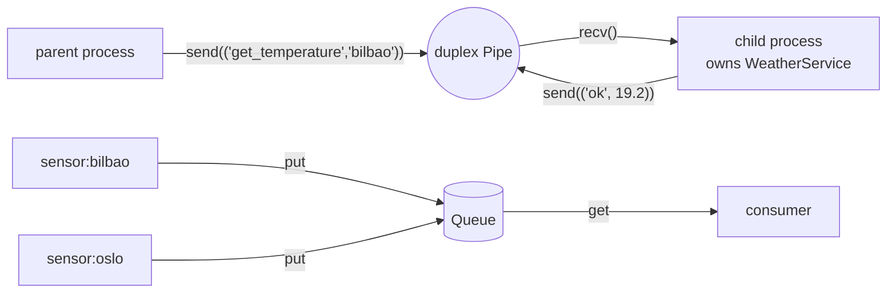

# 01 · Message passing

> **Slides:** 4 · **Code:** [`demo.py`](demo.py) · **Back to:** [main README](../../README.md)

## 1. The idea

Message passing is the most basic way for processes to cooperate: they share **no memory** and interact only by
**sending** and **receiving** messages through a channel that the operating system provides (pipe, queue, socket...).
Every other paradigm in this course (client/server, RPC, brokers, REST, gRPC, actors...) is built on top of it.
The example contrasts two message channels with the opposite approach, **shared memory**.

## 2. The picture



## 3. Run it

```bash
python examples/01_message_passing/demo.py        # the whole story
python run_all.py 01                                  # same, through the runner
```

Install / tools (same block as in the `demo.py` docstring):

```text
(nothing: Python standard library only)
pip install mpi4py          # optional: real message passing for HPC (needs an MPI runtime)
```

## 4. Walkthrough: what happens, step by step

Each step corresponds to one `▶` section of the console output. The excerpt is from a real run; timings and ports differ between runs.

### Step 1 · 1) Request/reply over a duplex Pipe (send / receive)

`main()` creates a `Pipe(duplex=True)` and starts `weather_process()` in a **child process**.
The parent sends tuples such as `("get_temperature", "bilbao")`. The child `recv()`s each one, calls the method on *its own*
`WeatherService` and `send()`s back `("ok", result)` or `("error", repr(exc))`. Finally `("stop",)` ends the child.
**Point out:** the error for `atlantis` also travels **as a message**. Nothing is shared: the parent never touches the service object.

```text
  0.00s [ child:15893] received get_temperature('bilbao',)
  0.00s [      parent] sent ('get_temperature', 'bilbao') -> got ('ok', 19.2)
  0.00s [ child:15893] received report('bilbao', 21.0)
  0.00s [      parent] sent ('report', 'bilbao', 21.0) -> got ('ok', {'city': 'bilbao', 'count': 4, 'last': 21.0, 'mean': 18.93, 'min': 17.5, 'max': 21.0})
  0.00s [ child:15893] received summary('bilbao',)
  0.00s [      parent] sent ('summary', 'bilbao') -> got ('ok', {'city': 'bilbao', 'count': 4, 'last': 21.0, 'mean': 18.93, 'min': 17.5, 'max': 21.0})
  0.00s [ child:15893] received get_temperature('atlantis',)
  0.00s [      parent] sent ('get_temperature', 'atlantis') -> got ('error', "KeyError('atlantis')")
  0.00s [ child:15893] received stop()
  0.00s [      parent] final reply: bye
```

### Step 2 · 2) Many producers -> one consumer through a Queue (asynchronous)

Two `sensor()` processes `put()` readings into a `multiprocessing.Queue` and finish with a `None`
sentinel. The parent `get()`s until it has seen one sentinel per producer.
**Point out:** the order of the collected list **interleaves** the producers and changes from run to run. Asynchronous messaging gives no global order.

```text
  0.01s [sensor:bilbao] put 18.1°C
  0.01s [ sensor:oslo] put 7.0°C
  0.01s [ sensor:oslo] put 6.5°C
  0.01s [ sensor:oslo] put 6.9°C
  0.01s [sensor:bilbao] put 18.4°C
  0.01s [    consumer] collected 5 readings (order is not guaranteed!): [('bilbao', 18.1), ('oslo', 7.0), ('oslo', 6.5), ('oslo', 6.9), ('bilbao', 18.4)]
```

### Step 3 · 3) Contrast: shared memory (processes share state, no messages)

A `SharedMemory` block is created and a child writes `b"HELLO"` into it; the parent reads it directly.
**Point out:** no message was sent. It is faster, but you must now synchronise access yourself (locks). That is why distributed systems, which have no shared RAM, rely on messages.

```text
  0.01s [      parent] read from shared memory: b'HELLO'
```

## 5. Code map

Read the code in this order: the table follows the file from top to bottom.

| Where | Symbol | What it does |
|---|---|---|
| [`demo.py:43`](demo.py#L43) | function `weather_process` | Child process: receive requests over a pipe, reply with results. |
| [`demo.py:64`](demo.py#L64) | function `sensor` | Producer process: push readings into a queue, then a ``None`` sentinel. |
| [`demo.py:72`](demo.py#L72) | function `shm_writer` | Write bytes into an existing shared-memory block (no message is sent). |
| [`demo.py:79`](demo.py#L79) | function `main` | Run the three message-passing mini-demos. |

## 6. Points to stress in class

- `send`/`receive` + connect/disconnect are the whole API (slide 4).
- The protocol is simply 'tuples with an operation name': later examples formalise it (JSON lines, XML-RPC, protobuf).
- Processes on the same machine behave like tiny distributed systems: separate memory, failures, message ordering.
- `if __name__ == '__main__'` is mandatory with `multiprocessing` on Windows/macOS (spawn start method).

## 7. Discussion questions

1. What would happen if two parents shared the same end of the Pipe?
2. Why can the Queue consumer not rely on the order of arrival? When would you need ordering?
3. Shared memory is faster: why do we still prefer messages between machines?

## 8. Try it yourself

- Add an operation `('report', 'oslo', 12.0)` and check that only the child's state changes.
- Add a third sensor and a `time.sleep(random.random()/10)` between puts: watch the interleaving change.
- Remove the `None` sentinels. How does the consumer know when to stop now?

## 9. Further reading

- [multiprocessing (Process, Pipe, Queue)](https://docs.python.org/3/library/multiprocessing.html)
- [multiprocessing programming guidelines](https://docs.python.org/3/library/multiprocessing.html#programming-guidelines)
- [multiprocessing.shared_memory](https://docs.python.org/3/library/multiprocessing.shared_memory.html)
- [mpi4py: MPI for Python (message passing in HPC)](https://mpi4py.readthedocs.io/)

## 10. Full console output of a real run

<details><summary>Show / hide</summary>

```text
==============================================================================
 01 · Message passing: pipes, queues (and shared memory)  [slides 4]
==============================================================================

▶ 1) Request/reply over a duplex Pipe (send / receive)
  0.00s [ child:15893] received get_temperature('bilbao',)
  0.00s [      parent] sent ('get_temperature', 'bilbao') -> got ('ok', 19.2)
  0.00s [ child:15893] received report('bilbao', 21.0)
  0.00s [      parent] sent ('report', 'bilbao', 21.0) -> got ('ok', {'city': 'bilbao', 'count': 4, 'last': 21.0, 'mean': 18.93, 'min': 17.5, 'max': 21.0})
  0.00s [ child:15893] received summary('bilbao',)
  0.00s [      parent] sent ('summary', 'bilbao') -> got ('ok', {'city': 'bilbao', 'count': 4, 'last': 21.0, 'mean': 18.93, 'min': 17.5, 'max': 21.0})
  0.00s [ child:15893] received get_temperature('atlantis',)
  0.00s [      parent] sent ('get_temperature', 'atlantis') -> got ('error', "KeyError('atlantis')")
  0.00s [ child:15893] received stop()
  0.00s [      parent] final reply: bye

▶ 2) Many producers -> one consumer through a Queue (asynchronous)
  0.01s [sensor:bilbao] put 18.1°C
  0.01s [ sensor:oslo] put 7.0°C
  0.01s [ sensor:oslo] put 6.5°C
  0.01s [ sensor:oslo] put 6.9°C
  0.01s [sensor:bilbao] put 18.4°C
  0.01s [    consumer] collected 5 readings (order is not guaranteed!): [('bilbao', 18.1), ('oslo', 7.0), ('oslo', 6.5), ('oslo', 6.9), ('bilbao', 18.4)]

▶ 3) Contrast: shared memory (processes share state, no messages)
  0.01s [      parent] read from shared memory: b'HELLO'

Key takeaways:
  • Processes do not share variables: the WeatherService state lives in the child only.
  • The whole protocol is 'send' + 'receive' of self-describing messages (here tuples).
  • Queues decouple producers from consumers; arrival order across producers is not guaranteed.
  • Every later paradigm (sockets, RPC, REST, brokers...) is built on top of message passing.
```

</details>
