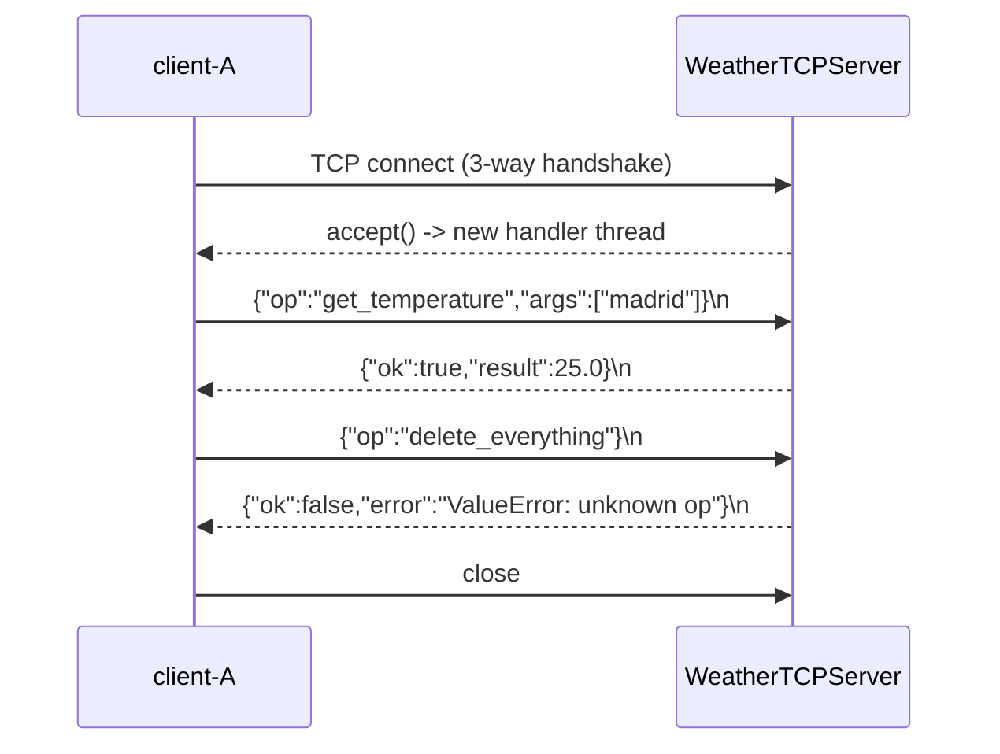

# 02 · Client/server with TCP sockets

> **Slides:** 5 · **Code:** [`demo.py`](demo.py) · **Back to:** [main README](../../README.md)

## 1. The idea

In the **client/server** paradigm a *passive* server `listen`s and `accept`s connections, and *active* clients `connect`,
send a request and wait for the response. With raw sockets we must invent our own **application protocol**; here it is
*one JSON object per line* ("JSON Lines"). The server is multi-threaded, so it serves several clients at once.

## 2. The picture



## 3. Run it

```bash
python examples/02_client_server_sockets/demo.py        # the whole story
python run_all.py 02                                  # same, through the runner
python examples/02_client_server_sockets/demo.py --help # server/client roles for live demos
```

Install / tools (same block as in the `demo.py` docstring):

```text
(nothing: Python standard library only)
nc 127.0.0.1 5000           # talk to --role server by hand; netcat: apt install netcat-openbsd | brew install netcat
then type: {"op": "get_temperature", "args": ["bilbao"]}
```

## 4. Walkthrough: what happens, step by step

Each step corresponds to one `▶` section of the console output. The excerpt is from a real run; timings and ports differ between runs.

### Step 1 · One client, several requests on the same TCP connection

`WeatherClient` opens **one TCP connection** and sends several JSON lines through `call()`. On the server,
`WeatherTCPHandler.handle()` reads line by line, `handle_request()` checks the operation against `ALLOWED_OPS` and builds the reply.
**Point out:** the unknown operation returns `{"ok": false, ...}` and the connection **survives**. Errors are part of the protocol.

```text
  0.01s [      server] accepted connection from 127.0.0.1:44778 (Thread-2 (process_request_thread))
  0.01s [    client-A] cities() -> {'ok': True, 'result': ['barcelona', 'bilbao', 'madrid', 'oslo']}
  0.01s [    client-A] get_temperature('madrid',) -> {'ok': True, 'result': 25.0}
  0.01s [    client-A] report('madrid', 27.5) -> {'ok': True, 'result': {'city': 'madrid', 'count': 4, 'last': 27.5, 'mean': 25.73, 'min': 24.1, 'max': 27.5}}
  0.01s [    client-A] summary('madrid',) -> {'ok': True, 'result': {'city': 'madrid', 'count': 4, 'last': 27.5, 'mean': 25.73, 'min': 24.1, 'max': 27.5}}
  0.01s [    client-A] delete_everything() -> {'ok': False, 'error': "ValueError: unknown op 'delete_everything'"}
  0.01s [      server] 127.0.0.1:44778 disconnected
```

### Step 2 · Three concurrent clients (the threaded server serves them in parallel)

Three threads each connect and `report()` a reading. `ThreadingTCPServer` creates **one thread per connection**
(see the thread names in the "accepted connection" lines).
**Point out:** the interleaved `accepted`/`disconnected` lines. The shared `WeatherService` is protected by a lock in `common/domain.py`.

```text
  0.01s [      server] accepted connection from 127.0.0.1:44784 (Thread-6 (process_request_thread))
  0.01s [    client-2] report('bilbao', 22.0) -> {'ok': True, 'result': {'city': 'bilbao', 'count': 4, 'last': 22.0, 'mean': 19.18, 'min': 17.5, 'max': 22.0}}
  0.01s [      server] accepted connection from 127.0.0.1:44786 (Thread-7 (process_request_thread))
  0.01s [      server] 127.0.0.1:44784 disconnected
  0.01s [    client-0] report('bilbao', 20.0) -> {'ok': True, 'result': {'city': 'bilbao', 'count': 5, 'last': 20.0, 'mean': 19.34, 'min': 17.5, 'max': 22.0}}
  0.01s [      server] accepted connection from 127.0.0.1:44796 (Thread-8 (process_request_thread))
  0.01s [      server] 127.0.0.1:44786 disconnected
  0.01s [    client-1] report('bilbao', 21.0) -> {'ok': True, 'result': {'city': 'bilbao', 'count': 6, 'last': 21.0, 'mean': 19.62, 'min': 17.5, 'max': 22.0}}
  0.01s [      server] 127.0.0.1:44796 disconnected
  0.01s [      server] accepted connection from 127.0.0.1:44810 (Thread-9 (process_request_thread))
  0.01s [    client-Z] summary('bilbao',) -> {'ok': True, 'result': {'city': 'bilbao', 'count': 6, 'last': 21.0, 'mean': 19.62, 'min': 17.5, 'max': 22.0}}
  0.01s [      server] 127.0.0.1:44810 disconnected
```

### Step 3 · Contrast: UDP (no connection, no delivery guarantee, message boundaries kept)

`udp_demo()` sends one datagram and gets one datagram back. There is no connection and no delivery guarantee, but message boundaries are kept.
**Point out:** with UDP a lost datagram is simply lost, so the client needs a timeout (`settimeout(2)`).

```text
  0.06s [  udp-client] datagram reply: {"ok": true, "result": 9.1}
```

## 5. Code map

Read the code in this order: the table follows the file from top to bottom.

| Where | Symbol | What it does |
|---|---|---|
| [`demo.py:56`](demo.py#L56) | function `handle_request` | Decode one request line, run it against the service, build the reply. |
| [`demo.py:67`](demo.py#L67) | class `WeatherTCPHandler` | One instance per client connection (runs in its own thread). |
| [`demo.py:70`](demo.py#L70) | &nbsp;&nbsp;↳ `handle()` | Serve JSON-line requests until the client disconnects. |
| [`demo.py:81`](demo.py#L81) | class `WeatherTCPServer` | Thread-per-connection TCP server. |
| [`demo.py:88`](demo.py#L88) | class `WeatherClient` | Client-side helper hiding the socket + protocol details. |
| [`demo.py:104`](demo.py#L104) | &nbsp;&nbsp;↳ `call()` | Send one request and block until its reply arrives. |
| [`demo.py:112`](demo.py#L112) | &nbsp;&nbsp;↳ `close()` | Disconnect. |
| [`demo.py:118`](demo.py#L118) | function `run_clients` | Run a few sequential and concurrent clients against ``port``. |
| [`demo.py:142`](demo.py#L142) | function `udp_demo` | Connection-less request/response with UDP datagrams. |
| [`demo.py:163`](demo.py#L163) | function `main` | Entry point supporting ``--role demo/server/client``. |

## 6. Points to stress in class

- The server never initiates communication (slide 5).
- TCP is a *byte stream*: framing (the `\n`) is OUR job; forgetting it is a classic bug.
- Thread-per-connection is simple but does not scale to 10k clients (see asyncio in example 13).
- Every later API style (RPC, REST, gRPC) is 'this, plus a standard protocol'.

## 7. Discussion questions

1. What happens if a JSON message contains a newline inside a string? How would you frame messages instead?
2. Why is state shared between clients a problem? Where is the lock?
3. When would you choose UDP over TCP?

## 8. Try it yourself

- Run the two roles in two terminals (`--role server --port 5000` / `--role client --port 5000`).
- Talk to the server by hand: `nc 127.0.0.1 5000` and type `{"op": "cities"}`.
- Add a `stats` operation that returns the number of requests served (mind the lock).

## 9. Further reading

- [Socket Programming HOWTO (official tutorial)](https://docs.python.org/3/howto/sockets.html)
- [socket: low-level networking interface](https://docs.python.org/3/library/socket.html)
- [socketserver: framework for network servers](https://docs.python.org/3/library/socketserver.html)
- [Real Python: Socket Programming in Python (guide)](https://realpython.com/python-sockets/)
- [JSON Lines format](https://jsonlines.org/)

## 10. Full console output of a real run

<details><summary>Show / hide</summary>

```text
==============================================================================
 02 · Client/server with TCP sockets and a JSON-lines protocol  [slides 5]
==============================================================================
  0.00s [      server] listening on 127.0.0.1:36843

▶ One client, several requests on the same TCP connection
  0.01s [      server] accepted connection from 127.0.0.1:44778 (Thread-2 (process_request_thread))
  0.01s [    client-A] cities() -> {'ok': True, 'result': ['barcelona', 'bilbao', 'madrid', 'oslo']}
  0.01s [    client-A] get_temperature('madrid',) -> {'ok': True, 'result': 25.0}
  0.01s [    client-A] report('madrid', 27.5) -> {'ok': True, 'result': {'city': 'madrid', 'count': 4, 'last': 27.5, 'mean': 25.73, 'min': 24.1, 'max': 27.5}}
  0.01s [    client-A] summary('madrid',) -> {'ok': True, 'result': {'city': 'madrid', 'count': 4, 'last': 27.5, 'mean': 25.73, 'min': 24.1, 'max': 27.5}}
  0.01s [    client-A] delete_everything() -> {'ok': False, 'error': "ValueError: unknown op 'delete_everything'"}
  0.01s [      server] 127.0.0.1:44778 disconnected
▶ Three concurrent clients (the threaded server serves them in parallel)

  0.01s [      server] accepted connection from 127.0.0.1:44784 (Thread-6 (process_request_thread))
  0.01s [    client-2] report('bilbao', 22.0) -> {'ok': True, 'result': {'city': 'bilbao', 'count': 4, 'last': 22.0, 'mean': 19.18, 'min': 17.5, 'max': 22.0}}
  0.01s [      server] accepted connection from 127.0.0.1:44786 (Thread-7 (process_request_thread))
  0.01s [      server] 127.0.0.1:44784 disconnected
  0.01s [    client-0] report('bilbao', 20.0) -> {'ok': True, 'result': {'city': 'bilbao', 'count': 5, 'last': 20.0, 'mean': 19.34, 'min': 17.5, 'max': 22.0}}
  0.01s [      server] accepted connection from 127.0.0.1:44796 (Thread-8 (process_request_thread))
  0.01s [      server] 127.0.0.1:44786 disconnected
  0.01s [    client-1] report('bilbao', 21.0) -> {'ok': True, 'result': {'city': 'bilbao', 'count': 6, 'last': 21.0, 'mean': 19.62, 'min': 17.5, 'max': 22.0}}
  0.01s [      server] 127.0.0.1:44796 disconnected
  0.01s [      server] accepted connection from 127.0.0.1:44810 (Thread-9 (process_request_thread))
  0.01s [    client-Z] summary('bilbao',) -> {'ok': True, 'result': {'city': 'bilbao', 'count': 6, 'last': 21.0, 'mean': 19.62, 'min': 17.5, 'max': 22.0}}
  0.01s [      server] 127.0.0.1:44810 disconnected

▶ Contrast: UDP (no connection, no delivery guarantee, message boundaries kept)
  0.06s [  udp-client] datagram reply: {"ok": true, "result": 9.1}

Key takeaways:
  • The server is passive: it only reacts to client requests (listen/accept).
  • WE had to design the protocol (framing, encoding, errors). Higher-level paradigms do it for us.
  • A thread per connection gives concurrency; state shared across clients needs locking.
  • TCP = reliable byte stream; UDP = unreliable datagrams with no connection.
```

</details>
