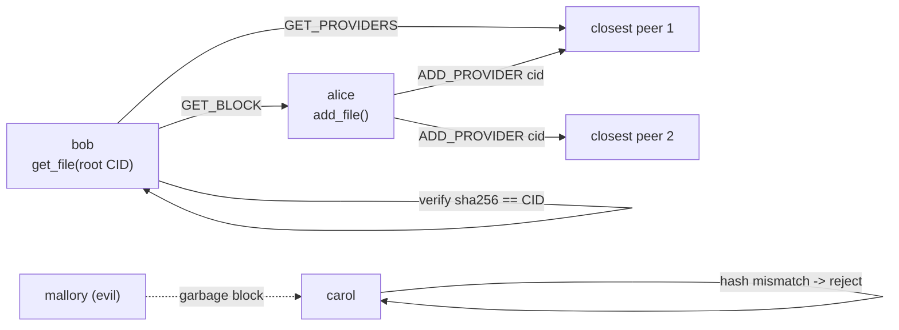

# 03 · Peer-to-peer: a mini-IPFS

> **Slides:** 6 · **Code:** [`demo.py`](demo.py) · **Back to:** [main README](../../README.md)

## 1. The idea

In **peer-to-peer** there is no server: every node is both client and server. This example mimics **IPFS**.
Files are split into blocks named by their hash (**content addressing**, CID = SHA-256), and "who has block X?" is
stored in a **distributed hash table** (DHT, Kademlia-style: on the peers whose ID is *XOR-closest* to X). Anyone can
serve a block, because the receiver can **verify** it.

## 2. The picture



## 3. Run it

```bash
python examples/03_peer_to_peer/demo.py        # the whole story
python run_all.py 03                                  # same, through the runner
```

Install / tools (same block as in the `demo.py` docstring):

```text
(nothing: Python standard library only)
Try real IPFS (Kubo): https://docs.ipfs.tech/install/command-line/
  ipfs init && ipfs add README.md && ipfs cat <CID>
```

## 4. Walkthrough: what happens, step by step

Each step corresponds to one `▶` section of the console output. The excerpt is from a real run; timings and ports differ between runs.

### Step 1 · Alice shares a file; the DHT stores 'who has it' on the closest peers

`Peer.add_file()` chunks the text into 64-byte blocks, computes each `cid_of()`, builds a **manifest** block
listing the chunk CIDs, and calls `provide()` for every CID. `provide()` sends `ADD_PROVIDER` to the `K_CLOSEST` peers
(`closest()` sorts peers by `peer_id XOR cid`).
**Point out:** the root CID identifies the whole file, and the same content always gives the same CID.

```text
  0.01s [       alice] added file: 3 chunks, root CID 0c4de741fe87…
```

### Step 2 · Bob downloads it by CID only (no server, no URL) and becomes a seeder

`get_file(root)` fetches the manifest, then each chunk with `fetch_block()`. That asks the DHT
(`find_providers()`), downloads with `GET_BLOCK` and checks `cid_of(data) == cid`. After downloading, Bob **provides** the blocks too.
**Point out:** no URL and no server address, only a hash.

```text
  0.02s [         bob] downloaded 139 bytes, verified 3 chunks
```

### Step 3 · Alice leaves the network - the content survives on Bob

`leave()` shuts Alice's server down. Some DHT lookups now fail ("unreachable, trying others") but the content is still available from Bob.
**Point out:** availability grows with popularity. The more peers download, the more seeders there are.

```text
  0.06s [       alice] went OFFLINE
```

### Step 4 · Mallory also claims to have the blocks, but serves garbage

Mallory announces two chunks but returns corrupted bytes. Carol's `fetch_block()` detects the hash mismatch,
**rejects** them and gets them from an honest peer.
**Point out:** content addressing gives integrity without trusting anyone.

```text
  0.07s [       carol] DHT node on :56389 unreachable, trying others
  0.07s [       carol] ⚠ block a5c56bdb from :36289 FAILED hash check -> rejected
  0.07s [       carol] ⚠ block 9b009ca9 from :36289 FAILED hash check -> rejected
  0.07s [       carol] DHT node on :56389 unreachable, trying others
  0.08s [       carol] downloaded 139 bytes, verified 3 chunks
  0.08s [       carol] content: Distributed computing: a collection of independent computers…
  0.13s [         bob] went OFFLINE
  0.13s [       carol] went OFFLINE
  0.15s [        dave] went OFFLINE
  0.20s [        erin] went OFFLINE
  0.23s [     mallory] went OFFLINE
```

## 5. Code map

Read the code in this order: the table follows the file from top to bottom.

| Where | Symbol | What it does |
|---|---|---|
| [`demo.py:56`](demo.py#L56) | function `cid_of` | Content identifier: the SHA-256 of the bytes. |
| [`demo.py:61`](demo.py#L61) | function `rpc` | Send one JSON message to the peer on ``port`` and return its reply. |
| [`demo.py:68`](demo.py#L68) | class `Peer` | A node that is simultaneously server and client. |
| [`demo.py:98`](demo.py#L98) | &nbsp;&nbsp;↳ `on_message()` | Handle an incoming message from another peer. |
| [`demo.py:115`](demo.py#L115) | &nbsp;&nbsp;↳ `join()` | Bootstrap: learn about other peers. |
| [`demo.py:120`](demo.py#L120) | &nbsp;&nbsp;↳ `closest()` | Ports of the K peers whose ID is XOR-closest to ``cid`` (Kademlia metric). |
| [`demo.py:125`](demo.py#L125) | &nbsp;&nbsp;↳ `provide()` | Announce in the DHT that this peer holds ``cid``. |
| [`demo.py:133`](demo.py#L133) | &nbsp;&nbsp;↳ `find_providers()` | Look up who holds ``cid`` by asking the closest peers (freshest first). |
| [`demo.py:145`](demo.py#L145) | &nbsp;&nbsp;↳ `add_file()` | Chunk, store and announce a file. Returns the root CID (of the manifest). |
| [`demo.py:160`](demo.py#L160) | &nbsp;&nbsp;↳ `fetch_block()` | Download a block from any provider and verify its hash. |
| [`demo.py:178`](demo.py#L178) | &nbsp;&nbsp;↳ `get_file()` | Fetch a whole file by its root CID. |
| [`demo.py:185`](demo.py#L185) | &nbsp;&nbsp;↳ `leave()` | Go offline. |
| [`demo.py:192`](demo.py#L192) | function `main` | Run the P2P story. |

## 6. Points to stress in class

- No central index: the DHT spreads 'who has what' over the peers themselves.
- Content addressing = integrity + deduplication + cacheability.
- Churn (peers joining/leaving) is normal; replication (`K_CLOSEST`) is the defence.
- Real systems: IPFS/libp2p, BitTorrent (Mainline DHT), blockchains' P2P layers.

## 7. Discussion questions

1. Why can Carol accept a block from a stranger but not a *mutable* file?
2. What happens to lookups if `K_CLOSEST = 1` and that peer leaves?
3. How would you name a file whose content changes? (hint: IPNS / mutable pointers)

## 8. Try it yourself

- Set `CHUNK_SIZE = 16` and watch the number of blocks grow.
- Make Dave evil too: is the file still downloadable? When would it not be?
- Install IPFS Kubo and compare: `ipfs add README.md`, then `ipfs cat <CID>`.

## 9. Further reading

- [IPFS docs: Content Identifiers (CIDs)](https://docs.ipfs.tech/concepts/content-addressing/)
- [IPFS: basic CLI operations with Kubo](https://docs.ipfs.tech/how-to/kubo-basic-cli/)
- [Maymounkov & Mazieres, Kademlia (IPTPS 2002)](https://www.scs.stanford.edu/~dm/home/papers/kpos.pdf)
- [libp2p: modular peer-to-peer networking stack](https://libp2p.io/)
- [hashlib (SHA-256)](https://docs.python.org/3/library/hashlib.html)

## 10. Full console output of a real run

<details><summary>Show / hide</summary>

```text
==============================================================================
 03 · Peer-to-peer: content addressing + DHT (mini-IPFS)  [slides 6]
==============================================================================
  0.00s [     network] peers: alice:56389, bob:46833, carol:50777, dave:36919, erin:37643, mallory:36289

▶ Alice shares a file; the DHT stores 'who has it' on the closest peers
  0.01s [       alice] added file: 3 chunks, root CID 0c4de741fe87…

▶ Bob downloads it by CID only (no server, no URL) and becomes a seeder
  0.02s [         bob] downloaded 139 bytes, verified 3 chunks

▶ Alice leaves the network - the content survives on Bob
  0.06s [       alice] went OFFLINE

▶ Mallory also claims to have the blocks, but serves garbage
  0.07s [       carol] DHT node on :56389 unreachable, trying others
  0.07s [       carol] ⚠ block a5c56bdb from :36289 FAILED hash check -> rejected
  0.07s [       carol] ⚠ block 9b009ca9 from :36289 FAILED hash check -> rejected
  0.07s [       carol] DHT node on :56389 unreachable, trying others
  0.08s [       carol] downloaded 139 bytes, verified 3 chunks
  0.08s [       carol] content: Distributed computing: a collection of independent computers…
  0.13s [         bob] went OFFLINE
  0.13s [       carol] went OFFLINE
  0.15s [        dave] went OFFLINE
  0.20s [        erin] went OFFLINE
  0.23s [     mallory] went OFFLINE

Key takeaways:
  • Every peer is both client and server; any peer can join or leave at any time.
  • Content addressing (CID = hash) lets you download from untrusted peers and verify integrity.
  • A DHT spreads the 'index' over the peers themselves (no central tracker).
  • Popular content becomes MORE available as more peers download and re-seed it.
```

</details>
