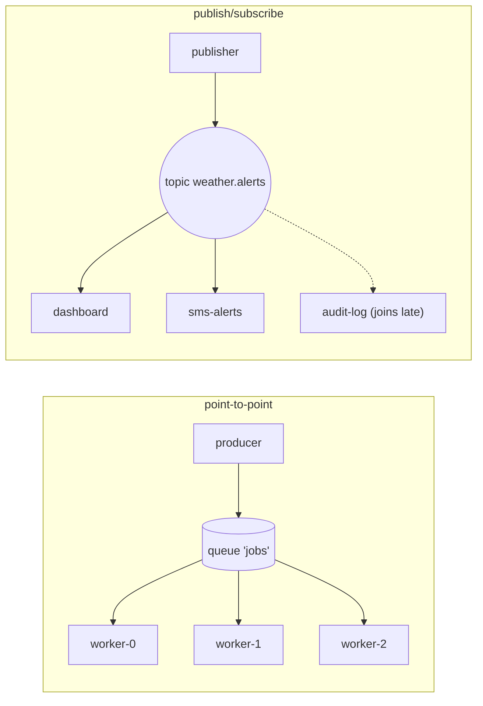

# 04 · Message system (message-oriented middleware)

> **Slides:** 7-9 · **Code:** [`demo.py`](demo.py) · **Back to:** [main README](../../README.md)

## 1. The idea

A **broker** sits between producers and consumers, so they are decoupled **in space** (they don't know each other) and
**in time** (they don't have to run at the same moment). The broker offers two models: **point-to-point queues**, where each
message goes to exactly one consumer, and **publish/subscribe topics**, where every subscriber gets a copy.

## 2. The picture



## 3. Run it

```bash
python examples/04_message_system/demo.py        # the whole story
python run_all.py 04                                  # same, through the runner
```

Install / tools (same block as in the `demo.py` docstring):

```text
(nothing: Python standard library only)
Real brokers: see example 14 (RabbitMQ) and 17 (Kafka)
```

## 4. Walkthrough: what happens, step by step

Each step corresponds to one `▶` section of the console output. The excerpt is from a real run; timings and ports differ between runs.

### Step 1 · Point-to-point: the producer sends while NO consumer is running (time decoupling)

The producer `send()`s 8 jobs and exits before any worker exists.
**Point out:** this is **time decoupling**. The broker stores the messages.

```text
  0.00s [    producer] sent 8 jobs and exits - it never knew who would process them
```

### Step 2 · Three competing consumers start later; one crashes before acknowledging

Three `worker()` threads `receive()` from the same queue. Every delivery is **unacked** until `ack()`.
worker-0 "crashes" on its 2nd delivery. `Broker.connection_lost()` **requeues** that message and another worker processes it.
**Point out:** each job is processed and acked exactly once, the load is balanced, and the crashed job is redelivered.
This is *at-least-once* delivery.

```text
  0.05s [    worker-0] processed + acked 'compute-daily-avg-0'
  0.05s [    worker-0] received 'compute-daily-avg-3' ... 💥 CRASHED before ACK
  0.05s [      broker] requeued unacked message 'compute-daily-avg-3'
  0.05s [    worker-2] processed + acked 'compute-daily-avg-2'
  0.05s [    worker-1] processed + acked 'compute-daily-avg-1'
  0.10s [    worker-2] processed + acked 'compute-daily-avg-4'
  0.10s [    worker-1] processed + acked 'compute-daily-avg-5'
  0.15s [    worker-2] processed + acked 'compute-daily-avg-6'
  0.15s [    worker-1] processed + acked 'compute-daily-avg-7'
  0.20s [    worker-2] processed + acked 'compute-daily-avg-3'
  0.70s [       stats] jobs per worker: {'worker-0': 1, 'worker-2': 4, 'worker-1': 3} -> total 8 (each acked exactly once)
```

### Step 3 · Publish/subscribe: every subscriber receives its own copy

`subscribe()` gives each subscriber its own inbox; `publish()` copies the message into every current inbox.
`audit-log` subscribes **after** the first alert.
**Point out:** audit-log got 1 message and the others got 2. Classic pub/sub does not keep history (compare with example 17).

```text
  0.70s [   publisher] published to 2 subscribers
  0.70s [   dashboard] got 'HEAT: madrid 41°C'
  0.70s [  sms-alerts] got 'HEAT: madrid 41°C'
  0.80s [   publisher] published to 3 subscribers
  0.80s [   dashboard] got 'STORM: bilbao wind 90km/h'
  0.80s [  sms-alerts] got 'STORM: bilbao wind 90km/h'
  0.80s [   audit-log] got 'STORM: bilbao wind 90km/h'
  0.90s [       stats] {'dashboard': 2, 'sms-alerts': 2, 'audit-log': 1, 'note': 'audit-log joined late and missed the HEAT alert'}
```

## 5. Code map

Read the code in this order: the table follows the file from top to bottom.

| Where | Symbol | What it does |
|---|---|---|
| [`demo.py:53`](demo.py#L53) | class `Delivery` | A message handed to a consumer, pending acknowledgement. |
| [`demo.py:61`](demo.py#L61) | class `Broker` | A minimal message broker with durable-ish queues and topics. |
| [`demo.py:73`](demo.py#L73) | &nbsp;&nbsp;↳ `send()` | Enqueue a message (the sender does not wait for any consumer). |
| [`demo.py:77`](demo.py#L77) | &nbsp;&nbsp;↳ `receive()` | Take the next message; it stays 'unacked' until :meth:`ack`. |
| [`demo.py:88`](demo.py#L88) | &nbsp;&nbsp;↳ `ack()` | Confirm processing: the broker can forget the message. |
| [`demo.py:93`](demo.py#L93) | &nbsp;&nbsp;↳ `connection_lost()` | A consumer died: requeue what it had not acknowledged. |
| [`demo.py:102`](demo.py#L102) | &nbsp;&nbsp;↳ `subscribe()` | Register a subscriber; returns its private inbox. |
| [`demo.py:108`](demo.py#L108) | &nbsp;&nbsp;↳ `publish()` | Copy the message to every current subscriber. Returns #copies. |
| [`demo.py:116`](demo.py#L116) | function `worker` | Competing consumer that processes jobs from the ``jobs`` queue. |
| [`demo.py:138`](demo.py#L138) | function `subscriber` | Pub/sub consumer: prints whatever arrives on its inbox. |
| [`demo.py:145`](demo.py#L145) | function `main` | Run the point-to-point and publish/subscribe scenarios. |

## 6. Points to stress in class

- Queues = work distribution; topics = event notification.
- ACK + redelivery = at-least-once, so handlers must be **idempotent**.
- The broker is a single component to operate and scale (and a potential SPOF).
- Products: RabbitMQ (ex. 14), Amazon SQS/SNS, ActiveMQ, IBM MQ, Azure Service Bus.

## 7. Discussion questions

1. What should a worker do if it processed a job but crashed *before* acking?
2. How would you give late subscribers the missed messages?
3. When is ordering guaranteed in a queue with competing consumers?

## 8. Try it yourself

- Crash two workers instead of one.
- Add a dead-letter queue: after 3 redeliveries move the message aside.
- Replace the in-process broker with RabbitMQ using the pika code of example 14.

## 9. Further reading

- [Enterprise Integration Patterns: messaging](https://www.enterpriseintegrationpatterns.com/patterns/messaging/)
- [EIP: Point-to-Point Channel](https://www.enterpriseintegrationpatterns.com/patterns/messaging/PointToPointChannel.html)
- [EIP: Publish-Subscribe Channel](https://www.enterpriseintegrationpatterns.com/patterns/messaging/PublishSubscribeChannel.html)
- [EIP: Competing Consumers](https://www.enterpriseintegrationpatterns.com/patterns/messaging/CompetingConsumers.html)
- [queue: synchronized queue class](https://docs.python.org/3/library/queue.html)

## 10. Full console output of a real run

<details><summary>Show / hide</summary>

```text
==============================================================================
 04 · Message system: point-to-point queues vs publish/subscribe  [slides 7-9]
==============================================================================

▶ Point-to-point: the producer sends while NO consumer is running (time decoupling)
  0.00s [    producer] sent 8 jobs and exits - it never knew who would process them

▶ Three competing consumers start later; one crashes before acknowledging
  0.05s [    worker-0] processed + acked 'compute-daily-avg-0'
  0.05s [    worker-0] received 'compute-daily-avg-3' ... 💥 CRASHED before ACK
  0.05s [      broker] requeued unacked message 'compute-daily-avg-3'
  0.05s [    worker-2] processed + acked 'compute-daily-avg-2'
  0.05s [    worker-1] processed + acked 'compute-daily-avg-1'
  0.10s [    worker-2] processed + acked 'compute-daily-avg-4'
  0.10s [    worker-1] processed + acked 'compute-daily-avg-5'
  0.15s [    worker-2] processed + acked 'compute-daily-avg-6'
  0.15s [    worker-1] processed + acked 'compute-daily-avg-7'
  0.20s [    worker-2] processed + acked 'compute-daily-avg-3'
  0.70s [       stats] jobs per worker: {'worker-0': 1, 'worker-2': 4, 'worker-1': 3} -> total 8 (each acked exactly once)

▶ Publish/subscribe: every subscriber receives its own copy
  0.70s [   publisher] published to 2 subscribers
  0.70s [   dashboard] got 'HEAT: madrid 41°C'
  0.70s [  sms-alerts] got 'HEAT: madrid 41°C'
  0.80s [   publisher] published to 3 subscribers
  0.80s [   dashboard] got 'STORM: bilbao wind 90km/h'
  0.80s [  sms-alerts] got 'STORM: bilbao wind 90km/h'
  0.80s [   audit-log] got 'STORM: bilbao wind 90km/h'
  0.90s [       stats] {'dashboard': 2, 'sms-alerts': 2, 'audit-log': 1, 'note': 'audit-log joined late and missed the HEAT alert'}

Key takeaways:
  • Queues: one message -> one consumer. Add consumers to scale out (competing consumers).
  • ACKs make delivery at-least-once: crashed work is redelivered (so handlers should be idempotent).
  • Topics: one message -> N subscribers; publishers don't know who listens.
  • Classic pub/sub does not keep history: late subscribers miss messages (see 17 for log-based streaming).
```

</details>
