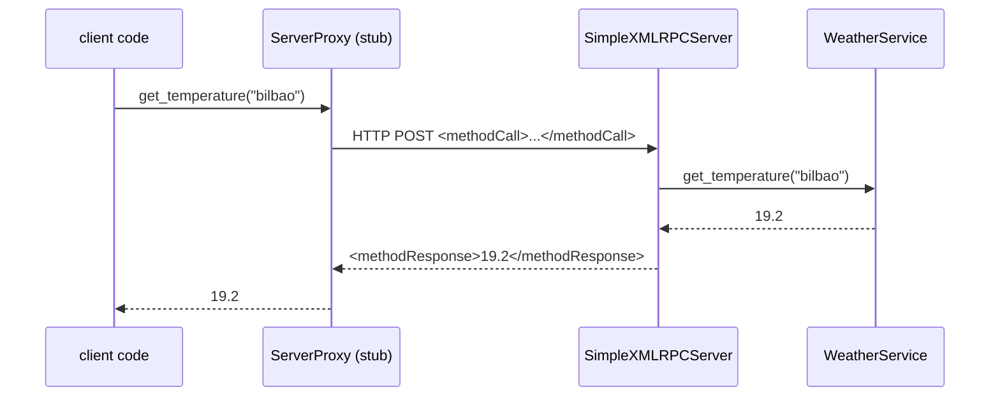

# 05 · Remote Procedure Call: XML-RPC and JSON-RPC 2.0

> **Slides:** 10, 20 · **Code:** [`demo.py`](demo.py) · **Back to:** [main README](../../README.md)

## 1. The idea

**RPC** makes a call to a function in another process *look like a local call*. A client **stub** marshals the
procedure name and its arguments, sends them, waits for the result and unmarshals it; a server **skeleton** does the reverse. We
show the two classic text-based flavours (XML-RPC from 1998, JSON-RPC 2.0) and the *leaky abstraction*: remote calls
can fail or time out in ways local calls never do.

## 2. The picture



## 3. Run it

```bash
python examples/05_rpc/demo.py        # the whole story
python run_all.py 05                                  # same, through the runner
python examples/05_rpc/demo.py --help # server/client roles for live demos
```

Install / tools (same block as in the `demo.py` docstring):

```text
(nothing: Python standard library only)
pip install zeep            # optional: SOAP client (the other RPC style of slide 20)
```

## 4. Walkthrough: what happens, step by step

Each step corresponds to one `▶` section of the console output. The excerpt is from a real run; timings and ports differ between runs.

### Step 1 · XML-RPC: the proxy makes remote procedures look local

`make_xmlrpc_server()` registers the `WeatherService` instance, so every public method becomes a remote
procedure, and it enables introspection (`system.listMethods`). The client uses `xmlrpc.client.ServerProxy`.
`LoggingTransport` prints the **XML actually sent on the wire** once.
**Point out:** the client code reads like local calls, and the XML payload is verbose.

```text
  0.00s [  xml-client] system.listMethods() -> ['cities', 'get_temperature', 'report', 'slow_forecast', 'station', 'summary']
  0.00s [        wire] XML-RPC request body:
<?xml version='1.0'?>
  …
```

### Step 2 · JSON-RPC 2.0: same idea, JSON payloads, plus notifications and batches

`JsonRpcHandler.do_POST()` and `jsonrpc_dispatch()` implement the spec by hand: request `id`, `result`/`error`
objects, **notifications** (no id, so no reply) and **batches** (a list of calls in one HTTP round trip). `JsonRpcProxy`
turns attribute access into remote calls through `__getattr__`.
**Point out:** three calls in one round trip, and the notification that gets no response.

```text
  0.01s [ json-client] summary('madrid') -> {'city': 'madrid', 'count': 3, 'last': 25.0, 'mean': 25.13, 'min': 24.1, 'max': 26.3}
  0.01s [ json-client] notify report('madrid', 30.1) -> (no response by design)
  0.01s [ json-client] batch of 3 calls in ONE round trip -> [30.1, 9.1, ['barcelona', 'bilbao', 'madrid', 'oslo']]
```

### Step 3 · Remote is NOT local: remote faults and network timeouts

(1) A server exception reaches the client as a `Fault`. (2) An unknown method returns error `-32601`.
(3) `slow_forecast` sleeps for 3 s but the client waits only 1 s, so it times out.
**Point out:** after a timeout the client **cannot know** whether the procedure ran. This is the key lesson.

```text
  0.01s [  xml-client] remote exception propagated as Fault: <class 'KeyError'>:'atlantis'
  0.01s [ json-client] JSON-RPC error object: {'code': -32601, 'message': 'Method not found'}
  1.01s [  xml-client] slow_forecast timed out after 1s -> did it run or not? The client cannot know!
```

## 5. Code map

Read the code in this order: the table follows the file from top to bottom.

| Where | Symbol | What it does |
|---|---|---|
| [`demo.py:62`](demo.py#L62) | function `slow_forecast` | A slow remote procedure (to demonstrate client timeouts). |
| [`demo.py:69`](demo.py#L69) | class `QuietHandler` | XML-RPC handler without per-request access logs. |
| [`demo.py:72`](demo.py#L72) | &nbsp;&nbsp;↳ `log_message()` |  |
| [`demo.py:76`](demo.py#L76) | function `make_xmlrpc_server` | Create an XML-RPC server exposing the weather service. |
| [`demo.py:86`](demo.py#L86) | class `LoggingTransport` | Client transport that prints the XML request payload (for teaching). |
| [`demo.py:91`](demo.py#L91) | &nbsp;&nbsp;↳ `send_request()` |  |
| [`demo.py:100`](demo.py#L100) | function `jsonrpc_dispatch` | Execute one JSON-RPC 2.0 request object; return None for notifications. |
| [`demo.py:116`](demo.py#L116) | class `JsonRpcHandler` | HTTP POST endpoint implementing JSON-RPC 2.0 (single + batch). |
| [`demo.py:119`](demo.py#L119) | &nbsp;&nbsp;↳ `do_POST()` | Handle a JSON-RPC call. |
| [`demo.py:132`](demo.py#L132) | &nbsp;&nbsp;↳ `log_message()` |  |
| [`demo.py:136`](demo.py#L136) | class `JsonRpcProxy` | Client stub: ``proxy.get_temperature("bilbao")`` -> HTTP POST. |
| [`demo.py:144`](demo.py#L144) | &nbsp;&nbsp;↳ `_post()` |  |
| [`demo.py:150`](demo.py#L150) | &nbsp;&nbsp;↳ `__getattr__()` |  |
| [`demo.py:158`](demo.py#L158) | &nbsp;&nbsp;↳ `notify()` | Fire-and-forget call (no id -> the server sends no reply). |
| [`demo.py:162`](demo.py#L162) | &nbsp;&nbsp;↳ `batch()` | Send several calls in one HTTP round-trip. |
| [`demo.py:168`](demo.py#L168) | function `run_clients` | Exercise both RPC flavours. |
| [`demo.py:202`](demo.py#L202) | function `main` | Entry point supporting ``--role demo/server/client``. |

## 6. Points to stress in class

- RPC is action-oriented (verbs), REST is resource-oriented (nouns, example 10).
- Stubs hide marshalling and transport: convenient, but latency and partial failure leak through.
- Design idempotent operations so that retries after timeouts are safe.
- Modern successor: gRPC (example 12), with contracts, binary encoding and streaming.

## 7. Discussion questions

1. Which of the service's methods are safe to retry after a timeout?
2. What does JSON-RPC give you that the socket protocol of example 02 did not?
3. Why did SOAP/XML-RPC lose popularity to REST and later gRPC?

## 8. Try it yourself

- Two terminals: `--role server --port 8000` and `--role client --port 8000`.
- Call the server from another language (e.g. `curl` with a JSON-RPC body).
- Add an idempotency key to `report` so that duplicates are ignored.

## 9. Further reading

- [xmlrpc.server](https://docs.python.org/3/library/xmlrpc.server.html)
- [xmlrpc.client](https://docs.python.org/3/library/xmlrpc.client.html)
- [JSON-RPC 2.0 specification](https://www.jsonrpc.org/specification)
- [http.server](https://docs.python.org/3/library/http.server.html)
- [Fallacies of distributed computing](https://en.wikipedia.org/wiki/Fallacies_of_distributed_computing)
- [Zeep: Python SOAP client](https://docs.python-zeep.org/)

## 10. Full console output of a real run

<details><summary>Show / hide</summary>

```text
==============================================================================
 05 · RPC: XML-RPC and JSON-RPC 2.0  [slides 10, 20]
==============================================================================
  0.00s [      server] XML-RPC on :49847, JSON-RPC on :43045

▶ XML-RPC: the proxy makes remote procedures look local
  0.00s [  xml-client] system.listMethods() -> ['cities', 'get_temperature', 'report', 'slow_forecast', 'station', 'summary']
  0.00s [        wire] XML-RPC request body:
<?xml version='1.0'?>
<methodCall>
<methodName>get_temperature</methodName>
<params>
<param>
<value><string>bilbao</string></value>
</param>
</params>
</methodCall>

  0.00s [  xml-client] get_temperature('bilbao') -> 19.2
  0.01s [  xml-client] report('bilbao', 22.3) -> {'city': 'bilbao', 'count': 4, 'last': 22.3, 'mean': 19.25, 'min': 17.5, 'max': 22.3}

▶ JSON-RPC 2.0: same idea, JSON payloads, plus notifications and batches
  0.01s [ json-client] summary('madrid') -> {'city': 'madrid', 'count': 3, 'last': 25.0, 'mean': 25.13, 'min': 24.1, 'max': 26.3}
  0.01s [ json-client] notify report('madrid', 30.1) -> (no response by design)
  0.01s [ json-client] batch of 3 calls in ONE round trip -> [30.1, 9.1, ['barcelona', 'bilbao', 'madrid', 'oslo']]

▶ Remote is NOT local: remote faults and network timeouts
  0.01s [  xml-client] remote exception propagated as Fault: <class 'KeyError'>:'atlantis'
  0.01s [ json-client] JSON-RPC error object: {'code': -32601, 'message': 'Method not found'}
  1.01s [  xml-client] slow_forecast timed out after 1s -> did it run or not? The client cannot know!

Key takeaways:
  • RPC hides marshalling and transport behind a stub: remote calls read like local calls.
  • It is action-oriented (verbs: get_temperature, report) - unlike REST's resources (see 10).
  • Transparency is leaky: latency, partial failures and timeouts don't exist in local calls.
  • After a timeout you don't know whether the call ran -> design idempotent operations.
```

</details>
