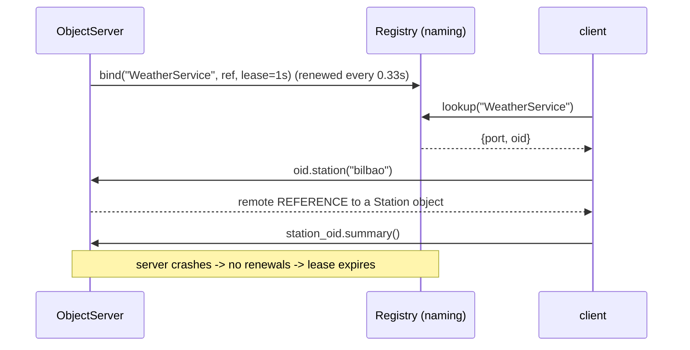

# 06 · Distributed objects: RMI/ORB, naming service and leases

> **Slides:** 11-13 · **Code:** [`demo.py`](demo.py) · **Back to:** [main README](../../README.md)

## 1. The idea

Distributed-object systems (Java RMI, CORBA, Pyro) extend RPC with **object identity**: you invoke methods on
*specific remote objects* that keep state, and objects can be passed **by reference**. Three pieces are involved:
a **naming service** (registry), an **object server** acting as the ORB/skeleton, and client **proxies** (stubs). Registrations are **leases**
that expire if the server stops renewing them, which is the idea behind Jini, etcd and Consul.

## 2. The picture



## 3. Run it

```bash
python examples/06_distributed_objects_rmi/demo.py        # the whole story
python run_all.py 06                                  # same, through the runner
```

Install / tools (same block as in the `demo.py` docstring):

```text
(nothing: Python standard library only)
pip install Pyro5           # real Python RMI library
python -m Pyro5.nameserver  # Pyro's naming service (the 'rmiregistry')
```

## 4. Walkthrough: what happens, step by step

Each step corresponds to one `▶` section of the console output. The excerpt is from a real run; timings and ports differ between runs.

### Step 1 · Clients only know the registry: lookup by name -> remote reference -> proxy

`ObjectServer.bind()` exports the object (`export()` returns `{port, oid}`) and keeps renewing its lease in the
`Registry`. The client only knows the registry port: `lookup()` returns a `RemoteProxy`, and every attribute becomes a remote
method call (`__getattr__`).

```text
  0.10s [    client-1] registry.list() -> ['VisitCounter', 'WeatherService']
  0.10s [    client-1] lookup('WeatherService') -> <RemoteProxy WeatherService@:40591/55820353>
  0.10s [    client-1] weather.get_temperature('oslo') -> 9.1
```

### Step 2 · Pass-by-reference: a returned object stays on the server, we get a new proxy

`weather.station("bilbao")` returns a `Station`. That is not plain data, so `ObjectServer.handle()`
**exports** it and returns a reference, and the client wraps it in a new proxy.
**Point out:** `station.summary()` runs on the server.

```text
  0.10s [    client-1] weather.station('bilbao') -> <RemoteProxy Station@:40591/f5a37e49>
  0.11s [    client-1] station.summary() executed remotely -> {'city': 'bilbao', 'count': 3, 'last': 19.2, 'mean': 18.23, 'min': 17.5, 'max': 19.2}
```

### Step 3 · Remote objects keep state shared by all clients

Two clients look up the same `Counter`; increments by one client are visible to the other.
**Point out:** the state lives in ONE place, on the server.

```text
  0.11s [    client-1] counter.increment() -> 1
  0.11s [    client-2] counter.increment(10) -> 11
  0.11s [    client-1] counter.increment() -> 12  (sees client-2's change)
```

### Step 4 · Leases: the server crashes; its registrations expire on their own

`crash()` kills the server without unbinding. The stale proxy fails at once (`ConnectionRefusedError`), and after the
lease period `lookup()` returns `NotBound`: the directory has **cleaned itself up**.

```text
  0.16s [  obj-server] 💥 crashed (no clean unbind!)
  0.16s [    client-1] stale proxy fails: ConnectionRefusedError
  1.36s [    client-3] lookup after lease expiry -> NotBound: WeatherService (directory self-cleaned)
```

## 5. Code map

Read the code in this order: the table follows the file from top to bottom.

| Where | Symbol | What it does |
|---|---|---|
| [`demo.py:56`](demo.py#L56) | function `call` | Send one JSON request to ``port`` and return the decoded reply. |
| [`demo.py:63`](demo.py#L63) | function `serve` | Start a threaded JSON-lines TCP server around ``handler_fn(msg) -> reply``. |
| [`demo.py:75`](demo.py#L75) | class `Registry` | Naming/lookup service with leased registrations. |
| [`demo.py:85`](demo.py#L85) | &nbsp;&nbsp;↳ `handle()` | Handle ``bind`` / ``lookup`` / ``list`` requests. |
| [`demo.py:100`](demo.py#L100) | class `ObjectServer` | Hosts remote objects; the per-call dispatch plays the role of the skeleton. |
| [`demo.py:111`](demo.py#L111) | &nbsp;&nbsp;↳ `export()` | Make ``obj`` remotely reachable and return its remote reference. |
| [`demo.py:117`](demo.py#L117) | &nbsp;&nbsp;↳ `handle()` | Skeleton: unmarshal, invoke the method, marshal the result. |
| [`demo.py:129`](demo.py#L129) | &nbsp;&nbsp;↳ `bind()` | Register ``obj`` under ``name`` and keep renewing the lease in background. |
| [`demo.py:139`](demo.py#L139) | &nbsp;&nbsp;↳ `crash()` | Die without unregistering anything. |
| [`demo.py:149`](demo.py#L149) | class `RemoteProxy` | Dynamic client stub: every attribute is a remote method. |
| [`demo.py:156`](demo.py#L156) | &nbsp;&nbsp;↳ `__getattr__()` |  |
| [`demo.py:169`](demo.py#L169) | function `lookup` | Ask the naming service for ``name`` and return a proxy. |
| [`demo.py:177`](demo.py#L177) | class `Counter` | A stateful remote object (state lives on the server). |
| [`demo.py:184`](demo.py#L184) | &nbsp;&nbsp;↳ `increment()` | Increase and return the counter. |
| [`demo.py:190`](demo.py#L190) | function `main` | Run the RMI/ORB scenario. |

## 6. Points to stress in class

- RMI = RPC + object identity + pass-by-reference.
- The naming/directory service decouples clients from locations (network service paradigm, slide 13).
- Leases turn silent failures into automatic cleanup (heartbeats/TTLs everywhere today).
- Distributed objects encourage chatty, fine-grained calls, which is a performance trap over the network.

## 7. Discussion questions

1. Why are remote object references dangerous for garbage collection?
2. What happens if a network glitch delays lease renewals?
3. Compare `station.summary()` (remote) with returning the data by value: pros and cons?

## 8. Try it yourself

- Install Pyro5 and re-implement the counter with `@Pyro5.api.expose` and the Pyro name server.
- Make the lease 5 s and measure how long stale entries survive.
- Add `unbind()` on clean shutdown.

## 9. Further reading

- [Pyro5: intro and example](https://pyro5.readthedocs.io/en/latest/intro.html)
- [Pyro5 tutorial](https://pyro5.readthedocs.io/en/latest/tutorials.html)
- [Pyro5 name server](https://pyro5.readthedocs.io/en/latest/nameserver.html)
- [Oracle Java tutorial: RMI](https://docs.oracle.com/javase/tutorial/rmi/)
- [OMG CORBA specification](https://www.omg.org/spec/CORBA/)

## 10. Full console output of a real run

<details><summary>Show / hide</summary>

```text
==============================================================================
 06 · Distributed objects: RMI/ORB, naming service & leases  [slides 11-13]
==============================================================================
  0.00s [    registry] naming service on :37281

▶ Clients only know the registry: lookup by name -> remote reference -> proxy
  0.10s [    client-1] registry.list() -> ['VisitCounter', 'WeatherService']
  0.10s [    client-1] lookup('WeatherService') -> <RemoteProxy WeatherService@:40591/55820353>
  0.10s [    client-1] weather.get_temperature('oslo') -> 9.1

▶ Pass-by-reference: a returned object stays on the server, we get a new proxy
  0.10s [    client-1] weather.station('bilbao') -> <RemoteProxy Station@:40591/f5a37e49>
  0.11s [    client-1] station.summary() executed remotely -> {'city': 'bilbao', 'count': 3, 'last': 19.2, 'mean': 18.23, 'min': 17.5, 'max': 19.2}

▶ Remote objects keep state shared by all clients
  0.11s [    client-1] counter.increment() -> 1
  0.11s [    client-2] counter.increment(10) -> 11
  0.11s [    client-1] counter.increment() -> 12  (sees client-2's change)

▶ Leases: the server crashes; its registrations expire on their own
  0.16s [  obj-server] 💥 crashed (no clean unbind!)
  0.16s [    client-1] stale proxy fails: ConnectionRefusedError
  1.36s [    client-3] lookup after lease expiry -> NotBound: WeatherService (directory self-cleaned)

Key takeaways:
  • RMI/ORB = RPC + object identity: calls target a specific remote object (oid) with its own state.
  • Plain data travels by value; objects travel as remote references (proxies).
  • A naming/directory service decouples clients from locations (network service paradigm, Jini).
  • Leases turn silent failures into automatic cleanup - the same idea as etcd/Consul TTLs today.
  • Real libraries: Java RMI, CORBA, and in Python: Pyro5 (pip install Pyro5).
```

</details>
