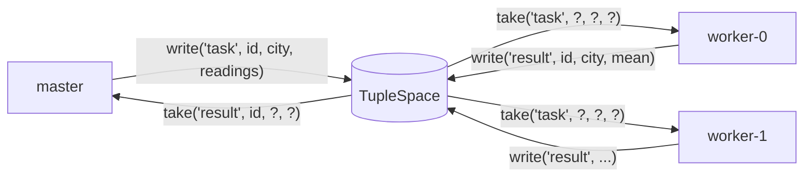

# 07 · Object space / tuple space (Linda, JavaSpaces)

> **Slides:** 12 · **Code:** [`demo.py`](demo.py) · **Back to:** [main README](../../README.md)

## 1. The idea

Processes coordinate through a **shared associative memory** (the *space*) with three operations:
`write(tuple)`, `read(template)` (copy, blocking) and `take(template)` (remove, atomic, blocking). Templates match by
position with `None` as a wildcard. Producers and consumers never know each other (**space and time decoupling**).

## 2. The picture



## 3. Run it

```bash
python examples/07_object_space/demo.py        # the whole story
python run_all.py 07                                  # same, through the runner
```

Install / tools (same block as in the `demo.py` docstring):

```text
(nothing: Python standard library only)
```

## 4. Walkthrough: what happens, step by step

Each step corresponds to one `▶` section of the console output. The excerpt is from a real run; timings and ports differ between runs.

### Step 1 · Master writes a bag of tasks; anonymous workers take them

The master writes 8 `("task", id, city, readings)` tuples. Three `worker()` threads `take()` tasks, compute the mean
and `write()` results. The master `take()`s the results. A poison pill (`id == -1`) stops the workers.
**Point out:** faster workers simply take more tasks (automatic load balancing), and `take()` is atomic, so no task is done twice.

```text
  0.00s [      master] wrote 8 task tuples; space size = 8
  0.03s [    worker-2] took task 2 (barcelona) -> writes result mean=22.7
  0.04s [    worker-0] took task 0 (bilbao) -> writes result mean=18.23
  0.07s [    worker-1] took task 1 (madrid) -> writes result mean=25.13
  0.08s [    worker-0] took task 4 (bilbao) -> writes result mean=18.23
  0.11s [    worker-1] took task 5 (madrid) -> writes result mean=25.13
  0.13s [    worker-2] took task 3 (oslo) -> writes result mean=8.4
  0.15s [    worker-0] took task 6 (barcelona) -> writes result mean=22.7
  0.21s [    worker-1] took task 7 (oslo) -> writes result mean=8.4
  0.21s [      master] collected 8 results, e.g. ('result', 0, 'bilbao', 18.23)
```

### Step 2 · read() vs take(): a config tuple read by many, never consumed

A config tuple is `read()` by two services and is still there afterwards.
**Point out:** `read` = shared knowledge, `take` = consumable work.

```text
  0.21s [       svc-a] read -> ('config', 'units', 'celsius')
  0.21s [       svc-b] read -> ('config', 'units', 'celsius')
  0.21s [       space] config still present: True
```

### Step 3 · A single token tuple = distributed mutual exclusion

A single `("printer-token",)` tuple acts as a lock: `take()` to acquire and `write()` back to release.
**Point out:** the users print strictly one after another. `take(..., timeout=0.2)` avoids waiting forever.

```text
  0.21s [      user-0] acquired printer token, printing report...
  0.26s [      user-0] releasing token
  0.26s [      user-1] acquired printer token, printing report...
  0.31s [      user-1] releasing token
  0.31s [      user-2] acquired printer token, printing report...
  0.36s [      user-2] releasing token
  0.56s [       space] nobody waits for a missing tuple forever: take(('ghost',), timeout=0.2) -> None
```

## 5. Code map

Read the code in this order: the table follows the file from top to bottom.

| Where | Symbol | What it does |
|---|---|---|
| [`demo.py:49`](demo.py#L49) | class `TupleSpace` | A thread-safe Linda-style tuple space. |
| [`demo.py:58`](demo.py#L58) | &nbsp;&nbsp;↳ `_match()` |  |
| [`demo.py:61`](demo.py#L61) | &nbsp;&nbsp;↳ `write()` | Add an entry and wake up waiting readers. |
| [`demo.py:67`](demo.py#L67) | &nbsp;&nbsp;↳ `_find()` |  |
| [`demo.py:79`](demo.py#L79) | &nbsp;&nbsp;↳ `read()` | Return (without removing) an entry matching ``template``. |
| [`demo.py:83`](demo.py#L83) | &nbsp;&nbsp;↳ `take()` | Atomically remove and return an entry matching ``template``. |
| [`demo.py:92`](demo.py#L92) | function `worker` | Take tasks until a poison pill appears; write results back. |
| [`demo.py:105`](demo.py#L105) | function `printer_user` | Uses a shared resource guarded by a token tuple (distributed mutex). |
| [`demo.py:114`](demo.py#L114) | function `main` | Run the master/worker and mutex scenarios. |

## 6. Points to stress in class

- Generative communication: tuples outlive their writers.
- Very loose coupling, but the space is a central component (in Linda) or must be distributed itself.
- Descendants: JavaSpaces/GigaSpaces, and coordination with Redis/etcd keys.

## 7. Discussion questions

1. What happens to the token if a user crashes while holding it? How do leases (example 06) help?
2. How would you implement a barrier (wait until N workers are ready) with tuples?
3. Compare the bag of tasks with the queue of example 04.

## 8. Try it yourself

- Add a 4th worker that is 3x slower and count the tasks each one takes.
- Implement `eval()`-style active tuples: a tuple that is a function to be executed.
- Implement a barrier with a counter tuple.

## 9. Further reading

- [Gelernter, Generative communication in Linda (TOPLAS 1985)](https://doi.org/10.1145/2363.2433)
- [Tuple space (overview)](https://en.wikipedia.org/wiki/Tuple_space)
- [threading.Condition (blocking read/take)](https://docs.python.org/3/library/threading.html#condition-objects)

## 10. Full console output of a real run

<details><summary>Show / hide</summary>

```text
==============================================================================
 07 · Object/tuple space (Linda / JavaSpaces)  [slides 12]
==============================================================================

▶ Master writes a bag of tasks; anonymous workers take them
  0.00s [      master] wrote 8 task tuples; space size = 8
  0.03s [    worker-2] took task 2 (barcelona) -> writes result mean=22.7
  0.04s [    worker-0] took task 0 (bilbao) -> writes result mean=18.23
  0.07s [    worker-1] took task 1 (madrid) -> writes result mean=25.13
  0.08s [    worker-0] took task 4 (bilbao) -> writes result mean=18.23
  0.11s [    worker-1] took task 5 (madrid) -> writes result mean=25.13
  0.13s [    worker-2] took task 3 (oslo) -> writes result mean=8.4
  0.15s [    worker-0] took task 6 (barcelona) -> writes result mean=22.7
  0.21s [    worker-1] took task 7 (oslo) -> writes result mean=8.4
  0.21s [      master] collected 8 results, e.g. ('result', 0, 'bilbao', 18.23)

▶ read() vs take(): a config tuple read by many, never consumed
  0.21s [       svc-a] read -> ('config', 'units', 'celsius')
  0.21s [       svc-b] read -> ('config', 'units', 'celsius')
  0.21s [       space] config still present: True

▶ A single token tuple = distributed mutual exclusion
  0.21s [      user-0] acquired printer token, printing report...
  0.26s [      user-0] releasing token
  0.26s [      user-1] acquired printer token, printing report...
  0.31s [      user-1] releasing token
  0.31s [      user-2] acquired printer token, printing report...
  0.36s [      user-2] releasing token
  0.56s [       space] nobody waits for a missing tuple forever: take(('ghost',), timeout=0.2) -> None

Key takeaways:
  • Coordination through a shared space: decoupled in space (no addresses) and time (entries persist).
  • take() is atomic, so each task is processed exactly once without any explicit lock.
  • Load balancing is automatic: faster workers simply take more tasks.
  • Modern descendants: JavaSpaces/GigaSpaces, Redis/etcd used as coordination spaces.
```

</details>
