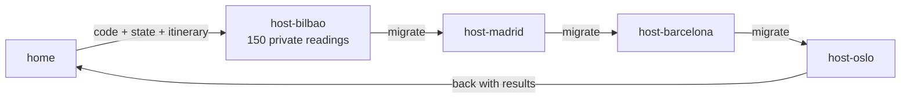

# 08 · Mobile agents: move the code to the data

> **Slides:** 13 · **Code:** [`demo.py`](demo.py) · **Back to:** [main README](../../README.md)

## 1. The idea

A **mobile agent** is code **plus state** that travels from host to host, runs locally against each host's
resources and finally returns home. Only the small agent crosses the network, not the (large, possibly private) data. The same idea
appears today in Spark "code shipping", edge functions and, arguably, LLM agents calling tools. It raises serious **security** questions:
running code you received from the network.

## 2. The picture



## 3. Run it

```bash
python examples/08_mobile_agents/demo.py        # the whole story
python run_all.py 08                                  # same, through the runner
```

Install / tools (same block as in the `demo.py` docstring):

```text
(nothing: Python standard library only)
pip install wasmtime        # optional: a REAL sandbox for travelling code (WebAssembly)
```

## 4. Walkthrough: what happens, step by step

Each step corresponds to one `▶` section of the console output. The excerpt is from a real run; timings and ports differ between runs.

### Step 1 · Dispatch: serialise code + state + itinerary and send it to the first host

`main()` starts 4 **host processes** (`host_main()`), each with private readings. The agent class `HeatwaveScout` is
serialised as **source code** (`inspect.getsource`) plus a JSON state and an itinerary, and sent to the first host.
Each host `exec()`s the code in a namespace restricted to `SAFE_BUILTINS`, calls `visit()` and forwards the agent to the next host.
**Point out:** the state size grows by only a few bytes per hop.

```text
  0.02s [        home] agent payload is 1006 bytes; itinerary: host-bilbao -> host-madrid -> host-barcelona -> host-oslo -> home
  0.02s [ host-bilbao] agent ran locally on 150 private readings; state size now 129 bytes
  0.02s [ host-bilbao] migrating agent -> host-madrid
  0.02s [ host-madrid] agent ran locally on 150 private readings; state size now 175 bytes
  0.02s [ host-madrid] migrating agent -> host-barcelona
  0.02s [host-barcelona] agent ran locally on 100 private readings; state size now 193 bytes
  0.02s [host-barcelona] migrating agent -> host-oslo
  0.03s [   host-oslo] agent ran locally on 150 private readings; state size now 206 bytes
  0.03s [   host-oslo] migrating agent -> home
```

### Step 2 · The agent is back home with its results

The home server receives the agent with the visited hosts, the hottest city and the alerts.
**Point out:** 550 raw values were examined, but they never crossed the network.

```text
  0.03s [        home] visited: ['host-bilbao', 'host-madrid', 'host-barcelona', 'host-oslo']
  0.03s [        home] hottest: {'city': 'madrid', 'max': 26.3}, alerts (>= 25.0°C): [{'city': 'madrid', 'max': 26.3}]
  0.03s [        home] raw readings examined remotely: 550 values (~3158 bytes) that never crossed the network
```

## 5. Code map

Read the code in this order: the table follows the file from top to bottom.

| Where | Symbol | What it does |
|---|---|---|
| [`demo.py:60`](demo.py#L60) | class `HeatwaveScout` | The mobile agent. MUST be self-contained: its source travels over the network. |
| [`demo.py:66`](demo.py#L66) | &nbsp;&nbsp;↳ `visit()` | Run at each host against local data only. |
| [`demo.py:79`](demo.py#L79) | function `send` | Ship a serialised agent to the host listening on ``port``. |
| [`demo.py:85`](demo.py#L85) | function `host_main` | A host process: receive agents, run them locally, forward them. |
| [`demo.py:106`](demo.py#L106) | function `free_ports` | Reserve ``n`` distinct free ports. |
| [`demo.py:117`](demo.py#L117) | function `main` | Launch hosts, dispatch the agent, wait for it to come home. |

## 6. Points to stress in class

- Code + state migrate; the data stays where it is (data locality).
- Disconnected operation: hosts need not be up at the same time.
- `exec` with restricted builtins is NOT a sandbox; real systems use WebAssembly, containers, signed code.
- Descendants: MapReduce/Spark shipping closures, edge functions, agents that call tools.

## 7. Discussion questions

1. What could a malicious agent do on a host? And a malicious host to an agent?
2. When is shipping code cheaper than shipping data? Estimate it for this example.
3. How would you make the agent survive a host crash in the middle of the itinerary?

## 8. Try it yourself

- Add a host that refuses agents (returns an error): make the agent skip it.
- Run the agent's code inside WebAssembly with `wasmtime` (see references).
- Change the itinerary to be decided dynamically by the agent itself.

## 9. Further reading

- [exec() and its security caveats](https://docs.python.org/3/library/functions.html#exec)
- [inspect.getsource (shipping source code)](https://docs.python.org/3/library/inspect.html#inspect.getsource)
- [Mobile agent (overview)](https://en.wikipedia.org/wiki/Mobile_agent)
- [WebAssembly](https://webassembly.org/)
- [wasmtime-py: run Wasm from Python](https://github.com/bytecodealliance/wasmtime-py)

## 10. Full console output of a real run

<details><summary>Show / hide</summary>

```text
==============================================================================
 08 · Mobile agents: move the code to the data  [slides 13]
==============================================================================
  0.01s [        home] started 4 host processes: ['host-bilbao', 'host-madrid', 'host-barcelona', 'host-oslo']

▶ Dispatch: serialise code + state + itinerary and send it to the first host
  0.02s [        home] agent payload is 1006 bytes; itinerary: host-bilbao -> host-madrid -> host-barcelona -> host-oslo -> home
  0.02s [ host-bilbao] agent ran locally on 150 private readings; state size now 129 bytes
  0.02s [ host-bilbao] migrating agent -> host-madrid
  0.02s [ host-madrid] agent ran locally on 150 private readings; state size now 175 bytes
  0.02s [ host-madrid] migrating agent -> host-barcelona
  0.02s [host-barcelona] agent ran locally on 100 private readings; state size now 193 bytes
  0.02s [host-barcelona] migrating agent -> host-oslo
  0.03s [   host-oslo] agent ran locally on 150 private readings; state size now 206 bytes
  0.03s [   host-oslo] migrating agent -> home

▶ The agent is back home with its results
  0.03s [        home] visited: ['host-bilbao', 'host-madrid', 'host-barcelona', 'host-oslo']
  0.03s [        home] hottest: {'city': 'madrid', 'max': 26.3}, alerts (>= 25.0°C): [{'city': 'madrid', 'max': 26.3}]
  0.03s [        home] raw readings examined remotely: 550 values (~3158 bytes) that never crossed the network

Key takeaways:
  • The agent carries code AND state; each hop runs locally, close to the data.
  • Only a small payload travels, and hosts can be disconnected between hops.
  • Big risk: executing foreign code. Today: sandboxes (WebAssembly, containers), signed code.
  • Descendants: Spark/MapReduce code shipping, edge functions, and LLM agents that 'travel' via tool calls (see 23).
```

</details>
