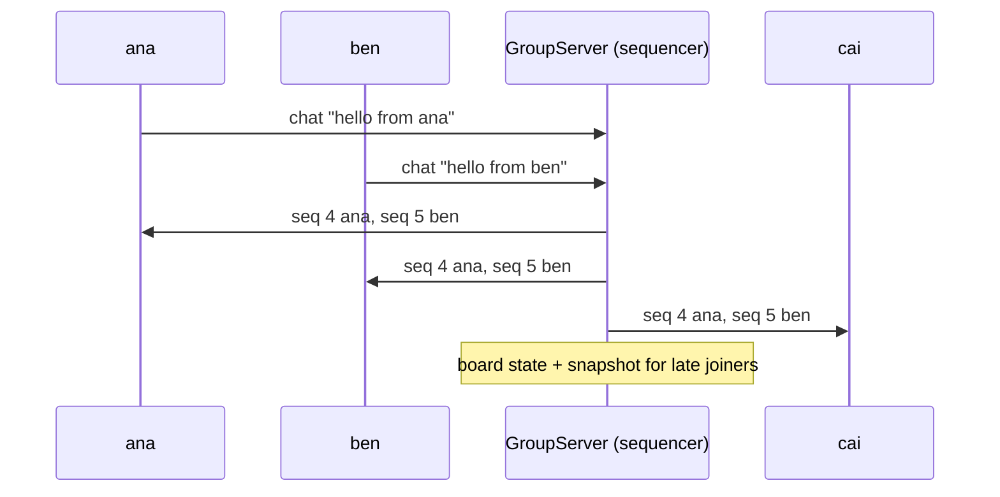

# 09 · Collaborative applications (groupware)

> **Slides:** 14 · **Code:** [`demo.py`](demo.py) · **Back to:** [main README](../../README.md)

## 1. The idea

Processes join a **group session** and all of them contribute. **Message-based groupware** multicasts messages to
the group; a **sequencer** stamps every message with a global sequence number, so all members see the **same order**
(total-order multicast). **Whiteboard-based groupware** keeps a shared state that anyone can read and write; late joiners
get a **snapshot**.

## 2. The picture



## 3. Run it

```bash
python examples/09_collaborative_groupware/demo.py        # the whole story
python run_all.py 09                                  # same, through the runner
```

Install / tools (same block as in the `demo.py` docstring):

```text
(nothing: Python standard library only)
```

## 4. Walkthrough: what happens, step by step

Each step corresponds to one `▶` section of the console output. The excerpt is from a real run; timings and ports differ between runs.

### Step 1 · Message-based groupware: multicast to the group, total order via a sequencer

Three `Member`s connect to the `GroupServer` and send concurrently. `GroupServer.multicast()` increments
`seq` under a lock and writes the message to every member, so the lock order **is** the delivery order. A message with `to=[...]`
goes only to a sub-group.
**Point out:** `all members saw ... in the SAME order: True`.

```text
  0.00s [         ana] joined; members=['ana']; board snapshot={}
  0.00s [         ben] joined; members=['ana', 'ben']; board snapshot={}
  0.00s [         cai] joined; members=['ana', 'ben', 'cai']; board snapshot={}
  …
  0.31s [       check] all members saw the 3 concurrent messages in the SAME order: False
```

### Step 2 · Whiteboard-based groupware: everyone reads/writes a shared board

`draw(cell, value)` messages update the server's `board` and every member's copy. Two members write `A1`;
the sequencer decides which write is last, identically everywhere.
**Point out:** all three boards are identical.

```text
  0.51s [       check] ana's board == ben's board == cai's board: True -> {'B1': 'Madrid 26°C', 'A1': 'Bilbao 21°C (updated)'}
```

### Step 3 · A late joiner gets the current board as a snapshot

`dan` joins later and receives the current board in the `welcome` message (a snapshot).

```text
  0.51s [         dan] joined; members=['ana', 'ben', 'cai', 'dan']; board snapshot={'B1': 'Madrid 26°C', 'A1': 'Bilbao 21°C (updated)'}
  0.61s [       check] dan's board: {'B1': 'Madrid 26°C', 'A1': 'Bilbao 21°C (updated)'}
```

## 5. Code map

Read the code in this order: the table follows the file from top to bottom.

| Where | Symbol | What it does |
|---|---|---|
| [`demo.py:47`](demo.py#L47) | class `GroupServer` | Sequencer for total-order multicast + holder of the shared whiteboard. |
| [`demo.py:78`](demo.py#L78) | &nbsp;&nbsp;↳ `multicast()` | Stamp with a sequence number, apply to the board, send to the group. |
| [`demo.py:92`](demo.py#L92) | class `Member` | A participant of the collaborative session. |
| [`demo.py:108`](demo.py#L108) | &nbsp;&nbsp;↳ `_listen()` |  |
| [`demo.py:119`](demo.py#L119) | &nbsp;&nbsp;↳ `say()` | Multicast a chat message to the group (or to a subset). |
| [`demo.py:123`](demo.py#L123) | &nbsp;&nbsp;↳ `draw()` | Write on the shared whiteboard. |
| [`demo.py:127`](demo.py#L127) | &nbsp;&nbsp;↳ `leave()` | Close the connection. |
| [`demo.py:132`](demo.py#L132) | function `main` | Run the groupware session. |

## 6. Points to stress in class

- Concurrent multicasts can be delivered in different orders without a sequencer.
- The central sequencer is simple but is a bottleneck and a single point of failure.
- Snapshots + a log of changes = how collaborative editors bootstrap new clients.
- CRDTs (example 19) remove the central sequencer.

## 7. Discussion questions

1. Which kinds of application need total order, and which only need causal order?
2. What happens to the session if the GroupServer crashes?
3. How would you do this peer-to-peer (no server)?

## 8. Try it yourself

- Remove the lock in `multicast()` and run it several times: do the orders diverge?
- Add a `leave` message and member list updates.
- Replace the board with the LWW-map of example 19 and drop the sequencer.

## 9. Further reading

- [Atomic (total-order) broadcast](https://en.wikipedia.org/wiki/Atomic_broadcast)
- [Collaborative software / groupware](https://en.wikipedia.org/wiki/Collaborative_software)
- [socketserver](https://docs.python.org/3/library/socketserver.html)
- [WebRTC (browser peer-to-peer collaboration)](https://webrtc.org/)

## 10. Full console output of a real run

<details><summary>Show / hide</summary>

```text
==============================================================================
 09 · Collaborative groupware: multicast + shared whiteboard  [slides 14]
==============================================================================

▶ Message-based groupware: multicast to the group, total order via a sequencer
  0.00s [         ana] joined; members=['ana']; board snapshot={}
  0.00s [         ben] joined; members=['ana', 'ben']; board snapshot={}
  0.00s [         cai] joined; members=['ana', 'ben', 'cai']; board snapshot={}
  0.11s [         ben] #4 ana says 'hello from ana'
  0.11s [         cai] #4 ana says 'hello from ana'
  0.11s [         ana] #4 ana says 'hello from ana'
  0.11s [         ana] #5 ben says 'hello from ben'
  0.11s [         ben] #5 ben says 'hello from ben'
  0.11s [         ben] #6 ana says 'psst, only for ben' (private to ['ben', 'ana'])
  0.11s [         cai] #5 ben says 'hello from ben'
  0.11s [         ben] #7 cai says 'hello from cai'
  0.11s [         cai] #7 cai says 'hello from cai'
  0.15s [         ana] #6 ana says 'psst, only for ben' (private to ['ben', 'ana'])
  0.15s [         ana] #7 cai says 'hello from cai'
  0.31s [       check] all members saw the 3 concurrent messages in the SAME order: False

▶ Whiteboard-based groupware: everyone reads/writes a shared board
  0.51s [       check] ana's board == ben's board == cai's board: True -> {'B1': 'Madrid 26°C', 'A1': 'Bilbao 21°C (updated)'}

▶ A late joiner gets the current board as a snapshot
  0.51s [         dan] joined; members=['ana', 'ben', 'cai', 'dan']; board snapshot={'B1': 'Madrid 26°C', 'A1': 'Bilbao 21°C (updated)'}
  0.61s [       check] dan's board: {'B1': 'Madrid 26°C', 'A1': 'Bilbao 21°C (updated)'}

Key takeaways:
  • Groupware = many-to-many: every participant is producer and consumer.
  • Concurrent multicasts can arrive in different orders; a sequencer gives total order.
  • Shared-state (whiteboard) groupware needs snapshots for late joiners.
  • The central sequencer is simple but a bottleneck/SPOF: CRDTs remove it (see 19).
```

</details>
