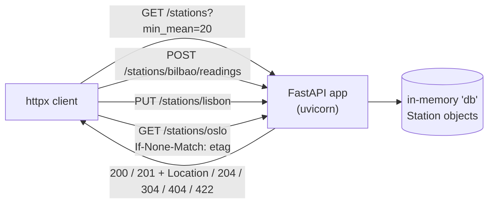

# 10 · RESTful API with FastAPI, Pydantic and OpenAPI

> **Slides:** 15-25, 41-58 · **Code:** [`demo.py`](demo.py) · **Back to:** [main README](../../README.md)

## 1. The idea

**REST** models the system as **resources** (nouns) identified by URIs and manipulated through the **uniform interface**
of HTTP (GET, POST, PUT, DELETE). It relies on standard **status codes**, **stateless** requests, **cacheability** (ETag) and
hypermedia links. **FastAPI** builds the API from type hints, **Pydantic** validates the bodies, and the **OpenAPI** contract is generated
automatically.

## 2. The picture



## 3. Run it

```bash
python examples/10_rest_api/demo.py        # the whole story
python run_all.py 10                                  # same, through the runner
python examples/10_rest_api/demo.py --help # server/client roles for live demos
```

Install / tools (same block as in the `demo.py` docstring):

```text
pip install fastapi uvicorn httpx     # or: pip install "fastapi[standard]"
python examples/10_rest_api/demo.py --role server --port 8000
curl -i http://127.0.0.1:8000/stations/bilbao
curl -i -X POST -H 'Content-Type: application/json' -d '{"temperature": 21.5}' \
     http://127.0.0.1:8000/stations/bilbao/readings
open http://127.0.0.1:8000/docs    (Swagger UI)  |  http://127.0.0.1:8000/redoc
```

## 4. Walkthrough: what happens, step by step

Each step corresponds to one `▶` section of the console output. The excerpt is from a real run; timings and ports differ between runs.

### Step 1 · GET collection, filters (query params), a single resource

`list_stations()` supports the query parameters `min_mean` and `limit` (validated by `Query`). `represent()` adds
**links** (`self`, `readings`, `collection`), and the client follows the `readings` link (HATEOAS).

```text
  0.36s [ http-client] GET    /stations?min_mean=20  -> 200 [{"city":"madrid","count":3,"last":25.0,"mean":25.13,"links":{"self":"/stations/madrid","readings":"/stations/madrid/readings","collection":"/stations"}},{"city":"barc...
  0.36s [ http-client] GET    /stations/bilbao  -> 200 {"city":"bilbao","count":3,"last":19.2,"mean":18.23,"links":{"self":"/stations/bilbao","readings":"/stations/bilbao/readings","collection":"/stations"}}
  0.36s [ http-client] follow hypermedia link 'readings' -> [17.5, 18.0, 19.2]
```

### Step 2 · POST (create in sub-collection, 201 + Location) vs PUT (idempotent create/replace)

`add_reading()` answers **201** with a `Location` header. `put_station()` creates (201) and then replaces (200) the same
resource with the same result, which makes PUT **idempotent**. POST is not: repeating it adds another reading.

```text
  0.37s [ http-client] POST   /stations/bilbao/readings  -> 201 {"city":"bilbao","count":4,"last":23.4,"mean":19.52,"links":{"self":"/stations/bilbao","readings":"/stations/bilbao/readings","collection":"/stations"}}
  0.37s [ http-client] Location header: /stations/bilbao/readings/3
  0.37s [ http-client] PUT    /stations/lisbon  -> 201 {"city":"lisbon","count":2,"last":22.5,"mean":21.75,"links":{"self":"/stations/lisbon","readings":"/stations/lisbon/readings","collection":"/stations"}}
  0.37s [ http-client] PUT    /stations/lisbon  -> 200 {"city":"lisbon","count":2,"last":22.5,"mean":21.75,"links":{"self":"/stations/lisbon","readings":"/stations/lisbon/readings","collection":"/stations"}}
```

### Step 3 · Errors: 404 unknown resource, 422 validation by Pydantic

`get_or_404()` returns **404**. A temperature of 999 violates `Field(ge=-90, le=60)` in `ReadingIn`, so Pydantic returns
**422** with a precise error location.

```text
  0.37s [ http-client] GET    /stations/atlantis  -> 404 {"detail":"station 'atlantis' not found"}
  0.38s [ http-client] POST   /stations/bilbao/readings  -> 422 {"detail":[{"type":"less_than_equal","loc":["body","temperature"],"msg":"Input should be less than or equal to 60","input":999,"ctx":{"le":60.0}}]}
```

### Step 4 · Cacheability: ETag + conditional GET -> 304 Not Modified (no body transferred)

`get_station()` computes an **ETag** (a hash of the representation) and a `Cache-Control` header. The second request
sends `If-None-Match` and gets **304 Not Modified** with no body.

```text
  0.38s [ http-client] ETag="de5853793fbbaf80" Cache-Control=max-age=30
  0.38s [ http-client] GET    /stations/oslo  -> 304
```

### Step 5 · DELETE, then the resource is gone

`delete_station()` returns **204**, and a later GET gives 404.

```text
  0.38s [ http-client] DELETE /stations/lisbon  -> 204
  0.38s [ http-client] GET    /stations/lisbon  -> 404 {"detail":"station 'lisbon' not found"}
```

### Step 6 · The OpenAPI contract is generated from the code

`/openapi.json` is saved next to the demo. Open `/docs` (Swagger UI) with `--role server`.

```text
  0.39s [     openapi] version 3.1.0, paths: ['/stations', '/stations/{city}', '/stations/{city}/readings']
  0.39s [     openapi] saved to examples/10_rest_api/openapi.json
```

## 5. Code map

Read the code in this order: the table follows the file from top to bottom.

| Where | Symbol | What it does |
|---|---|---|
| [`demo.py:74`](demo.py#L74) | class `ReadingIn` | Body of POST /stations/{city}/readings. |
| [`demo.py:80`](demo.py#L80) | class `StationIn` | Body of PUT /stations/{city}. |
| [`demo.py:86`](demo.py#L86) | class `StationOut` | Representation of a station (with hypermedia links). |
| [`demo.py:97`](demo.py#L97) | function `create_app` | Build the FastAPI application (a fresh in-memory 'database' each time). |
| [`demo.py:167`](demo.py#L167) | function `show` | Log a request/response pair in a compact way. |
| [`demo.py:174`](demo.py#L174) | function `run_demo` | Exercise the API as an HTTP client would. |
| [`demo.py:211`](demo.py#L211) | function `main` | Entry point supporting ``--role demo/server``. |

## 6. Points to stress in class

- Resources + uniform interface, not custom verbs (compare with RPC, example 05).
- Status codes carry meaning, so clients react to them rather than parse texts.
- Idempotency (GET/PUT/DELETE) makes retries safe; POST needs idempotency keys.
- Contract-first vs code-first: here the code generates the OpenAPI contract.

## 7. Discussion questions

1. Why is `POST /stations/bilbao/readings` not idempotent? How would you make it safe to retry?
2. What does the ETag save? Who else (proxies/CDNs) can use it?
3. Where would authentication and pagination go?

## 8. Try it yourself

- `--role server --port 8000` and explore `/docs`; try the endpoints from Swagger UI.
- Add pagination with `offset`/`limit` and `Link` headers.
- Add optimistic concurrency: require `If-Match` on PUT, return 412 on mismatch.

## 9. Further reading

- [FastAPI tutorial - user guide](https://fastapi.tiangolo.com/tutorial/)
- [FastAPI: first steps](https://fastapi.tiangolo.com/tutorial/first-steps/)
- [The Ultimate FastAPI Tutorial (slides 50-58)](https://christophergs.com/tutorials/ultimate-fastapi-tutorial-pt-1-hello-world/)
- [Pydantic documentation](https://docs.pydantic.dev/)
- [Uvicorn (ASGI server)](https://www.uvicorn.org/)
- [HTTPX (HTTP client)](https://www.python-httpx.org/)
- [OpenAPI Specification](https://spec.openapis.org/oas/latest.html)
- [RFC 9110: HTTP Semantics (methods, status codes, ETag)](https://www.rfc-editor.org/rfc/rfc9110)
- [Fielding's dissertation, ch. 5 (REST)](https://ics.uci.edu/~fielding/pubs/dissertation/rest_arch_style.htm)

## 10. Full console output of a real run

<details><summary>Show / hide</summary>

```text
==============================================================================
 10 · RESTful API: FastAPI + Pydantic + OpenAPI  [slides 15-25, 41-58]
==============================================================================
  0.30s [      server] uvicorn serving on http://127.0.0.1:33289

▶ GET collection, filters (query params), a single resource
  0.36s [ http-client] GET    /stations?min_mean=20  -> 200 [{"city":"madrid","count":3,"last":25.0,"mean":25.13,"links":{"self":"/stations/madrid","readings":"/stations/madrid/readings","collection":"/stations"}},{"city":"barc...
  0.36s [ http-client] GET    /stations/bilbao  -> 200 {"city":"bilbao","count":3,"last":19.2,"mean":18.23,"links":{"self":"/stations/bilbao","readings":"/stations/bilbao/readings","collection":"/stations"}}
  0.36s [ http-client] follow hypermedia link 'readings' -> [17.5, 18.0, 19.2]

▶ POST (create in sub-collection, 201 + Location) vs PUT (idempotent create/replace)
  0.37s [ http-client] POST   /stations/bilbao/readings  -> 201 {"city":"bilbao","count":4,"last":23.4,"mean":19.52,"links":{"self":"/stations/bilbao","readings":"/stations/bilbao/readings","collection":"/stations"}}
  0.37s [ http-client] Location header: /stations/bilbao/readings/3
  0.37s [ http-client] PUT    /stations/lisbon  -> 201 {"city":"lisbon","count":2,"last":22.5,"mean":21.75,"links":{"self":"/stations/lisbon","readings":"/stations/lisbon/readings","collection":"/stations"}}
  0.37s [ http-client] PUT    /stations/lisbon  -> 200 {"city":"lisbon","count":2,"last":22.5,"mean":21.75,"links":{"self":"/stations/lisbon","readings":"/stations/lisbon/readings","collection":"/stations"}}

▶ Errors: 404 unknown resource, 422 validation by Pydantic
  0.37s [ http-client] GET    /stations/atlantis  -> 404 {"detail":"station 'atlantis' not found"}
  0.38s [ http-client] POST   /stations/bilbao/readings  -> 422 {"detail":[{"type":"less_than_equal","loc":["body","temperature"],"msg":"Input should be less than or equal to 60","input":999,"ctx":{"le":60.0}}]}

▶ Cacheability: ETag + conditional GET -> 304 Not Modified (no body transferred)
  0.38s [ http-client] ETag="de5853793fbbaf80" Cache-Control=max-age=30
  0.38s [ http-client] GET    /stations/oslo  -> 304 

▶ DELETE, then the resource is gone
  0.38s [ http-client] DELETE /stations/lisbon  -> 204 
  0.38s [ http-client] GET    /stations/lisbon  -> 404 {"detail":"station 'lisbon' not found"}

▶ The OpenAPI contract is generated from the code
  0.39s [     openapi] version 3.1.0, paths: ['/stations', '/stations/{city}', '/stations/{city}/readings']
  0.39s [     openapi] saved to examples/10_rest_api/openapi.json

Key takeaways:
  • Nouns, not verbs: resources + uniform interface (GET/POST/PUT/DELETE) instead of custom procedures.
  • Status codes carry semantics: 200, 201+Location, 204, 304, 404, 422...
  • Statelessness + cacheability (ETag) are what make REST scale behind proxies and CDNs.
  • PUT/DELETE are idempotent, POST is not - crucial when clients retry after timeouts.
  • With FastAPI the OpenAPI contract comes for free from type hints (see /docs).
```

</details>
