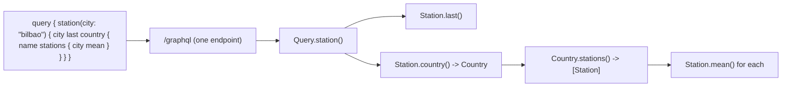

# 11 · GraphQL with Strawberry

> **Slides:** 26 · **Code:** [`demo.py`](demo.py) · **Back to:** [main README](../../README.md)

## 1. The idea

**GraphQL** exposes **one endpoint** and a strongly-typed **schema**. The *client* describes the exact shape of the
data it wants and the server resolves it field by field. This avoids REST's **over-fetching** (getting fields you don't need)
and **under-fetching** (needing N+1 requests for related data), and the schema is **introspectable**.

## 2. The picture



## 3. Run it

```bash
python examples/11_graphql/demo.py        # the whole story
python run_all.py 11                                  # same, through the runner
python examples/11_graphql/demo.py --help # server/client roles for live demos
```

Install / tools (same block as in the `demo.py` docstring):

```text
pip install strawberry-graphql fastapi uvicorn httpx
python examples/11_graphql/demo.py --role server --port 8001
open http://127.0.0.1:8001/graphql   (GraphiQL IDE in the browser)
curl -s -X POST -H 'Content-Type: application/json' \
     -d '{"query": "{ stations { city mean } }"}' http://127.0.0.1:8001/graphql
```

## 4. Walkthrough: what happens, step by step

Each step corresponds to one `▶` section of the console output. The excerpt is from a real run; timings and ports differ between runs.

### Step 1 · Ask for exactly the fields you need (no over-fetching)

`{ stations { city } }` returns only city names; `stations(minMean: 20)` shows an argument (`min_mean`
becomes `minMean` automatically).
**Point out:** the response size in bytes follows the query.

```text
  0.50s [  gql-client] { stations { city } }
  0.50s [  gql-client]   -> HTTP 200, 96 bytes: {"data": {"stations": [{"city": "barcelona"}, {"city": "bilbao"}, {"city": "madrid"}, {"city": "oslo"}]}}
  0.50s [  gql-client] { stations(minMean: 20) { city mean } }
  0.50s [  gql-client]   -> HTTP 200, 87 bytes: {"data": {"stations": [{"city": "barcelona", "mean": 22.7}, {"city": "madrid", "mean": 25.13}]}}
```

### Step 2 · Nested data in ONE round trip (REST would need 1 + N requests)

`station → country → stations → mean` crosses the graph (`Station.country()`, `Country.stations()`) in
**one** HTTP request; REST would need 1 + N requests.

```text
  0.51s [  gql-client] { station(city: "bilbao") { city last readings(last: 2) country { name stations { city mean } }…
  0.51s [  gql-client]   -> HTTP 200, 208 bytes: {"data": {"station": {"city": "bilbao", "last": 19.2, "readings": [18.0, 19.2], "country": {"name": "Spain", "stations": [{"city": "barcelona", "mean"
```

### Step 3 · Mutations with variables

`addReading(city: $c, temperature: $t)` changes state and returns the updated station, so the client chooses the fields
of the result too.

```text
  0.51s [  gql-client] mutation Add($c: String!, $t: Float!) { addReading(city: $c, temperature: $t) { city last mean …
  0.51s [  gql-client]   -> HTTP 200, 63 bytes: {"data": {"addReading": {"city": "oslo", "last": 12.5, "mean": 9.43}}}
```

### Step 4 · Errors come in an 'errors' array (partial results are possible)

A resolver exception (temperature out of range) and an unknown field (`humidity`) both come back in an `errors` array
with **HTTP 200**, together with `data` when partial results exist.

```text
  0.52s [  gql-client] mutation { addReading(city: "oslo", temperature: 999) { city } }
  0.52s [  gql-client]   -> HTTP 200, 122 bytes: {"data": null, "errors": [{"message": "temperature out of range", "locations": [{"line": 1, "column": 12}], "path": ["addReading"]}]}
  0.52s [  gql-client] { stations { city humidity } }
  0.52s [  gql-client]   -> HTTP 200, 124 bytes: {"data": null, "errors": [{"message": "Cannot query field 'humidity' on type 'Station'.", "locations": [{"line": 1, "column": 19}]}]}
```

### Step 5 · Introspection: the schema is self-describing

`__schema` lists the queries and mutations, and the demo prints the **SDL** generated from the Python classes.

```text
  0.52s [  gql-client] { __schema { queryType { fields { name } } mutationType { fields { name } } } }
  0.52s [  gql-client]   -> HTTP 200, 137 bytes: {"data": {"__schema": {"queryType": {"fields": [{"name": "stations"}, {"name": "station"}]}, "mutationType": {"fields": [{"name": "addReading"}]}}}}
  0.52s [      schema] queries=['stations', 'station'], mutations=['addReading']
  …
```

## 5. Code map

Read the code in this order: the table follows the file from top to bottom.

| Where | Symbol | What it does |
|---|---|---|
| [`demo.py:66`](demo.py#L66) | class `Station` | A weather station. |
| [`demo.py:72`](demo.py#L72) | &nbsp;&nbsp;↳ `last()` | Latest reading. |
| [`demo.py:77`](demo.py#L77) | &nbsp;&nbsp;↳ `mean()` | Average temperature. |
| [`demo.py:82`](demo.py#L82) | &nbsp;&nbsp;↳ `readings()` | The last N readings (fields can take arguments). |
| [`demo.py:87`](demo.py#L87) | &nbsp;&nbsp;↳ `country()` | Edge of the graph: station -> country. |
| [`demo.py:93`](demo.py#L93) | class `Country` | A country, linked to its stations (the 'graph' in GraphQL). |
| [`demo.py:99`](demo.py#L99) | &nbsp;&nbsp;↳ `stations()` | Edge of the graph: country -> stations. |
| [`demo.py:105`](demo.py#L105) | class `Query` | Read operations. |
| [`demo.py:109`](demo.py#L109) | &nbsp;&nbsp;↳ `stations()` | All stations, optionally filtered. |
| [`demo.py:115`](demo.py#L115) | &nbsp;&nbsp;↳ `station()` | One station by city. |
| [`demo.py:121`](demo.py#L121) | class `Mutation` | Write operations. |
| [`demo.py:125`](demo.py#L125) | &nbsp;&nbsp;↳ `add_reading()` | Append a reading and return the updated station. |
| [`demo.py:136`](demo.py#L136) | function `create_app` | FastAPI app with the GraphQL router at /graphql. |
| [`demo.py:144`](demo.py#L144) | function `gql` | POST a GraphQL operation and log it. |
| [`demo.py:153`](demo.py#L153) | function `run_demo` | Run a few queries showing GraphQL's strengths. |
| [`demo.py:179`](demo.py#L179) | function `main` | Entry point supporting ``--role demo/server``. |

## 6. Points to stress in class

- Client-driven shape; one endpoint; typed schema; introspection powers tooling (GraphiQL).
- Resolvers can cause N+1 database queries: use DataLoaders/batching.
- HTTP caching is harder (POST to one URL); limit query depth/complexity.
- Typical role: backend-for-frontend / aggregation layer (example 15, capstone 24).

## 7. Discussion questions

1. Why does an error in GraphQL still return HTTP 200? Is that good or bad?
2. How could a malicious client overload a GraphQL server?
3. When would you still prefer REST?

## 8. Try it yourself

- `--role server --port 8001` and use GraphiQL at `/graphql` with auto-completion.
- Add a `humidity` field to `Station`: old clients keep working (no versioning).
- Add a subscription (`@strawberry.subscription`) streaming new readings over WebSocket.

## 9. Further reading

- [Introduction to GraphQL (official tutorial)](https://graphql.org/learn/)
- [GraphQL specification](https://spec.graphql.org/)
- [Strawberry: getting started](https://strawberry.rocks/docs)
- [Strawberry + FastAPI integration](https://strawberry.rocks/docs/integrations/fastapi)
- [Graphene (alternative Python library)](https://graphene-python.org/)

## 10. Full console output of a real run

<details><summary>Show / hide</summary>

```text
==============================================================================
 11 · GraphQL: one endpoint, client-shaped queries  [slides 26]
==============================================================================

▶ Ask for exactly the fields you need (no over-fetching)
  0.50s [  gql-client] { stations { city } }
  0.50s [  gql-client]   -> HTTP 200, 96 bytes: {"data": {"stations": [{"city": "barcelona"}, {"city": "bilbao"}, {"city": "madrid"}, {"city": "oslo"}]}}
  0.50s [  gql-client] { stations(minMean: 20) { city mean } }
  0.50s [  gql-client]   -> HTTP 200, 87 bytes: {"data": {"stations": [{"city": "barcelona", "mean": 22.7}, {"city": "madrid", "mean": 25.13}]}}

▶ Nested data in ONE round trip (REST would need 1 + N requests)
  0.51s [  gql-client] { station(city: "bilbao") { city last readings(last: 2) country { name stations { city mean } }…
  0.51s [  gql-client]   -> HTTP 200, 208 bytes: {"data": {"station": {"city": "bilbao", "last": 19.2, "readings": [18.0, 19.2], "country": {"name": "Spain", "stations": [{"city": "barcelona", "mean"

▶ Mutations with variables
  0.51s [  gql-client] mutation Add($c: String!, $t: Float!) { addReading(city: $c, temperature: $t) { city last mean …
  0.51s [  gql-client]   -> HTTP 200, 63 bytes: {"data": {"addReading": {"city": "oslo", "last": 12.5, "mean": 9.43}}}

▶ Errors come in an 'errors' array (partial results are possible)
  0.52s [  gql-client] mutation { addReading(city: "oslo", temperature: 999) { city } }
  0.52s [  gql-client]   -> HTTP 200, 122 bytes: {"data": null, "errors": [{"message": "temperature out of range", "locations": [{"line": 1, "column": 12}], "path": ["addReading"]}]}
  0.52s [  gql-client] { stations { city humidity } }
  0.52s [  gql-client]   -> HTTP 200, 124 bytes: {"data": null, "errors": [{"message": "Cannot query field 'humidity' on type 'Station'.", "locations": [{"line": 1, "column": 19}]}]}

▶ Introspection: the schema is self-describing
  0.52s [  gql-client] { __schema { queryType { fields { name } } mutationType { fields { name } } } }
  0.52s [  gql-client]   -> HTTP 200, 137 bytes: {"data": {"__schema": {"queryType": {"fields": [{"name": "stations"}, {"name": "station"}]}, "mutationType": {"fields": [{"name": "addReading"}]}}}}
  0.52s [      schema] queries=['stations', 'station'], mutations=['addReading']

SDL generated from the Python types:
type Country {
  name: String!
  stations: [Station!]!
}

type Mutation {
  addReading(city: String!, temperature: Float!): Station!
}

type Query {
  stations(minMean: Float = null): [Station!]!
  station(city: String!): Station
}

type Station {
  city: String!
  last: Float
  mean: Float
  readings(last: Int! = 100): [Float!]!
  country: Country!
}
...

Key takeaways:
  • One endpoint + typed schema; the CLIENT decides the shape of the response.
  • Avoids over-fetching and N+1 round trips - great for mobile and aggregating UIs.
  • Trade-offs: HTTP caching is harder (POST to one URL), and costly queries need limits.
  • Often used as a BFF/gateway layer in front of REST/gRPC microservices (see 15).
```

</details>
