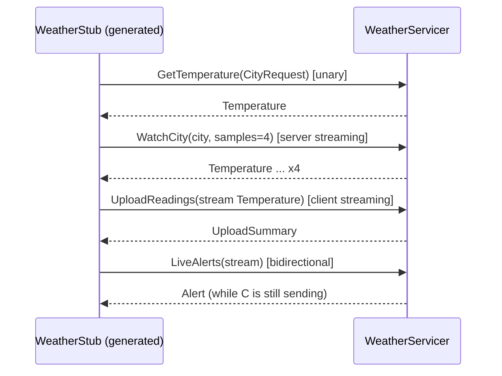

# 12 · gRPC: Protocol Buffers, HTTP/2 and streaming

> **Slides:** 20 · **Code:** [`demo.py`](demo.py) · **Back to:** [main README](../../README.md)

## 1. The idea

**gRPC** is modern, **contract-first** RPC. The API is written in an IDL (`protos/weather.proto`), and client and server
stubs are *generated* for many languages. Messages are compact binary **Protocol Buffers**, carried over **HTTP/2**, which
enables **four call types** (unary, server streaming, client streaming, bidirectional). Deadlines and rich status codes are
built in.

## 2. The picture



## 3. Run it

```bash
python examples/12_grpc/demo.py        # the whole story
python run_all.py 12                                  # same, through the runner
```

Install / tools (same block as in the `demo.py` docstring):

```text
pip install grpcio grpcio-tools
python -m grpc_tools.protoc -Iexamples/12_grpc/protos --python_out=. --grpc_python_out=. \
       examples/12_grpc/protos/weather.proto      # what demo.py does automatically
grpcurl (CLI client, like curl for gRPC): https://github.com/fullstorydev/grpcurl  (brew install grpcurl)
```

## 4. Walkthrough: what happens, step by step

Each step corresponds to one `▶` section of the console output. The excerpt is from a real run; timings and ports differ between runs.

### Step 1 · 1) Unary RPC + payload size: protobuf vs JSON

`compile_proto()` runs `grpc_tools.protoc` into `generated/` at start-up; then `GetTemperature` is a plain unary call.
**Point out:** the same data is 24 bytes in protobuf and 66 bytes in JSON.

```text
  0.07s [      client] GetTemperature(bilbao) -> 19.2°C
  0.07s [      client] protobuf message = 24 bytes vs JSON = 66 bytes
```

### Step 2 · Status codes and deadlines

An unknown city gives `context.abort(NOT_FOUND)`; `slowtown` sleeps for 1 s while the client allows 0.3 s, so the result is
`DEADLINE_EXCEEDED`.
**Point out:** the error codes are standard and understood by every gRPC language.

```text
  0.08s [      client] GetTemperature(atlantis) -> NOT_FOUND: unknown city 'atlantis'
  0.38s [      client] GetTemperature(slowtown) -> DEADLINE_EXCEEDED: Deadline Exceeded
```

### Step 3 · 2) Server streaming: subscribe to a city and receive a stream

`WatchCity()` is a generator: the server `yield`s 4 samples and the client iterates over them as they arrive.

```text
  0.48s [      client] stream item: madrid 25.0°C
  0.58s [      client] stream item: madrid 25.3°C
  0.68s [      client] stream item: madrid 25.6°C
  0.78s [      client] stream item: madrid 25.9°C
```

### Step 4 · 3) Client streaming: upload many readings, get one summary

The client passes a generator of readings; `UploadReadings()` consumes the stream and answers once.

```text
  0.78s [      client] sending 18.0
  0.78s [      client] sending 18.6
  0.78s [      client] sending 19.1
  0.78s [      client] sending 20.3
  0.78s [      client] server summary: received=4 mean=19.0
```

### Step 5 · 4) Bidirectional streaming: alerts come back while we are still sending

`LiveAlerts()` answers each reading immediately.
**Point out:** alerts come back **while** the client is still sending (look at the timestamps).

```text
  0.84s [      client] alert: sevilla OK     31.0°C
  0.89s [      client] alert: sevilla YELLOW 36.5°C
  0.94s [      client] alert: sevilla RED    41.2°C
  0.99s [      client] alert: sevilla OK     33.0°C
```

## 5. Code map

Read the code in this order: the table follows the file from top to bottom.

| Where | Symbol | What it does |
|---|---|---|
| [`demo.py:59`](demo.py#L59) | function `compile_proto` | Generate ``weather_pb2.py`` and ``weather_pb2_grpc.py`` into ./generated. |
| [`demo.py:80`](demo.py#L80) | function `now_ms` | Current time in milliseconds. |
| [`demo.py:85`](demo.py#L85) | class `WeatherServicer` | Server-side implementation of the generated interface. |
| [`demo.py:88`](demo.py#L88) | &nbsp;&nbsp;↳ `GetTemperature()` | Unary RPC. |
| [`demo.py:98`](demo.py#L98) | &nbsp;&nbsp;↳ `WatchCity()` | Server-streaming RPC: push samples as they are produced. |
| [`demo.py:105`](demo.py#L105) | &nbsp;&nbsp;↳ `UploadReadings()` | Client-streaming RPC: consume a stream, answer once. |
| [`demo.py:113`](demo.py#L113) | &nbsp;&nbsp;↳ `LiveAlerts()` | Bidirectional streaming: answer each reading as it arrives. |
| [`demo.py:120`](demo.py#L120) | function `main` | Start the server, run the four RPC kinds from a client. |
| [`protos/weather.proto`](protos/weather.proto) | contract | gRPC/protobuf IDL compiled into the Python stubs |

## 6. Points to stress in class

- The .proto is the single source of truth, and stubs are generated (polyglot).
- Binary + HTTP/2 = efficient service-to-service communication.
- Always set deadlines between services; propagate them.
- Browsers need gRPC-Web or a gateway; REST/GraphQL usually face the Internet (edge), gRPC inside.

## 7. Discussion questions

1. What happens to old clients if you add a field to `Temperature`? And if you renumber a field?
2. Why is a deadline better than a simple timeout in a chain of services?
3. Which of the four call types fits: file upload, chat, stock ticker, login?

## 8. Try it yourself

- Add a field `humidity = 4;` to `Temperature`, regenerate, and check compatibility.
- Call the server with `grpcurl` (see the Install block of `demo.py`).
- Write a client in another language from the same .proto.

## 9. Further reading

- [gRPC Python quick start](https://grpc.io/docs/languages/python/quickstart/)
- [gRPC Python basics tutorial (all 4 streaming kinds)](https://grpc.io/docs/languages/python/basics/)
- [gRPC generated-code reference (Python)](https://grpc.io/docs/languages/python/generated-code/)
- [Protocol Buffers: proto3 language guide](https://protobuf.dev/programming-guides/proto3/)
- [gRPC status codes](https://grpc.io/docs/guides/status-codes/)
- [gRPC deadlines](https://grpc.io/docs/guides/deadlines/)

## 10. Full console output of a real run

<details><summary>Show / hide</summary>

```text
==============================================================================
 12 · gRPC: Protocol Buffers, HTTP/2 and streaming  [slides 20]
==============================================================================
  0.07s [      server] gRPC server on :41619 (stubs generated from protos/weather.proto)

▶ 1) Unary RPC + payload size: protobuf vs JSON
  0.07s [      client] GetTemperature(bilbao) -> 19.2°C
  0.07s [      client] protobuf message = 24 bytes vs JSON = 66 bytes

▶ Status codes and deadlines
  0.08s [      client] GetTemperature(atlantis) -> NOT_FOUND: unknown city 'atlantis'
  0.38s [      client] GetTemperature(slowtown) -> DEADLINE_EXCEEDED: Deadline Exceeded

▶ 2) Server streaming: subscribe to a city and receive a stream
  0.48s [      client] stream item: madrid 25.0°C
  0.58s [      client] stream item: madrid 25.3°C
  0.68s [      client] stream item: madrid 25.6°C
  0.78s [      client] stream item: madrid 25.9°C

▶ 3) Client streaming: upload many readings, get one summary
  0.78s [      client] sending 18.0
  0.78s [      client] sending 18.6
  0.78s [      client] sending 19.1
  0.78s [      client] sending 20.3
  0.78s [      client] server summary: received=4 mean=19.0

▶ 4) Bidirectional streaming: alerts come back while we are still sending
  0.84s [      client] alert: sevilla OK     31.0°C
  0.89s [      client] alert: sevilla YELLOW 36.5°C
  0.94s [      client] alert: sevilla RED    41.2°C
  0.99s [      client] alert: sevilla OK     33.0°C

Key takeaways:
  • Contract-first: the .proto is the single source of truth; stubs are generated (polyglot).
  • Binary protobuf is smaller and faster to parse than JSON; HTTP/2 enables 4 streaming modes.
  • Deadlines and rich status codes are first-class - essential between microservices.
  • Typical split: REST/GraphQL at the edge (browsers), gRPC inside the cluster (service-to-service).
```

</details>
