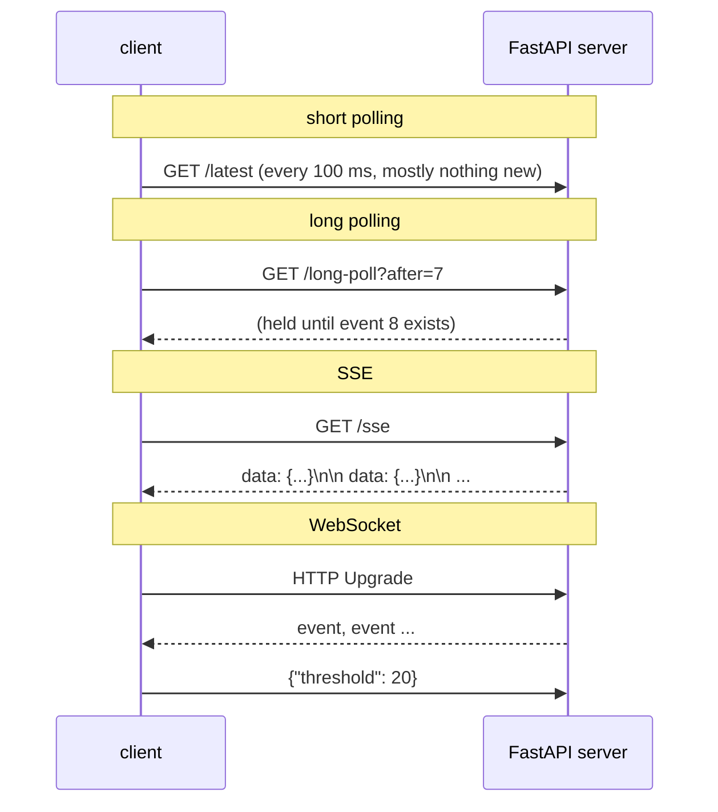

# 13 · Real-time web: polling, long polling, SSE and WebSocket

> **Slides:** 59-63 · **Code:** [`demo.py`](demo.py) · **Back to:** [main README](../../README.md)

## 1. The idea

HTTP is request/response: the **server cannot speak first**. The example compares four ways of getting server-side
events (new temperature readings) to a client quickly. They are **short polling**, **long polling**, **Server-Sent Events** (one HTTP
response streamed forever) and **WebSocket** (an upgraded full-duplex channel). It measures requests, events and latency for each.

## 2. The picture



## 3. Run it

```bash
python examples/13_realtime_web/demo.py        # the whole story
python run_all.py 13                                  # same, through the runner
```

Install / tools (same block as in the `demo.py` docstring):

```text
pip install fastapi uvicorn httpx websockets
curl -N http://127.0.0.1:<port>/sse                 # watch an SSE stream by hand
python -m websockets ws://127.0.0.1:<port>/ws       # interactive WebSocket client
```

## 4. Walkthrough: what happens, step by step

Each step corresponds to one `▶` section of the console output. The excerpt is from a real run; timings and ports differ between runs.

### Step 1 · Short polling every 100 ms

A background `sensor()` coroutine publishes an event every 250 ms into the `EventBus`. `short_polling()` asks
`/latest` every 100 ms.
**Point out:** many **wasted requests**, and a latency of tens of ms that depends on the polling interval.

```text
  2.72s [  short-poll] HTTP requests= 20  events= 9  avg latency=  60.4 ms (11 wasted requests)
```

### Step 2 · Long polling

`/long-poll` awaits `EventBus.wait_after()`, so the server **holds** the request until something newer exists.
**Point out:** one request per event and almost zero latency.

```text
  4.80s [   long-poll] HTTP requests=  9  events= 9  avg latency=   1.0 ms
```

### Step 3 · Server-Sent Events (server -> client stream)

`/sse` returns a `StreamingResponse` with `text/event-stream` lines (`id:`, `event:`, `data:`).
**Point out:** **one** HTTP request, a stream of events, and sub-millisecond latency. This is also how LLM APIs stream tokens.

```text
  4.85s [         sse] Content-Type: text/event-stream; charset=utf-8
  6.80s [         sse] HTTP requests=  1  events= 7  avg latency=   0.5 ms
```

### Step 4 · WebSocket (bidirectional)

`/ws` pushes events AND reads commands at the same time (`receive_commands` task). The client sets a threshold
halfway through and the server acknowledges it on the same socket.
**Point out:** full duplex after one HTTP upgrade.

```text
  7.81s [   websocket] client -> server: only send readings >= 20°C from now on
  7.81s [   websocket] server ack on the same socket: threshold set to 20.0
  8.81s [   websocket] HTTP requests=  1  events= 5  avg latency=   0.6 ms (1 HTTP upgrade, then full duplex)
```

### Step 5 · Comparison

The final table summarises requests, events and average latency for the four techniques.

```text
  technique     requests  events  latency ms
  short-poll          20       9        60.4
  long-poll            9       9         1.0
  sse                  1       7         0.5
  websocket            1       5         0.6
```

## 5. Code map

Read the code in this order: the table follows the file from top to bottom.

| Where | Symbol | What it does |
|---|---|---|
| [`demo.py:66`](demo.py#L66) | class `EventBus` | Holds the latest events and wakes up waiters (asyncio). |
| [`demo.py:74`](demo.py#L74) | &nbsp;&nbsp;↳ `publish()` | Store an event and notify everybody waiting. |
| [`demo.py:80`](demo.py#L80) | &nbsp;&nbsp;↳ `wait_after()` | Return events with ``seq`` greater than the given one, waiting up to ``timeout``. |
| [`demo.py:90`](demo.py#L90) | function `create_app` | Build the app with the four real-time endpoints. |
| [`demo.py:161`](demo.py#L161) | function `report` | Log and return the statistics of one technique. |
| [`demo.py:168`](demo.py#L168) | function `short_polling` | Ask every 100 ms whether something changed. |
| [`demo.py:182`](demo.py#L182) | function `long_polling` | Re-issue a held request as soon as the previous one returns. |
| [`demo.py:196`](demo.py#L196) | function `server_sent_events` | One request; parse the text/event-stream as it arrives. |
| [`demo.py:209`](demo.py#L209) | function `websocket` | Receive events AND send a command on the same connection. |
| [`demo.py:227`](demo.py#L227) | function `main` | Run the four techniques one after another against the same server. |

## 6. Points to stress in class

- Polling = simple but wasteful; latency is bounded by the interval.
- Long polling works everywhere (plain HTTP) but costs one request per event.
- SSE: server→client only, auto-reconnect in browsers (`EventSource`), plain HTTP (proxies OK).
- WebSocket: bidirectional; needs connection management (heartbeats, reconnection, scaling sticky sessions).

## 7. Discussion questions

1. Which technique would you use for: a stock ticker, a chat, a progress bar, an LLM answer?
2. Why does the event loop (asyncio) make holding thousands of connections cheap?
3. What happens to SSE/WebSocket connections behind a load balancer?

## 8. Try it yourself

- Change `PERIOD` to 0.05 and compare the table.
- Open `/sse` in a browser or with `curl -N` while the server runs.
- Connect two WebSocket clients with different thresholds.

## 9. Further reading

- [MDN: Using server-sent events](https://developer.mozilla.org/en-US/docs/Web/API/Server-sent_events/Using_server-sent_events)
- [MDN: The WebSocket API](https://developer.mozilla.org/en-US/docs/Web/API/WebSockets_API)
- [HTML standard: server-sent events](https://html.spec.whatwg.org/multipage/server-sent-events.html)
- [RFC 6455: The WebSocket Protocol](https://www.rfc-editor.org/rfc/rfc6455)
- [FastAPI: WebSockets](https://fastapi.tiangolo.com/advanced/websockets/)
- [websockets library documentation](https://websockets.readthedocs.io/)

## 10. Full console output of a real run

<details><summary>Show / hide</summary>

```text
==============================================================================
 13 · Real-time web: polling, long polling, SSE, WebSocket  [slides 59-63]
==============================================================================

▶ Short polling every 100 ms
  2.72s [  short-poll] HTTP requests= 20  events= 9  avg latency=  60.4 ms (11 wasted requests)

▶ Long polling
  4.80s [   long-poll] HTTP requests=  9  events= 9  avg latency=   1.0 ms 

▶ Server-Sent Events (server -> client stream)
  4.85s [         sse] Content-Type: text/event-stream; charset=utf-8
  6.80s [         sse] HTTP requests=  1  events= 7  avg latency=   0.5 ms 

▶ WebSocket (bidirectional)
  7.81s [   websocket] client -> server: only send readings >= 20°C from now on
  7.81s [   websocket] server ack on the same socket: threshold set to 20.0
  8.81s [   websocket] HTTP requests=  1  events= 5  avg latency=   0.6 ms (1 HTTP upgrade, then full duplex)

▶ Comparison
  technique     requests  events  latency ms
  short-poll          20       9        60.4
  long-poll            9       9         1.0
  sse                  1       7         0.5
  websocket            1       5         0.6

Key takeaways:
  • Short polling wastes requests and its latency depends on the polling interval.
  • Long polling gives near-immediate delivery with plain HTTP, at one request per event.
  • SSE: one HTTP response streamed forever; perfect for server->client feeds (and LLM token streaming!).
  • WebSocket: full duplex after an HTTP upgrade - chats, games, collaborative editors.
```

</details>
