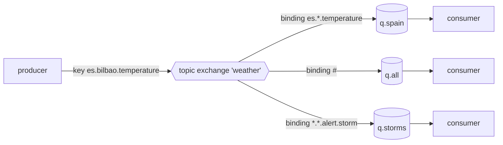

# 14 · AMQP: exchanges, bindings and queues

> **Slides:** 64-71 · **Code:** [`demo.py`](demo.py) · **Back to:** [main README](../../README.md)

## 1. The idea

In AMQP 0-9-1 (RabbitMQ) producers publish to an **exchange** with a **routing key**. **Bindings** decide which **queues**
receive a copy, according to the exchange type: *default*, *direct*, *fanout*, *topic* (`*` and `#` patterns) or *headers*.
Part 1 is an in-process **mini-broker** implementing these rules; part 2 repeats the topic scenario on a **real RabbitMQ** if
one is running.

## 2. The picture



## 3. Run it

```bash
python examples/14_amqp/demo.py        # the whole story
python run_all.py 14                                  # same, through the runner
```

Install / tools (same block as in the `demo.py` docstring):

```text
pip install pika
docker run -it --rm --name rabbitmq -p 5672:5672 -p 15672:15672 rabbitmq:4-management
management UI: http://localhost:15672  (user guest / password guest)
Other installers (Windows, Debian, macOS): https://www.rabbitmq.com/docs/download
```

## 4. Walkthrough: what happens, step by step

Each step corresponds to one `▶` section of the console output. The excerpt is from a real run; timings and ports differ between runs.

### Step 1 · Default exchange: publish 'to a queue' by using its name as routing key

Every declared queue is bound to the nameless exchange by its own name, so "publishing to a queue" is really
publishing to the default exchange with key = queue name.

```text
  0.00s [    producer] -> exchange (default)  key='tasks'                  routed to ['tasks']
```

### Step 2 · Direct exchange (unicast by exact key)

Routing requires `binding key == routing key`. `oslo` has no binding, so the message is **dropped**.

```text
  0.00s [    producer] -> exchange 'readings.direct' key='bilbao'                 routed to ['q.bilbao']
  0.00s [    producer] -> exchange 'readings.direct' key='oslo'                   routed to NOBODY (dropped)
```

### Step 3 · Fanout exchange (broadcast, routing key ignored)

Every bound queue gets a copy and the key is ignored (broadcast).

```text
  0.00s [    producer] -> exchange 'broadcast' key='whatever'               routed to ['q.archive', 'q.dash']
```

### Step 4 · Topic exchange (pub/sub with patterns: * one word, # zero or more)

`topic_matches()` implements `*` (exactly one word) and `#` (zero or more words) recursively.
**Point out:** one message can land in several queues (`q.all` and `q.spain`).

```text
  0.00s [    producer] -> exchange 'weather'  key='es.bilbao.temperature'  routed to ['q.all', 'q.spain']
  0.00s [    producer] -> exchange 'weather'  key='no.oslo.temperature'    routed to ['q.all']
  0.00s [    producer] -> exchange 'weather'  key='es.bilbao.alert.storm'  routed to ['q.all', 'q.storms']
```

### Step 5 · Headers exchange (route on message headers, x-match all/any)

Bindings match message headers with `x-match: any|all`, and the routing key is ignored.

```text
  0.00s [    producer] -> exchange 'reports'  key=''                       routed to ['q.pdf-or-eu']
  0.00s [    producer] -> exchange 'reports'  key=''                       routed to NOBODY (dropped)
```

### Step 6 · Consumers drain their queues

Each queue's content shows the result of the routing.

```text
  0.00s [consumer:tasks] ['recompute averages']
  0.00s [consumer:q.bilbao] ['19.2']
  0.00s [consumer:q.spain] ['19.2']
  0.00s [consumer:q.all] ['19.2', '9.1', 'wind 90 km/h']
  0.00s [consumer:q.storms] ['wind 90 km/h']
  0.00s [consumer:q.dash] ['system maintenance at 02:00']
  0.00s [consumer:q.archive] ['system maintenance at 02:00']
  0.00s [consumer:q.pdf-or-eu] ['monthly.pdf']
```

### Step 7 · Part 2: the same topic routing on a REAL RabbitMQ broker (pika)

`real_rabbitmq_demo()` uses **pika**: it declares a topic exchange and server-named exclusive queues, publishes, and reads with
`basic_get`. It is skipped if pika is missing or no broker listens on 5672.

```text
  0.03s [    rabbitmq] no broker on localhost:5672 -> skipping part 2 (see docker command in docstring)
```

## 5. Code map

Read the code in this order: the table follows the file from top to bottom.

| Where | Symbol | What it does |
|---|---|---|
| [`demo.py:64`](demo.py#L64) | function `topic_matches` | AMQP topic matching: ``*`` = exactly one word, ``#`` = zero or more words. |
| [`demo.py:76`](demo.py#L76) | class `Binding` | Link between an exchange and a queue. |
| [`demo.py:84`](demo.py#L84) | class `MiniBroker` | Tiny AMQP-like broker implementing the five exchange types. |
| [`demo.py:93`](demo.py#L93) | &nbsp;&nbsp;↳ `exchange_declare()` | Declare an exchange (applications declare what they need - 'programmable protocol'). |
| [`demo.py:97`](demo.py#L97) | &nbsp;&nbsp;↳ `queue_declare()` | Declare a queue; it is auto-bound to the default exchange by its name. |
| [`demo.py:102`](demo.py#L102) | &nbsp;&nbsp;↳ `queue_bind()` | Bind a queue to an exchange with a binding key / header arguments. |
| [`demo.py:106`](demo.py#L106) | &nbsp;&nbsp;↳ `_route()` |  |
| [`demo.py:124`](demo.py#L124) | &nbsp;&nbsp;↳ `basic_publish()` | Publish a message; returns the queues that received a copy. |
| [`demo.py:133`](demo.py#L133) | &nbsp;&nbsp;↳ `drain()` | Consume all messages in a queue. |
| [`demo.py:140`](demo.py#L140) | function `mini_broker_demo` | Show the five exchange types with the in-process broker. |
| [`demo.py:181`](demo.py#L181) | function `rabbitmq_available` | True if something listens on the AMQP port. |
| [`demo.py:190`](demo.py#L190) | function `real_rabbitmq_demo` | Topic exchange scenario against a real RabbitMQ using pika. |
| [`demo.py:222`](demo.py#L222) | function `main` | Run both parts. |
| [`rabbitmq_send.py:19`](rabbitmq_send.py#L19) | function `main` | Publish ``text`` to the 'hello' queue through the default exchange. |
| [`rabbitmq_receive.py:14`](rabbitmq_receive.py#L14) | function `on_message` | Callback invoked by pika for every delivered message. |
| [`rabbitmq_receive.py:19`](rabbitmq_receive.py#L19) | function `main` | Consume forever from the 'hello' queue. |

## 6. Points to stress in class

- Producers never address queues; the exchange + bindings decide (decoupling).
- One protocol covers point-to-point and pub/sub.
- Applications declare their own entities: a 'programmable protocol' (slide 65).
- Unroutable messages are dropped unless you configure an alternate exchange / publisher confirms.

## 7. Discussion questions

1. Design bindings so that Spanish storm alerts go to an SMS queue and all alerts to an archive.
2. What is the difference between the fanout exchange and the topic pattern `#`?
3. How do ACKs, prefetch and durable queues change reliability?

## 8. Try it yourself

- Start RabbitMQ with Docker (see the Install block), rerun, and open the management UI at :15672.
- Run `rabbitmq_receive.py` and `rabbitmq_send.py hola` in two terminals.
- Add an alternate exchange to catch unroutable messages in the mini-broker.

## 9. Further reading

- [RabbitMQ tutorials (Python, pika)](https://www.rabbitmq.com/tutorials)
- [AMQP 0-9-1 model explained](https://www.rabbitmq.com/tutorials/amqp-concepts)
- [Tutorial 5: topic exchanges (Python)](https://www.rabbitmq.com/tutorials/tutorial-five-python)
- [AMQP 0-9-1 complete reference](https://www.rabbitmq.com/amqp-0-9-1-reference)
- [Pika documentation](https://pika.readthedocs.io/)
- [A quick guide to understanding RabbitMQ & AMQP (slide 71)](https://medium.com/swlh/a-quick-guide-to-understanding-rabbitmq-amqp-ba25fdfe421d)

## 10. Full console output of a real run

<details><summary>Show / hide</summary>

```text
==============================================================================
 14 · AMQP: exchanges, bindings, queues (RabbitMQ model)  [slides 64-71]
==============================================================================

▶ Part 1: in-process mini-broker implementing the AMQP routing rules

▶ Default exchange: publish 'to a queue' by using its name as routing key
  0.00s [    producer] -> exchange (default)  key='tasks'                  routed to ['tasks']

▶ Direct exchange (unicast by exact key)
  0.00s [    producer] -> exchange 'readings.direct' key='bilbao'                 routed to ['q.bilbao']
  0.00s [    producer] -> exchange 'readings.direct' key='oslo'                   routed to NOBODY (dropped)

▶ Fanout exchange (broadcast, routing key ignored)
  0.00s [    producer] -> exchange 'broadcast' key='whatever'               routed to ['q.archive', 'q.dash']

▶ Topic exchange (pub/sub with patterns: * one word, # zero or more)
  0.00s [    producer] -> exchange 'weather'  key='es.bilbao.temperature'  routed to ['q.all', 'q.spain']
  0.00s [    producer] -> exchange 'weather'  key='no.oslo.temperature'    routed to ['q.all']
  0.00s [    producer] -> exchange 'weather'  key='es.bilbao.alert.storm'  routed to ['q.all', 'q.storms']

▶ Headers exchange (route on message headers, x-match all/any)
  0.00s [    producer] -> exchange 'reports'  key=''                       routed to ['q.pdf-or-eu']
  0.00s [    producer] -> exchange 'reports'  key=''                       routed to NOBODY (dropped)

▶ Consumers drain their queues
  0.00s [consumer:tasks] ['recompute averages']
  0.00s [consumer:q.bilbao] ['19.2']
  0.00s [consumer:q.spain] ['19.2']
  0.00s [consumer:q.all] ['19.2', '9.1', 'wind 90 km/h']
  0.00s [consumer:q.storms] ['wind 90 km/h']
  0.00s [consumer:q.dash] ['system maintenance at 02:00']
  0.00s [consumer:q.archive] ['system maintenance at 02:00']
  0.00s [consumer:q.pdf-or-eu] ['monthly.pdf']

▶ Part 2: the same topic routing on a REAL RabbitMQ broker (pika)
  0.03s [    rabbitmq] no broker on localhost:5672 -> skipping part 2 (see docker command in docstring)

Key takeaways:
  • Producers publish to EXCHANGES; bindings decide which QUEUES get a copy.
  • One protocol gives point-to-point (direct/default) AND pub/sub (fanout/topic/headers).
  • Applications declare their own entities: AMQP is a 'programmable protocol'.
  • Messages with no matching binding are dropped (unless an alternate exchange is configured).
```

</details>
