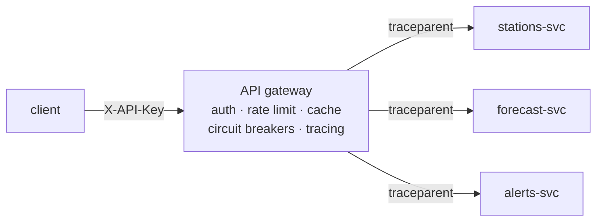

# 15 · Microservices behind an API Gateway

> **Slides:** 27-39 · **Code:** [`demo.py`](demo.py) · **Back to:** [main README](../../README.md)

## 1. The idea

The monolithic service is split into three **independently deployed processes** (stations, forecast, alerts), each
with its own data. An **API gateway** is the single entry point. It handles authentication, rate limiting, routing, parallel **composition**,
caching, **resilience** (timeouts, circuit breaker, fallbacks) and **distributed tracing** (a `traceparent` header shared by all services).

## 2. The picture



## 3. Run it

```bash
python examples/15_microservices_gateway/demo.py        # the whole story
python run_all.py 15                                  # same, through the runner
```

Install / tools (same block as in the `demo.py` docstring):

```text
pip install fastapi uvicorn httpx
optional real tracing: pip install opentelemetry-distro opentelemetry-exporter-otlp
                       opentelemetry-bootstrap -a install
```

## 4. Walkthrough: what happens, step by step

Each step corresponds to one `▶` section of the console output. The excerpt is from a real run; timings and ports differ between runs.

### Step 1 · Authentication at the edge and simple routing

`authenticate()` rejects requests without a valid key (**401**); `/api/stations/{city}` is forwarded to stations-svc
through `call()`.

```text
  1.50s [     gateway] trace=47693bbb /api/stations/bilbao -> 401 in 4 ms
  1.50s [      client] GET /api/stations/bilbao -> 401 {'detail': 'missing or invalid X-API-Key'}
  1.51s [stations-svc] trace=e3a5dea8 GET /stations/bilbao
  1.51s [     gateway] trace=e3a5dea8 /api/stations/bilbao -> 200 in 12 ms
  1.51s [      client] GET /api/stations/bilbao -> 200 {'city': 'bilbao', 'count': 3, 'last': 19.2, 'mean': 18.23, 'min': 17.5, 'max': 19.2}
```

### Step 2 · Composition: one client call -> 3 parallel backend calls (same trace id everywhere)

`/api/dashboard/{city}` calls the three services **in parallel** with `asyncio.gather` and aggregates the results.
The second call is served from the 0.5 s **cache**.
**Point out:** the same `trace=` id appears in the gateway and in the three service logs (W3C Trace Context).

```text
  1.52s [stations-svc] trace=4d44891d GET /stations/bilbao
  1.52s [forecast-svc] trace=4d44891d GET /forecast/bilbao (thinking...)
  1.53s [  alerts-svc] trace=4d44891d GET /alerts/bilbao
  1.73s [     gateway] trace=4d44891d /api/dashboard/bilbao -> 200 in 211 ms
  1.73s [      client] GET /api/dashboard/bilbao -> 200 {'user': 'student', 'city': 'bilbao', 'now': 19.2, 'tomorrow': 19.7, 'alerts': ['wind'], 'degraded': [], 'cache': 'MISS'}
  1.73s [     gateway] trace=b02a6d78 /api/dashboard/bilbao -> 200 in 1 ms
  1.73s [      client] GET /api/dashboard/bilbao -> 200 {'user': 'student', 'city': 'bilbao', 'now': 19.2, 'tomorrow': 19.7, 'alerts': ['wind'], 'degraded': [], 'cache': 'HIT'}
```

### Step 3 · Failure: forecast-svc crashes -> timeouts, circuit opens, degraded responses

forecast-svc is **killed**. The gateway's calls fail, the `CircuitBreaker` moves CLOSED→OPEN after 2 failures, and later requests
**fail fast** without any network call. Responses are **degraded** (`tomorrow: n/a (fallback)`), not errors.

```text
  2.33s [      deploy] 💥 forecast-svc killed
  2.34s [     gateway] forecast: call failed (ConnectError)
  2.34s [  alerts-svc] trace=67b64f60 GET /alerts/madrid
  …
  2.34s [     gateway] forecast: call failed (ConnectError)
  2.34s [     gateway] circuit[forecast] CLOSED -> OPEN
  …
  2.35s [     gateway] forecast: circuit OPEN -> fail fast, no network call
  …
```

### Step 4 · Recovery: forecast-svc is redeployed; after the reset timeout the breaker half-opens

forecast-svc is redeployed; after `reset_after` the breaker becomes HALF_OPEN, and one successful call closes it.

```text
  2.75s [      deploy] forecast-svc back online
  4.35s [     gateway] circuit[forecast] OPEN -> HALF_OPEN
  4.36s [forecast-svc] trace=8486fd7b GET /forecast/madrid (thinking...)
  4.36s [stations-svc] trace=8486fd7b GET /stations/madrid
  4.36s [  alerts-svc] trace=8486fd7b GET /alerts/madrid
  4.56s [     gateway] circuit[forecast] HALF_OPEN -> CLOSED
  4.56s [     gateway] trace=8486fd7b /api/dashboard/madrid -> 200 in 208 ms
  4.56s [      client] GET /api/dashboard/madrid -> 200 {'user': 'student', 'city': 'madrid', 'now': 25.0, 'tomorrow': 26.6, 'alerts': [], 'degraded': [], 'cache': 'MISS'}
```

### Step 5 · Rate limiting: a burst of requests from one client

A `TokenBucket` (2 tokens/s, burst of 5) per API key: 8 quick requests give 5×200 and 3×**429**.

```text
  7.07s [stations-svc] trace=246ae606 GET /stations/oslo
  7.07s [     gateway] trace=246ae606 /api/stations/oslo -> 200 in 4 ms
  7.07s [stations-svc] trace=56dd680c GET /stations/oslo
  …
  7.09s [     gateway] trace=59586b68 /api/stations/oslo -> 429 in 0 ms
  7.09s [     gateway] trace=a27b0dcd /api/stations/oslo -> 429 in 0 ms
  7.09s [     gateway] trace=b6641ac3 /api/stations/oslo -> 429 in 0 ms
  7.09s [      client] 8 quick requests -> status codes [200, 200, 200, 200, 200, 429, 429, 429]
```

## 5. Code map

Read the code in this order: the table follows the file from top to bottom.

| Where | Symbol | What it does |
|---|---|---|
| [`demo.py:74`](demo.py#L74) | function `create_service` | Build one microservice. Each owns its data (database-per-service). |
| [`demo.py:115`](demo.py#L115) | class `CircuitBreaker` | CLOSED -> (N failures) -> OPEN -> (timeout) -> HALF_OPEN -> success: CLOSED / failure: OPEN. |
| [`demo.py:123`](demo.py#L123) | &nbsp;&nbsp;↳ `allow()` | May a call go through right now? |
| [`demo.py:129`](demo.py#L129) | &nbsp;&nbsp;↳ `success()` | Record a successful call. |
| [`demo.py:135`](demo.py#L135) | &nbsp;&nbsp;↳ `failure()` | Record a failed call. |
| [`demo.py:142`](demo.py#L142) | &nbsp;&nbsp;↳ `_set()` |  |
| [`demo.py:148`](demo.py#L148) | class `TokenBucket` | Rate limiter: ``rate`` tokens/second, bursts up to ``capacity``. |
| [`demo.py:155`](demo.py#L155) | &nbsp;&nbsp;↳ `take()` | Consume one token if available. |
| [`demo.py:166`](demo.py#L166) | function `create_gateway` | Build the API Gateway app, given the service base URLs. |
| [`demo.py:240`](demo.py#L240) | function `spawn` | Launch a microservice as a separate OS process. |
| [`demo.py:247`](demo.py#L247) | function `main` | Either run one microservice (``--service``) or the whole demo. |

## 6. Points to stress in class

- Each service = own process, own data, own deployment and failure domain.
- Partial failure is the normal case: timeouts + circuit breakers + fallbacks.
- The gateway is a facade (slide 37) but must not become a new monolith.
- Tracing is how you debug one request across many services (OpenTelemetry).

## 7. Discussion questions

1. What is the difference between a timeout, a retry and a circuit breaker? Why combine them?
2. Which gateway responsibilities could move to a service mesh (Istio/Linkerd)?
3. What must you change to run 3 replicas of stations-svc?

## 8. Try it yourself

- Kill alerts-svc instead and observe the degraded dashboard.
- Add retries with exponential backoff + jitter before the breaker.
- Export the traces to Jaeger with OpenTelemetry (see the references).

## 9. Further reading

- [microservices.io: Microservice Architecture pattern](https://microservices.io/patterns/microservices.html)
- [microservices.io: API Gateway / BFF](https://microservices.io/patterns/apigateway.html)
- [microservices.io: Circuit Breaker](https://microservices.io/patterns/reliability/circuit-breaker.html)
- [M. Fowler: CircuitBreaker](https://martinfowler.com/bliki/CircuitBreaker.html)
- [W3C Trace Context (traceparent header)](https://www.w3.org/TR/trace-context/)
- [OpenTelemetry Python: getting started](https://opentelemetry.io/docs/languages/python/getting-started/)
- [NGINX as an API gateway (slide 39)](https://dzone.com/articles/deploying-nginx-plus-as-an-api-gateway-part-1-ngin)

## 10. Full console output of a real run

<details><summary>Show / hide</summary>

```text
==============================================================================
 15 · Microservices + API Gateway (routing, aggregation, resilience, tracing)  [slides 27-39]
==============================================================================
  1.28s [      deploy] 3 microservices running as separate processes: stations:59041, forecast:41503, alerts:56139

▶ Authentication at the edge and simple routing
  1.50s [     gateway] trace=47693bbb /api/stations/bilbao -> 401 in 4 ms
  1.50s [      client] GET /api/stations/bilbao -> 401 {'detail': 'missing or invalid X-API-Key'}
  1.51s [stations-svc] trace=e3a5dea8 GET /stations/bilbao
  1.51s [     gateway] trace=e3a5dea8 /api/stations/bilbao -> 200 in 12 ms
  1.51s [      client] GET /api/stations/bilbao -> 200 {'city': 'bilbao', 'count': 3, 'last': 19.2, 'mean': 18.23, 'min': 17.5, 'max': 19.2}

▶ Composition: one client call -> 3 parallel backend calls (same trace id everywhere)
  1.52s [stations-svc] trace=4d44891d GET /stations/bilbao
  1.52s [forecast-svc] trace=4d44891d GET /forecast/bilbao (thinking...)
  1.53s [  alerts-svc] trace=4d44891d GET /alerts/bilbao
  1.73s [     gateway] trace=4d44891d /api/dashboard/bilbao -> 200 in 211 ms
  1.73s [      client] GET /api/dashboard/bilbao -> 200 {'user': 'student', 'city': 'bilbao', 'now': 19.2, 'tomorrow': 19.7, 'alerts': ['wind'], 'degraded': [], 'cache': 'MISS'}
  1.73s [     gateway] trace=b02a6d78 /api/dashboard/bilbao -> 200 in 1 ms
  1.73s [      client] GET /api/dashboard/bilbao -> 200 {'user': 'student', 'city': 'bilbao', 'now': 19.2, 'tomorrow': 19.7, 'alerts': ['wind'], 'degraded': [], 'cache': 'HIT'}

▶ Failure: forecast-svc crashes -> timeouts, circuit opens, degraded responses
  2.33s [      deploy] 💥 forecast-svc killed
  2.34s [     gateway] forecast: call failed (ConnectError)
  2.34s [  alerts-svc] trace=67b64f60 GET /alerts/madrid
  2.34s [stations-svc] trace=67b64f60 GET /stations/madrid
  2.34s [     gateway] trace=67b64f60 /api/dashboard/madrid -> 200 in 4 ms
  2.34s [      client] GET /api/dashboard/madrid -> 200 {'user': 'student', 'city': 'madrid', 'now': 25.0, 'tomorrow': 'n/a (fallback)', 'alerts': [], 'degraded': ['forecast'], 'cache': 'MISS'}
  2.34s [stations-svc] trace=42a1c535 GET /stations/madrid
  2.34s [     gateway] forecast: call failed (ConnectError)
  2.34s [     gateway] circuit[forecast] CLOSED -> OPEN
  2.34s [  alerts-svc] trace=42a1c535 GET /alerts/madrid
  2.34s [     gateway] trace=42a1c535 /api/dashboard/madrid -> 200 in 4 ms
  2.34s [      client] GET /api/dashboard/madrid -> 200 {'user': 'student', 'city': 'madrid', 'now': 25.0, 'tomorrow': 'n/a (fallback)', 'alerts': [], 'degraded': ['forecast'], 'cache': 'MISS'}
  2.35s [     gateway] forecast: circuit OPEN -> fail fast, no network call
  2.35s [stations-svc] trace=77261c4d GET /stations/madrid
  2.35s [  alerts-svc] trace=77261c4d GET /alerts/madrid
  2.35s [     gateway] trace=77261c4d /api/dashboard/madrid -> 200 in 3 ms
  2.35s [      client] GET /api/dashboard/madrid -> 200 {'user': 'student', 'city': 'madrid', 'now': 25.0, 'tomorrow': 'n/a (fallback)', 'alerts': [], 'degraded': ['forecast'], 'cache': 'MISS'}

▶ Recovery: forecast-svc is redeployed; after the reset timeout the breaker half-opens
  2.75s [      deploy] forecast-svc back online
  4.35s [     gateway] circuit[forecast] OPEN -> HALF_OPEN
  4.36s [forecast-svc] trace=8486fd7b GET /forecast/madrid (thinking...)
  4.36s [stations-svc] trace=8486fd7b GET /stations/madrid
  4.36s [  alerts-svc] trace=8486fd7b GET /alerts/madrid
  4.56s [     gateway] circuit[forecast] HALF_OPEN -> CLOSED
  4.56s [     gateway] trace=8486fd7b /api/dashboard/madrid -> 200 in 208 ms
  4.56s [      client] GET /api/dashboard/madrid -> 200 {'user': 'student', 'city': 'madrid', 'now': 25.0, 'tomorrow': 26.6, 'alerts': [], 'degraded': [], 'cache': 'MISS'}

▶ Rate limiting: a burst of requests from one client
  7.07s [stations-svc] trace=246ae606 GET /stations/oslo
  7.07s [     gateway] trace=246ae606 /api/stations/oslo -> 200 in 4 ms
  7.07s [stations-svc] trace=56dd680c GET /stations/oslo
  7.07s [     gateway] trace=56dd680c /api/stations/oslo -> 200 in 3 ms
  7.07s [stations-svc] trace=89e6d599 GET /stations/oslo
  7.08s [     gateway] trace=89e6d599 /api/stations/oslo -> 200 in 4 ms
  7.08s [stations-svc] trace=c17df66c GET /stations/oslo
  7.08s [     gateway] trace=c17df66c /api/stations/oslo -> 200 in 3 ms
  7.08s [stations-svc] trace=d38e31ab GET /stations/oslo
  7.09s [     gateway] trace=d38e31ab /api/stations/oslo -> 200 in 3 ms
  7.09s [     gateway] trace=59586b68 /api/stations/oslo -> 429 in 0 ms
  7.09s [     gateway] trace=a27b0dcd /api/stations/oslo -> 429 in 0 ms
  7.09s [     gateway] trace=b6641ac3 /api/stations/oslo -> 429 in 0 ms
  7.09s [      client] 8 quick requests -> status codes [200, 200, 200, 200, 200, 429, 429, 429]

Key takeaways:
  • Each microservice is its own process with its own data; it can be deployed/scaled/fail independently.
  • The gateway is the single entry point: auth, rate limits, routing, aggregation, caching.
  • Partial failures are normal: timeouts + circuit breakers + fallbacks keep the system responsive.
  • Trace context propagation (OpenTelemetry) is how you debug one request across many services.
  • In production: Kong/NGINX/Envoy gateways, and service meshes (Istio, Linkerd) for service-to-service.
```

</details>
