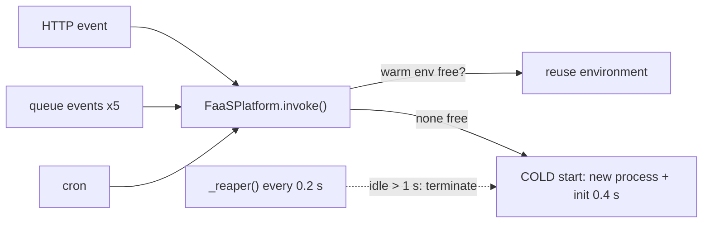

# 16 · Serverless / Function-as-a-Service

> **Slides:** 72 · **Code:** [`demo.py`](demo.py) · **Back to:** [main README](../../README.md)

## 1. The idea

With FaaS you deploy **functions, not servers**. The platform creates **execution environments** on demand for each event
(HTTP, queue, schedule), reuses them while **warm**, scales them out under load, **reclaims** them when idle (scale to zero) and
bills per millisecond of execution × memory. A toy platform (environments = OS processes) makes each mechanism visible.

## 2. The picture



## 3. Run it

```bash
python examples/16_serverless_faas/demo.py        # the whole story
python run_all.py 16                                  # same, through the runner
```

Install / tools (same block as in the `demo.py` docstring):

```text
(nothing: Python standard library only)
Try real FaaS locally: pip install functions-framework   (Google Cloud Run functions)
                       functions-framework --target=<function_name>
AWS SAM CLI: https://docs.aws.amazon.com/serverless-application-model/latest/developerguide/install-sam-cli.html
             sam init && sam local invoke
```

## 4. Walkthrough: what happens, step by step

Each step corresponds to one `▶` section of the console output. The excerpt is from a real run; timings and ports differ between runs.

### Step 1 · HTTP trigger: first call is a COLD start, the next ones are warm (and reuse globals!)

The first `invoke()` of `to_fahrenheit` creates an environment (`environment_main()` sleeps `COLD_START_INIT`), and the next two
reuse it.
**Point out:** latency ~500 ms vs ~100 ms, and `invocations_seen_by_this_env` goes 1, 2, 3 because the module global survives in a warm environment.

```text
  0.50s [http trigger] to_fahrenheit env#1 COLD latency= 503 ms billed=100 ms -> {'city': 'bilbao', 'fahrenheit': 64.4, 'invocations_seen_by_this_env': 1}
  0.61s [http trigger] to_fahrenheit env#1 warm latency= 101 ms billed=100 ms -> {'city': 'bilbao', 'fahrenheit': 77.0, 'invocations_seen_by_this_env': 2}
  0.71s [http trigger] to_fahrenheit env#1 warm latency= 101 ms billed=100 ms -> {'city': 'bilbao', 'fahrenheit': 86.0, 'invocations_seen_by_this_env': 3}
```

### Step 2 · Burst of 5 concurrent queue events -> the platform scales out automatically

5 concurrent queue events: `_acquire()` finds no free environment, so it creates 5 (**autoscaling**, one request per environment).

```text
  1.31s [queue trigger] on_new_reading env#3 COLD latency= 604 ms billed=200 ms -> {'alert': True, 'city': 'madrid'}
  1.31s [queue trigger] on_new_reading env#5 COLD latency= 606 ms billed=200 ms -> {'alert': False, 'city': 'madrid'}
  1.31s [queue trigger] on_new_reading env#6 COLD latency= 607 ms billed=200 ms -> {'alert': True, 'city': 'madrid'}
  1.32s [queue trigger] on_new_reading env#4 COLD latency= 608 ms billed=200 ms -> {'alert': True, 'city': 'madrid'}
  1.32s [queue trigger] on_new_reading env#2 COLD latency= 609 ms billed=200 ms -> {'alert': False, 'city': 'madrid'}
  1.32s [    platform] environments running now: 6
```

### Step 3 · Schedule trigger + a function that exceeds its timeout

The cron-triggered function runs once. `buggy` never ends: `conn.poll(fn.timeout)` expires and the platform **kills** the
environment.

```text
  1.72s [cron trigger] hourly_report env#7 COLD latency= 403 ms billed=1 ms -> report generated at 12:48:51
  1.80s [    platform] scale-to-zero: reclaimed idle env#1 of 'to_fahrenheit'
  2.40s [    platform] scale-to-zero: reclaimed idle env#2 of 'on_new_reading'
  2.40s [    platform] scale-to-zero: reclaimed idle env#3 of 'on_new_reading'
  2.40s [    platform] scale-to-zero: reclaimed idle env#4 of 'on_new_reading'
  2.40s [    platform] scale-to-zero: reclaimed idle env#5 of 'on_new_reading'
  2.40s [    platform] scale-to-zero: reclaimed idle env#6 of 'on_new_reading'
  2.62s [    platform] buggy: ⏱ TIMEOUT after 0.5s -> environment #8 killed
```

### Step 4 · Idle period -> scale to zero

After `IDLE_TIMEOUT`, `_reaper()` terminates idle environments: 0 running.

```text
  2.80s [    platform] scale-to-zero: reclaimed idle env#7 of 'hourly_report'
  4.22s [    platform] environments running now: 0
```

### Step 5 · Next request after scale-to-zero pays a cold start again, and the global counter is RESET

The next call pays a cold start **and the global counter is back to 1**, which proves that functions must be stateless.

```text
  4.73s [http trigger] to_fahrenheit env#9 COLD latency= 504 ms billed=100 ms -> {'city': 'oslo', 'fahrenheit': 48.2, 'invocations_seen_by_this_env': 1}
```

### Step 6 · Billing: you pay only for execution time x memory

Only execution time × memory is billed (GB-s); idle time costs nothing.

```text
  4.73s [     billing] total = 0.3001 GB-s ≈ $0.00000500 (idle time costs nothing)
```

## 5. Code map

Read the code in this order: the table follows the file from top to bottom.

| Where | Symbol | What it does |
|---|---|---|
| [`demo.py:66`](demo.py#L66) | function `to_fahrenheit` | HTTP-triggered function. |
| [`demo.py:75`](demo.py#L75) | function `on_new_reading` | Queue-triggered function: react to a message. |
| [`demo.py:81`](demo.py#L81) | function `hourly_report` | Schedule-triggered function. |
| [`demo.py:86`](demo.py#L86) | function `buggy_infinite_loop` | A function that never ends (to show platform timeouts). |
| [`demo.py:94`](demo.py#L94) | function `environment_main` | Code running inside one execution environment (container). |
| [`demo.py:106`](demo.py#L106) | class `Environment` | A running execution environment for one function. |
| [`demo.py:117`](demo.py#L117) | class `FunctionSpec` | A deployed function. |
| [`demo.py:127`](demo.py#L127) | class `FaaSPlatform` | Schedules invocations onto warm or new environments; reaps idle ones. |
| [`demo.py:139`](demo.py#L139) | &nbsp;&nbsp;↳ `deploy()` | Register a function. No server is started until an event arrives. |
| [`demo.py:144`](demo.py#L144) | &nbsp;&nbsp;↳ `_acquire()` |  |
| [`demo.py:158`](demo.py#L158) | &nbsp;&nbsp;↳ `invoke()` | Handle one event: pick/create an environment, run, bill. |
| [`demo.py:180`](demo.py#L180) | &nbsp;&nbsp;↳ `running()` | Number of live environments across all functions. |
| [`demo.py:184`](demo.py#L184) | &nbsp;&nbsp;↳ `_reaper()` |  |
| [`demo.py:193`](demo.py#L193) | &nbsp;&nbsp;↳ `shutdown()` | Stop everything. |
| [`demo.py:201`](demo.py#L201) | function `main` | Run the FaaS scenarios. |

## 6. Points to stress in class

- No servers to manage; scaling and availability are the platform's job.
- Cold starts are the main latency cost (mitigations: provisioned concurrency, SnapStart).
- Statelessness: keep state in external storage, never in globals.
- Timeouts/limits make FaaS unsuitable for long jobs: use workflows (example 21).

## 7. Discussion questions

1. Why does the burst create 5 environments instead of queueing on 1?
2. Estimate the monthly cost of 1 million invocations of 100 ms at 128 MB.
3. Which workloads are a bad fit for FaaS?

## 8. Try it yourself

- Set `COLD_START_INIT = 2.0` and see the effect on the burst.
- Implement 'provisioned concurrency': keep 1 warm environment per function.
- Run a real function locally with `functions-framework` (see the Install block).

## 9. Further reading

- [AWS Lambda: execution environment lifecycle (cold starts)](https://docs.aws.amazon.com/lambda/latest/dg/lambda-runtime-environment.html)
- [AWS Lambda: function scaling](https://docs.aws.amazon.com/lambda/latest/dg/lambda-concurrency.html)
- [AWS Lambda pricing (GB-seconds)](https://aws.amazon.com/lambda/pricing/)
- [Azure Functions Python developer guide](https://learn.microsoft.com/azure/azure-functions/functions-reference-python)
- [OpenFaaS (open-source FaaS on Kubernetes)](https://docs.openfaas.com/)
- [Knative (serverless on Kubernetes)](https://knative.dev/docs/)

## 10. Full console output of a real run

<details><summary>Show / hide</summary>

```text
==============================================================================
 16 · Serverless / FaaS: cold starts, autoscaling, scale-to-zero, pay-per-use  [slides 72]
==============================================================================
  0.00s [    platform] deployed 'to_fahrenheit' (128 MB, timeout 2.0s) - 0 environments running
  0.00s [    platform] deployed 'on_new_reading' (256 MB, timeout 2.0s) - 0 environments running
  0.00s [    platform] deployed 'hourly_report' (128 MB, timeout 2.0s) - 0 environments running
  0.00s [    platform] deployed 'buggy' (128 MB, timeout 0.5s) - 0 environments running

▶ HTTP trigger: first call is a COLD start, the next ones are warm (and reuse globals!)
  0.50s [http trigger] to_fahrenheit env#1 COLD latency= 503 ms billed=100 ms -> {'city': 'bilbao', 'fahrenheit': 64.4, 'invocations_seen_by_this_env': 1}
  0.61s [http trigger] to_fahrenheit env#1 warm latency= 101 ms billed=100 ms -> {'city': 'bilbao', 'fahrenheit': 77.0, 'invocations_seen_by_this_env': 2}
  0.71s [http trigger] to_fahrenheit env#1 warm latency= 101 ms billed=100 ms -> {'city': 'bilbao', 'fahrenheit': 86.0, 'invocations_seen_by_this_env': 3}

▶ Burst of 5 concurrent queue events -> the platform scales out automatically
  1.31s [queue trigger] on_new_reading env#3 COLD latency= 604 ms billed=200 ms -> {'alert': True, 'city': 'madrid'}
  1.31s [queue trigger] on_new_reading env#5 COLD latency= 606 ms billed=200 ms -> {'alert': False, 'city': 'madrid'}
  1.31s [queue trigger] on_new_reading env#6 COLD latency= 607 ms billed=200 ms -> {'alert': True, 'city': 'madrid'}
  1.32s [queue trigger] on_new_reading env#4 COLD latency= 608 ms billed=200 ms -> {'alert': True, 'city': 'madrid'}
  1.32s [queue trigger] on_new_reading env#2 COLD latency= 609 ms billed=200 ms -> {'alert': False, 'city': 'madrid'}
  1.32s [    platform] environments running now: 6

▶ Schedule trigger + a function that exceeds its timeout
  1.72s [cron trigger] hourly_report env#7 COLD latency= 403 ms billed=1 ms -> report generated at 12:48:51
  1.80s [    platform] scale-to-zero: reclaimed idle env#1 of 'to_fahrenheit'
  2.40s [    platform] scale-to-zero: reclaimed idle env#2 of 'on_new_reading'
  2.40s [    platform] scale-to-zero: reclaimed idle env#3 of 'on_new_reading'
  2.40s [    platform] scale-to-zero: reclaimed idle env#4 of 'on_new_reading'
  2.40s [    platform] scale-to-zero: reclaimed idle env#5 of 'on_new_reading'
  2.40s [    platform] scale-to-zero: reclaimed idle env#6 of 'on_new_reading'
  2.62s [    platform] buggy: ⏱ TIMEOUT after 0.5s -> environment #8 killed

▶ Idle period -> scale to zero
  2.80s [    platform] scale-to-zero: reclaimed idle env#7 of 'hourly_report'
  4.22s [    platform] environments running now: 0

▶ Next request after scale-to-zero pays a cold start again, and the global counter is RESET
  4.73s [http trigger] to_fahrenheit env#9 COLD latency= 504 ms billed=100 ms -> {'city': 'oslo', 'fahrenheit': 48.2, 'invocations_seen_by_this_env': 1}

▶ Billing: you pay only for execution time x memory
  4.73s [     billing] total = 0.3001 GB-s ≈ $0.00000500 (idle time costs nothing)

Key takeaways:
  • No servers to manage: deploy a function, the platform provisions environments per event.
  • Cold starts add latency (runtime boot + imports); warm environments are reused.
  • Autoscaling is per event and scale-to-zero makes idle cost 0 - pay-per-use (GB-s).
  • Functions must be stateless: globals survive only by accident (warm env). Use external storage.
  • Timeouts and limits are enforced by the platform; long work belongs in workflows (see 21).
```

</details>
