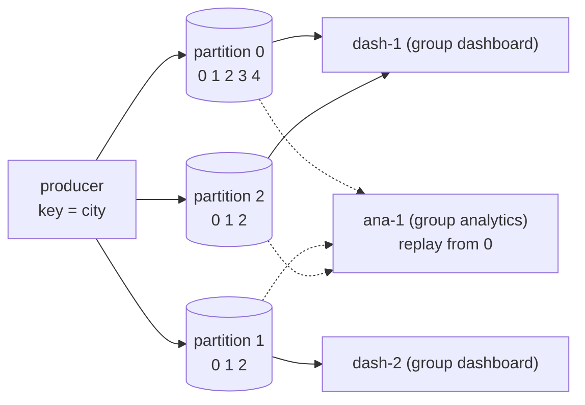

# 17 · Event streaming: the distributed commit log (Kafka-style)

> **Slides:** new · **Code:** [`demo.py`](demo.py) · **Back to:** [main README](../../README.md)

## 1. The idea

Kafka, Redpanda, Pulsar and Kinesis are **persistent, partitioned, append-only logs**, not queues: consuming does **not**
delete. Records with the same **key** go to the same **partition** (per-key ordering), and each has an **offset**. **Consumer
groups** share partitions for scale, different groups read the same data independently, and **committed offsets** allow
recovery and replay. This is the backbone of event-driven architectures and of the capstone (24).

## 2. The picture



## 3. Run it

```bash
python examples/17_event_streaming/demo.py        # the whole story
python run_all.py 17                                  # same, through the runner
```

Install / tools (same block as in the `demo.py` docstring):

```text
(nothing: Python standard library only)
Real Kafka: docker run -d --name kafka -p 9092:9092 apache/kafka:latest
            pip install confluent-kafka
Kafka quickstart: https://kafka.apache.org/quickstart/
```

## 4. Walkthrough: what happens, step by step

Each step corresponds to one `▶` section of the console output. The excerpt is from a real run; timings and ports differ between runs.

### Step 1 · Producers append keyed events; same key -> same partition (per-city ordering)

`Topic.append()` picks `partition_for(key)` (a stable hash) and appends a JSON line to that partition's **file**.
**Point out:** every bilbao record lands in the same partition, with increasing offsets.

```text
  0.00s [    producer] bilbao     17.5 -> partition 1, offset 0
  0.00s [    producer] madrid     24.1 -> partition 2, offset 0
  0.00s [    producer] oslo        8.2 -> partition 0, offset 0
  0.00s [    producer] bilbao     18.0 -> partition 1, offset 1
  0.00s [    producer] madrid     26.3 -> partition 2, offset 1
  0.00s [    producer] barcelona  22.4 -> partition 0, offset 1
  0.00s [    producer] bilbao     19.2 -> partition 1, offset 2
  0.00s [    producer] oslo        7.9 -> partition 0, offset 2
```

### Step 2 · Consumer group 'dashboard' with 2 members shares the partitions

`ConsumerGroup.join()` triggers `_rebalance()`: the partitions are split between dash-1 and dash-2. `poll()` reads from the
committed offset and commits the new one.

```text
  0.00s [group:dashboard] rebalance -> {'dash-1': [0, 1, 2]}
  0.00s [group:dashboard] rebalance -> {'dash-1': [0, 2], 'dash-2': [1]}
  0.00s [      dash-1] p0@0:oslo=8.2, p0@1:barcelona=22.4, p0@2:oslo=7.9, p2@0:madrid=24.1, p2@1:madrid=26.3
  0.00s [      dash-2] p1@0:bilbao=17.5, p1@1:bilbao=18.0, p1@2:bilbao=19.2
```

### Step 3 · An independent group 'analytics' reads the SAME events from offset 0 (replay)

The analytics group starts at offset 0 and reads all 8 events, although dashboard already consumed them.

```text
  0.00s [group:analytics] rebalance -> {'ana-1': [0, 1, 2]}
  0.00s [       ana-1] read 8 events; history is not lost for new readers
```

### Step 4 · dash-2 crashes; new events arrive; dash-1 takes over from the COMMITTED offsets

dash-2 leaves, so there is a rebalance and dash-1 gets all partitions. New events are read **from the committed offsets**
and nothing is re-read ("poll again → nothing new").

```text
  0.00s [group:dashboard] rebalance -> {'dash-1': [0, 1, 2]}
  0.00s [      dash-1] p0@3:oslo=9.1, p0@4:barcelona=23.0, p2@2:madrid=25.0
  0.00s [      dash-1] poll again -> (nothing new)
```

### Step 5 · Stream processing: tumbling-window average per city (like Kafka Streams / Flink)

A tumbling-window average per city over the log (what Kafka Streams/Flink do continuously).

```text
  0.00s [  stream-job] window 0 bilbao    avg=17.75 over 2 events
  0.00s [  stream-job] window 0 madrid    avg=24.10 over 1 events
  0.00s [  stream-job] window 0 oslo      avg= 8.20 over 1 events
  0.00s [  stream-job] window 1 barcelona avg=22.40 over 1 events
  0.00s [  stream-job] window 1 bilbao    avg=19.20 over 1 events
  0.00s [  stream-job] window 1 madrid    avg=26.30 over 1 events
  0.00s [  stream-job] window 1 oslo      avg= 7.90 over 1 events
  0.00s [  stream-job] window 2 barcelona avg=23.00 over 1 events
  0.00s [  stream-job] window 2 madrid    avg=25.00 over 1 events
  0.00s [  stream-job] window 2 oslo      avg= 9.10 over 1 events
```

### Step 6 · Offsets are just numbers per (group, partition): the consumer controls its position

End offsets vs committed offsets per (group, partition). The difference is the **consumer lag**.

```text
  0.00s [      broker] end offsets: [5, 3, 3], committed: {'analytics/p0': 3, 'analytics/p1': 3, 'analytics/p2': 2, 'dashboard/p0': 5, 'dashboard/p1': 3, 'dashboard/p2': 3}
```

## 5. Code map

Read the code in this order: the table follows the file from top to bottom.

| Where | Symbol | What it does |
|---|---|---|
| [`demo.py:58`](demo.py#L58) | class `Topic` | A partitioned, file-backed, append-only log. |
| [`demo.py:69`](demo.py#L69) | &nbsp;&nbsp;↳ `partition_for()` | Deterministic key -> partition mapping (Kafka uses murmur2; any stable hash works). |
| [`demo.py:73`](demo.py#L73) | &nbsp;&nbsp;↳ `append()` | Produce a record. Returns (partition, offset). |
| [`demo.py:81`](demo.py#L81) | &nbsp;&nbsp;↳ `read()` | Fetch records from ``offset`` on (the log is never modified by reads). |
| [`demo.py:87`](demo.py#L87) | &nbsp;&nbsp;↳ `end_offset()` | Offset of the next record to be written. |
| [`demo.py:93`](demo.py#L93) | class `ConsumerGroup` | Group coordinator: assigns partitions to members and stores committed offsets. |
| [`demo.py:100`](demo.py#L100) | &nbsp;&nbsp;↳ `join()` | Add a member and rebalance. |
| [`demo.py:105`](demo.py#L105) | &nbsp;&nbsp;↳ `leave()` | Remove a member (crash or shutdown) and rebalance. |
| [`demo.py:110`](demo.py#L110) | &nbsp;&nbsp;↳ `_rebalance()` |  |
| [`demo.py:115`](demo.py#L115) | &nbsp;&nbsp;↳ `poll()` | Fetch new records for the member's partitions, optionally committing offsets. |
| [`demo.py:129`](demo.py#L129) | function `fmt` | Compact representation of records. |
| [`demo.py:134`](demo.py#L134) | function `main` | Run the event streaming scenarios. |

## 6. Points to stress in class

- A log keeps history, so new consumers and reprocessing are cheap.
- Partitions = unit of parallelism AND of ordering.
- Consumers own their position (offset); commit strategy defines at-least/at-most-once.
- Compare with 04/14: there a consumed message is gone.

## 7. Discussion questions

1. Why can a group never have more active consumers than partitions?
2. What happens if a consumer commits BEFORE processing? And after?
3. How would you rebuild a read model from scratch after a bug?

## 8. Try it yourself

- Use 4 partitions and 3 consumers: print the assignment.
- Implement retention: drop records older than N from each partition.
- Run real Kafka (`docker run -d -p 9092:9092 apache/kafka:latest`) and port the producer to `confluent-kafka`.

## 9. Further reading

- [Apache Kafka quickstart](https://kafka.apache.org/quickstart/)
- [Apache Kafka documentation](https://kafka.apache.org/documentation/)
- [Confluent: Apache Kafka and Python getting started](https://developer.confluent.io/get-started/python/)
- [confluent-kafka Python client](https://docs.confluent.io/kafka-clients/python/current/overview.html)
- [J. Kreps, The Log: what every software engineer should know](https://engineering.linkedin.com/distributed-systems/log-what-every-software-engineer-should-know-about-real-time-datas-unifying)
- [Apache Flink (stream processing)](https://flink.apache.org/)

## 10. Full console output of a real run

<details><summary>Show / hide</summary>

```text
==============================================================================
 17 · Event streaming: partitioned commit log, consumer groups, replay  [NEW: not in slides]
==============================================================================
  0.00s [      broker] topic 'readings' with 3 partitions stored in /tmp/tmp0ydxwt6k

▶ Producers append keyed events; same key -> same partition (per-city ordering)
  0.00s [    producer] bilbao     17.5 -> partition 1, offset 0
  0.00s [    producer] madrid     24.1 -> partition 2, offset 0
  0.00s [    producer] oslo        8.2 -> partition 0, offset 0
  0.00s [    producer] bilbao     18.0 -> partition 1, offset 1
  0.00s [    producer] madrid     26.3 -> partition 2, offset 1
  0.00s [    producer] barcelona  22.4 -> partition 0, offset 1
  0.00s [    producer] bilbao     19.2 -> partition 1, offset 2
  0.00s [    producer] oslo        7.9 -> partition 0, offset 2

▶ Consumer group 'dashboard' with 2 members shares the partitions
  0.00s [group:dashboard] rebalance -> {'dash-1': [0, 1, 2]}
  0.00s [group:dashboard] rebalance -> {'dash-1': [0, 2], 'dash-2': [1]}
  0.00s [      dash-1] p0@0:oslo=8.2, p0@1:barcelona=22.4, p0@2:oslo=7.9, p2@0:madrid=24.1, p2@1:madrid=26.3
  0.00s [      dash-2] p1@0:bilbao=17.5, p1@1:bilbao=18.0, p1@2:bilbao=19.2

▶ An independent group 'analytics' reads the SAME events from offset 0 (replay)
  0.00s [group:analytics] rebalance -> {'ana-1': [0, 1, 2]}
  0.00s [       ana-1] read 8 events; history is not lost for new readers

▶ dash-2 crashes; new events arrive; dash-1 takes over from the COMMITTED offsets
  0.00s [group:dashboard] rebalance -> {'dash-1': [0, 1, 2]}
  0.00s [      dash-1] p0@3:oslo=9.1, p0@4:barcelona=23.0, p2@2:madrid=25.0
  0.00s [      dash-1] poll again -> (nothing new)

▶ Stream processing: tumbling-window average per city (like Kafka Streams / Flink)
  0.00s [  stream-job] window 0 bilbao    avg=17.75 over 2 events
  0.00s [  stream-job] window 0 madrid    avg=24.10 over 1 events
  0.00s [  stream-job] window 0 oslo      avg= 8.20 over 1 events
  0.00s [  stream-job] window 1 barcelona avg=22.40 over 1 events
  0.00s [  stream-job] window 1 bilbao    avg=19.20 over 1 events
  0.00s [  stream-job] window 1 madrid    avg=26.30 over 1 events
  0.00s [  stream-job] window 1 oslo      avg= 7.90 over 1 events
  0.00s [  stream-job] window 2 barcelona avg=23.00 over 1 events
  0.00s [  stream-job] window 2 madrid    avg=25.00 over 1 events
  0.00s [  stream-job] window 2 oslo      avg= 9.10 over 1 events

▶ Offsets are just numbers per (group, partition): the consumer controls its position
  0.00s [      broker] end offsets: [5, 3, 3], committed: {'analytics/p0': 3, 'analytics/p1': 3, 'analytics/p2': 2, 'dashboard/p0': 5, 'dashboard/p1': 3, 'dashboard/p2': 3}

Key takeaways:
  • The log is persistent and immutable: consuming does NOT delete; many groups read independently.
  • Partitions = unit of parallelism and ordering (per key). Groups share partitions among members.
  • Committed offsets make recovery trivial and enable replay/reprocessing of history.
  • Foundation of event-driven microservices, CDC, event sourcing and real-time analytics.
```

</details>
