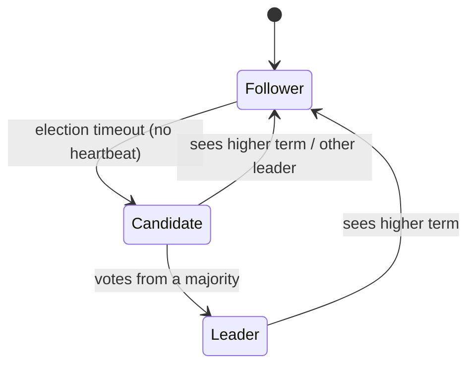

# 18 · Consensus with Raft

> **Slides:** new · **Code:** [`demo.py`](demo.py) · **Back to:** [main README](../../README.md)

## 1. The idea

**Consensus** is getting several servers to agree on **one ordered log** of commands despite crashes and network
partitions. **Raft** (used by etcd/Kubernetes, Consul, CockroachDB, Kafka KRaft) elects a **leader** per **term**; the leader
replicates entries, and an entry is **committed** once stored on a **majority**. A minority partition can never commit, so there is
never a second, conflicting history.

## 2. The picture



## 3. Run it

```bash
python examples/18_consensus_raft/demo.py        # the whole story
python run_all.py 18                                  # same, through the runner
```

Install / tools (same block as in the `demo.py` docstring):

```text
(nothing: Python standard library only)
pip install pysyncobj       # a real Raft library for Python
etcd (Raft-based KV store used by Kubernetes): https://etcd.io/docs/latest/install/
  etcdctl put city bilbao && etcdctl get city
```

## 4. Walkthrough: what happens, step by step

Each step corresponds to one `▶` section of the console output. The excerpt is from a real run; timings and ports differ between runs.

### Step 1 · 1) Leader election at start-up (randomised timeouts avoid split votes)

All nodes start as followers with **randomised** timeouts (`ELECTION_TIMEOUT`). The first to time out runs
`_start_election()` (term+1, `RequestVote`) and wins with a majority of votes.

```text
  0.33s [          n4] follower -> CANDIDATE (term 1)
  0.33s [          n4] candidate -> LEADER (term 1)
  0.33s [          n4] won election with votes from ['n2', 'n3', 'n4']
```

### Step 2 · 2) Replication: commands are committed once a MAJORITY stores them

`submit()` sends a client command to the leader. `_replicate()` sends `AppendEntries` (also used as heartbeats), followers check
`prev_index`/`prev_term`, and on `AppendReply` the leader advances `commit` once a majority has the entry, then every node `_apply()`s it
to its key-value store.

```text
  0.39s [      client] set bilbao=19.2 via n4 -> committed
  0.44s [      client] set madrid=25.0 via n4 -> committed
  0.64s [          n1] follower  term=1 log=2 commit=1 kv={'bilbao': 19.2, 'madrid': 25.0}
  0.64s [          n2] follower  term=1 log=2 commit=1 kv={'bilbao': 19.2, 'madrid': 25.0}
  0.64s [          n3] follower  term=1 log=2 commit=1 kv={'bilbao': 19.2, 'madrid': 25.0}
  0.64s [          n4] leader    term=1 log=2 commit=1 kv={'bilbao': 19.2, 'madrid': 25.0}
  0.64s [          n5] follower  term=1 log=2 commit=1 kv={'bilbao': 19.2, 'madrid': 25.0}
```

### Step 3 · 3) The leader crashes -> a new election, the service continues

The network drops the leader (`net.down`); followers time out and elect a new leader in a **higher term**; service continues.

```text
  0.64s [       chaos] 💥 n4 crashed
  0.91s [          n5] follower -> CANDIDATE (term 2)
  0.91s [          n5] candidate -> LEADER (term 2)
  0.91s [          n5] won election with votes from ['n2', 'n3', 'n5']
  0.97s [      client] set oslo=9.1 via n5 -> committed
```

### Step 4 · 4) The old node comes back and catches up through log replication

The old leader returns as a follower and receives the missing entries.

```text
  0.97s [       chaos] n4 restarted
  1.37s [          n1] follower  term=2 log=3 commit=2 kv={'bilbao': 19.2, 'madrid': 25.0, 'oslo': 9.1}
  1.37s [          n2] follower  term=2 log=3 commit=2 kv={'bilbao': 19.2, 'madrid': 25.0, 'oslo': 9.1}
  1.37s [          n3] follower  term=2 log=3 commit=2 kv={'bilbao': 19.2, 'madrid': 25.0, 'oslo': 9.1}
  1.37s [          n4] follower  term=2 log=3 commit=2 kv={'bilbao': 19.2, 'madrid': 25.0, 'oslo': 9.1}
  1.37s [          n5] leader    term=2 log=3 commit=2 kv={'bilbao': 19.2, 'madrid': 25.0, 'oslo': 9.1}
```

### Step 5 · 5) Network partition: leader + 1 node (minority) vs 3 nodes (majority)

`net.groups = [minority, majority]`: the old leader (minority, 2 of 5) accepts `barcelona=99.9` but can **not commit** it.
The majority elects a new leader that commits `barcelona=23.0`.

```text
  1.37s [       chaos] ✂ partition ['n1', 'n5'] | ['n2', 'n3', 'n4']
  1.65s [          n3] follower -> CANDIDATE (term 3)
  1.65s [          n3] candidate -> LEADER (term 3)
  1.65s [          n3] won election with votes from ['n2', 'n3', 'n4']
  2.17s [      client] set barcelona=99.9 via n5 -> NOT committed after 0.8s (no majority)
  2.21s [      client] set barcelona=23.0 via n3 -> committed
```

### Step 6 · 6) Heal the partition: the stale leader steps down and its uncommitted entry is discarded

The stale leader sees a higher term, steps down, and its uncommitted conflicting entry is **discarded** (the Raft log-matching rule).
All 5 state machines end up identical.

```text
  2.21s [       chaos] partition healed
  2.25s [          n5] leader -> FOLLOWER (term 3)
  2.27s [          n5] discarding uncommitted conflicting entries [('barcelona', 99.9)]
  2.27s [          n1] discarding uncommitted conflicting entries [('barcelona', 99.9)]
  2.81s [          n1] follower  term=3 log=4 commit=3 kv={'bilbao': 19.2, 'madrid': 25.0, 'oslo': 9.1, 'barcelona': 23.0}
  2.81s [          n2] follower  term=3 log=4 commit=3 kv={'bilbao': 19.2, 'madrid': 25.0, 'oslo': 9.1, 'barcelona': 23.0}
  2.81s [          n3] leader    term=3 log=4 commit=3 kv={'bilbao': 19.2, 'madrid': 25.0, 'oslo': 9.1, 'barcelona': 23.0}
  2.81s [          n4] follower  term=3 log=4 commit=3 kv={'bilbao': 19.2, 'madrid': 25.0, 'oslo': 9.1, 'barcelona': 23.0}
  2.81s [          n5] follower  term=3 log=4 commit=3 kv={'bilbao': 19.2, 'madrid': 25.0, 'oslo': 9.1, 'barcelona': 23.0}
  2.81s [       check] all 5 state machines identical: True
```

## 5. Code map

Read the code in this order: the table follows the file from top to bottom.

| Where | Symbol | What it does |
|---|---|---|
| [`demo.py:64`](demo.py#L64) | class `Entry` | A log entry: the term in which it was created and the command. |
| [`demo.py:71`](demo.py#L71) | class `Network` | Simulated network with crashes and partitions. |
| [`demo.py:80`](demo.py#L80) | &nbsp;&nbsp;↳ `can_talk()` | True if a message from ``a`` can reach ``b``. |
| [`demo.py:86`](demo.py#L86) | &nbsp;&nbsp;↳ `send()` | Deliver ``msg`` unless the network forbids it. |
| [`demo.py:93`](demo.py#L93) | class `RaftNode` | One Raft server (single-threaded event loop). |
| [`demo.py:120`](demo.py#L120) | &nbsp;&nbsp;↳ `_new_deadline()` |  |
| [`demo.py:123`](demo.py#L123) | &nbsp;&nbsp;↳ `_majority()` |  |
| [`demo.py:126`](demo.py#L126) | &nbsp;&nbsp;↳ `_last()` |  |
| [`demo.py:129`](demo.py#L129) | &nbsp;&nbsp;↳ `_send()` |  |
| [`demo.py:132`](demo.py#L132) | &nbsp;&nbsp;↳ `_become()` |  |
| [`demo.py:140`](demo.py#L140) | &nbsp;&nbsp;↳ `_loop()` |  |
| [`demo.py:158`](demo.py#L158) | &nbsp;&nbsp;↳ `_start_election()` |  |
| [`demo.py:168`](demo.py#L168) | &nbsp;&nbsp;↳ `_replicate()` |  |
| [`demo.py:176`](demo.py#L176) | &nbsp;&nbsp;↳ `_apply()` |  |
| [`demo.py:185`](demo.py#L185) | &nbsp;&nbsp;↳ `_handle()` |  |
| [`demo.py:249`](demo.py#L249) | class `Cluster` | Convenience wrapper: build nodes, find the leader, submit commands. |
| [`demo.py:259`](demo.py#L259) | &nbsp;&nbsp;↳ `leader()` | Wait until there is a live leader (optionally inside a node subset). |
| [`demo.py:270`](demo.py#L270) | &nbsp;&nbsp;↳ `submit()` | Send a command to ``node`` and wait for the commit notification. |
| [`demo.py:281`](demo.py#L281) | &nbsp;&nbsp;↳ `show()` | Print each node's term, role, log length and state machine. |
| [`demo.py:287`](demo.py#L287) | &nbsp;&nbsp;↳ `stop()` | Stop all node threads. |
| [`demo.py:293`](demo.py#L293) | function `main` | Run the Raft scenarios. |

## 6. Points to stress in class

- Quorums overlap, so there can't be two different committed histories.
- Raft chooses consistency over availability for the minority (CAP).
- Randomised timeouts avoid split votes; terms act as logical clocks.
- 5 nodes tolerate 2 failures; 4 nodes still only tolerate 1.

## 7. Discussion questions

1. Why does the client get 'NOT committed' although the old leader stored the entry?
2. What goes wrong if two leaders could exist in the same term?
3. Why do real systems persist `term`, `voted_for` and the log to disk?

## 8. Try it yourself

- Use 3 nodes and partition 1 | 2.
- Partition 2 | 2 | 1: can anyone commit?
- Watch the algorithm animated at thesecretlivesofdata.com/raft and compare with the log.

## 9. Further reading

- [The Raft consensus algorithm (site + visualisation)](https://raft.github.io/)
- [Ongaro & Ousterhout, In Search of an Understandable Consensus Algorithm](https://raft.github.io/raft.pdf)
- [The Secret Lives of Data: Raft, animated](https://thesecretlivesofdata.com/raft/)
- [etcd documentation](https://etcd.io/docs/)
- [PySyncObj (Raft in Python)](https://github.com/bakwc/PySyncObj)
- [Jepsen: testing distributed systems' safety](https://jepsen.io/)

## 10. Full console output of a real run

<details><summary>Show / hide</summary>

```text
==============================================================================
 18 · Consensus with Raft: leader election, replication, partitions  [NEW: not in slides]
==============================================================================

▶ 1) Leader election at start-up (randomised timeouts avoid split votes)
  0.33s [          n4] follower -> CANDIDATE (term 1)
  0.33s [          n4] candidate -> LEADER (term 1)
  0.33s [          n4] won election with votes from ['n2', 'n3', 'n4']

▶ 2) Replication: commands are committed once a MAJORITY stores them
  0.39s [      client] set bilbao=19.2 via n4 -> committed
  0.44s [      client] set madrid=25.0 via n4 -> committed
  0.64s [          n1] follower  term=1 log=2 commit=1 kv={'bilbao': 19.2, 'madrid': 25.0}
  0.64s [          n2] follower  term=1 log=2 commit=1 kv={'bilbao': 19.2, 'madrid': 25.0}
  0.64s [          n3] follower  term=1 log=2 commit=1 kv={'bilbao': 19.2, 'madrid': 25.0}
  0.64s [          n4] leader    term=1 log=2 commit=1 kv={'bilbao': 19.2, 'madrid': 25.0}
  0.64s [          n5] follower  term=1 log=2 commit=1 kv={'bilbao': 19.2, 'madrid': 25.0}

▶ 3) The leader crashes -> a new election, the service continues
  0.64s [       chaos] 💥 n4 crashed
  0.91s [          n5] follower -> CANDIDATE (term 2)
  0.91s [          n5] candidate -> LEADER (term 2)
  0.91s [          n5] won election with votes from ['n2', 'n3', 'n5']
  0.97s [      client] set oslo=9.1 via n5 -> committed

▶ 4) The old node comes back and catches up through log replication
  0.97s [       chaos] n4 restarted
  1.37s [          n1] follower  term=2 log=3 commit=2 kv={'bilbao': 19.2, 'madrid': 25.0, 'oslo': 9.1}
  1.37s [          n2] follower  term=2 log=3 commit=2 kv={'bilbao': 19.2, 'madrid': 25.0, 'oslo': 9.1}
  1.37s [          n3] follower  term=2 log=3 commit=2 kv={'bilbao': 19.2, 'madrid': 25.0, 'oslo': 9.1}
  1.37s [          n4] follower  term=2 log=3 commit=2 kv={'bilbao': 19.2, 'madrid': 25.0, 'oslo': 9.1}
  1.37s [          n5] leader    term=2 log=3 commit=2 kv={'bilbao': 19.2, 'madrid': 25.0, 'oslo': 9.1}

▶ 5) Network partition: leader + 1 node (minority) vs 3 nodes (majority)
  1.37s [       chaos] ✂ partition ['n1', 'n5'] | ['n2', 'n3', 'n4']
  1.65s [          n3] follower -> CANDIDATE (term 3)
  1.65s [          n3] candidate -> LEADER (term 3)
  1.65s [          n3] won election with votes from ['n2', 'n3', 'n4']
  2.17s [      client] set barcelona=99.9 via n5 -> NOT committed after 0.8s (no majority)
  2.21s [      client] set barcelona=23.0 via n3 -> committed

▶ 6) Heal the partition: the stale leader steps down and its uncommitted entry is discarded
  2.21s [       chaos] partition healed
  2.25s [          n5] leader -> FOLLOWER (term 3)
  2.27s [          n5] discarding uncommitted conflicting entries [('barcelona', 99.9)]
  2.27s [          n1] discarding uncommitted conflicting entries [('barcelona', 99.9)]
  2.81s [          n1] follower  term=3 log=4 commit=3 kv={'bilbao': 19.2, 'madrid': 25.0, 'oslo': 9.1, 'barcelona': 23.0}
  2.81s [          n2] follower  term=3 log=4 commit=3 kv={'bilbao': 19.2, 'madrid': 25.0, 'oslo': 9.1, 'barcelona': 23.0}
  2.81s [          n3] leader    term=3 log=4 commit=3 kv={'bilbao': 19.2, 'madrid': 25.0, 'oslo': 9.1, 'barcelona': 23.0}
  2.81s [          n4] follower  term=3 log=4 commit=3 kv={'bilbao': 19.2, 'madrid': 25.0, 'oslo': 9.1, 'barcelona': 23.0}
  2.81s [          n5] follower  term=3 log=4 commit=3 kv={'bilbao': 19.2, 'madrid': 25.0, 'oslo': 9.1, 'barcelona': 23.0}
  2.81s [       check] all 5 state machines identical: True

Key takeaways:
  • Consensus = agreeing on one ordered log despite crashes and partitions.
  • Majorities (quorums) are the trick: any two majorities overlap, so there can't be two histories.
  • A minority side stays available for reads at most; it cannot commit writes (CAP: Raft picks C over A).
  • This is the heart of etcd/Kubernetes, Consul, CockroachDB, KRaft... (5 nodes tolerate 2 failures).
```

</details>
