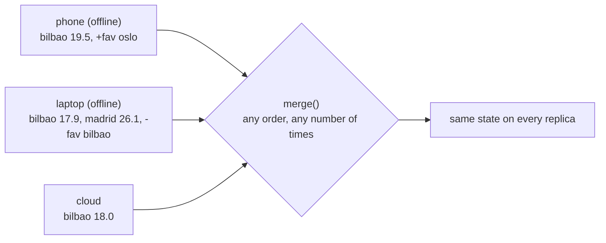

# 19 · CRDTs and local-first software

> **Slides:** new · **Code:** [`demo.py`](demo.py) · **Back to:** [main README](../../README.md)

## 1. The idea

**Conflict-free Replicated Data Types** let every replica accept writes **offline**, with no leader, no locks and no
consensus, and still **converge** once replicas exchange state. That works because `merge` is **commutative, associative and idempotent**
(a mathematical *join*). Three classic CRDTs are shown for a weather app on three devices: **PN-Counter**, **LWW-Map** and **OR-Set** (add-wins).

## 2. The picture



## 3. Run it

```bash
python examples/19_crdt_local_first/demo.py        # the whole story
python run_all.py 19                                  # same, through the runner
```

Install / tools (same block as in the `demo.py` docstring):

```text
(nothing: Python standard library only)
pip install pycrdt          # Python bindings of Yrs (the Rust port of Yjs)
```

## 4. Walkthrough: what happens, step by step

Each step corresponds to one `▶` section of the console output. The excerpt is from a real run; timings and ports differ between runs.

### Step 1 · Shared starting point (synced once)

The cloud reports one reading and a favourite; the phone and laptop `merge_from(cloud.export())`.

```text
  0.00s [       cloud] (offline) report bilbao=18.0
  0.00s [         all] {'readings': 1, 'temps': {'bilbao': 18.0}, 'favs': ['bilbao']}
```

### Step 2 · Network is DOWN: every device keeps working and edits concurrently

Phone and laptop both write `bilbao` (a conflict). The laptop removes the favourite `bilbao` while the phone re-adds it.
**Point out:** local views differ, and every write was instant, without asking anyone.

```text
  0.00s [       phone] (offline) report bilbao=19.5
  0.00s [      laptop] (offline) report bilbao=17.9
  0.00s [      laptop] (offline) report madrid=26.1
  0.00s [       phone] local view: {'readings': 2, 'temps': {'bilbao': 19.5}, 'favs': ['bilbao', 'oslo']}
  0.00s [      laptop] local view: {'readings': 3, 'temps': {'bilbao': 17.9, 'madrid': 26.1}, 'favs': []}
  0.00s [       cloud] local view: {'readings': 1, 'temps': {'bilbao': 18.0}, 'favs': ['bilbao']}
```

### Step 3 · Network is back: gossip states in an arbitrary order (even duplicated)

States are exported as JSON (what travels on the network) and merged in an arbitrary, duplicated order.
**Point out:** all three views are equal. The `why` lines explain each decision: LWW tie-break by replica id, add-wins set, and per-replica counter vectors.

```text
  0.00s [         net] state payload sizes (bytes): {'phone': 172, 'laptop': 197, 'cloud': 130}
  0.00s [       phone] converged view: {'readings': 4, 'temps': {'bilbao': 19.5, 'madrid': 26.1}, 'favs': ['bilbao', 'oslo']}
  0.00s [      laptop] converged view: {'readings': 4, 'temps': {'bilbao': 19.5, 'madrid': 26.1}, 'favs': ['bilbao', 'oslo']}
  0.00s [       cloud] converged view: {'readings': 4, 'temps': {'bilbao': 19.5, 'madrid': 26.1}, 'favs': ['bilbao', 'oslo']}
  0.00s [       check] all replicas equal: True
  0.00s [         why] temps: phone & laptop wrote bilbao at the same logical time -> deterministic tie-break by replica id; nobody's 'madrid' write was lost
  0.00s [         why] favs: 'bilbao' survives because phone's concurrent add carries a tag laptop never observed (add-wins)
  0.00s [         why] readings: 1 + 1 (phone) + 2 (laptop) = 4, no double counting despite duplicate merges
```

### Step 4 · Why it works: merge is commutative + associative + idempotent (all 6 orders tested)

All 6 permutations of merge order give **1** distinct result.

```text
  0.00s [       check] distinct results over all merge orders: 1
```

## 5. Code map

Read the code in this order: the table follows the file from top to bottom.

| Where | Symbol | What it does |
|---|---|---|
| [`demo.py:56`](demo.py#L56) | class `PNCounter` | Counter as two per-replica vectors: P (increments) and N (decrements). |
| [`demo.py:62`](demo.py#L62) | &nbsp;&nbsp;↳ `inc()` | Increment (or decrement if ``k`` < 0) on replica ``rid``. |
| [`demo.py:67`](demo.py#L67) | &nbsp;&nbsp;↳ `value()` | Current value. |
| [`demo.py:71`](demo.py#L71) | &nbsp;&nbsp;↳ `merge()` | Element-wise max of both vectors. |
| [`demo.py:79`](demo.py#L79) | class `LWWMap` | Map where each key keeps the value with the highest (timestamp, replica) stamp. |
| [`demo.py:84`](demo.py#L84) | &nbsp;&nbsp;↳ `set()` | Write ``value`` with a logical timestamp. |
| [`demo.py:88`](demo.py#L88) | &nbsp;&nbsp;↳ `merge()` | Keep, per key, the entry with the largest stamp. |
| [`demo.py:94`](demo.py#L94) | &nbsp;&nbsp;↳ `value()` | Plain dict view. |
| [`demo.py:101`](demo.py#L101) | class `ORSet` | Observed-Remove Set: each add gets a unique tag; remove deletes only observed tags. |
| [`demo.py:107`](demo.py#L107) | &nbsp;&nbsp;↳ `add()` | Add an element with a fresh unique tag. |
| [`demo.py:111`](demo.py#L111) | &nbsp;&nbsp;↳ `remove()` | Tombstone the tags we have *seen* for ``e``. |
| [`demo.py:115`](demo.py#L115) | &nbsp;&nbsp;↳ `value()` | Elements with at least one tag that was not removed. |
| [`demo.py:119`](demo.py#L119) | &nbsp;&nbsp;↳ `merge()` | Union of adds and of removes. |
| [`demo.py:126`](demo.py#L126) | class `Replica` | A device holding the three CRDTs; works fully offline. |
| [`demo.py:134`](demo.py#L134) | &nbsp;&nbsp;↳ `report()` | Local write: new reading. |
| [`demo.py:141`](demo.py#L141) | &nbsp;&nbsp;↳ `export()` | Serialise the full state (what would travel over the network). |
| [`demo.py:148`](demo.py#L148) | &nbsp;&nbsp;↳ `merge_from()` | Merge a remote state (order and repetition don't matter). |
| [`demo.py:156`](demo.py#L156) | &nbsp;&nbsp;↳ `view()` | User-visible state. |
| [`demo.py:161`](demo.py#L161) | function `main` | Run the offline-edit and sync story. |

## 6. Points to stress in class

- Availability + partition tolerance: writes never block (AP side of CAP).
- Semantics are a design choice per data type (LWW, add-wins, counters...).
- Strong eventual consistency: same updates received ⇒ same state.
- Real libraries: Automerge, Yjs (pycrdt), Loro; DBs: Riak, Redis Enterprise, Cosmos DB.

## 7. Discussion questions

1. Why can't a plain integer counter be merged by 'take the max'?
2. Is last-writer-wins acceptable for a bank balance? For a temperature?
3. How do tombstones make CRDT state grow, and how can it be garbage-collected?

## 8. Try it yourself

- Add a 4th replica that syncs only through the laptop (multi-hop gossip).
- Implement a multi-value register that keeps both concurrent values.
- Build the same favourites list with `pycrdt` (Yjs) and compare.

## 9. Further reading

- [crdt.tech: about CRDTs](https://crdt.tech/)
- [crdt.tech: papers](https://crdt.tech/papers.html)
- [Ink & Switch: Local-first software (2019)](https://www.inkandswitch.com/local-first/)
- [Automerge](https://automerge.org/)
- [Yjs documentation](https://docs.yjs.dev/)
- [pycrdt documentation](https://y-crdt.github.io/pycrdt/)

## 10. Full console output of a real run

<details><summary>Show / hide</summary>

```text
==============================================================================
 19 · CRDTs: offline edits that always converge (local-first)  [NEW: not in slides]
==============================================================================

▶ Shared starting point (synced once)
  0.00s [       cloud] (offline) report bilbao=18.0
  0.00s [         all] {'readings': 1, 'temps': {'bilbao': 18.0}, 'favs': ['bilbao']}

▶ Network is DOWN: every device keeps working and edits concurrently
  0.00s [       phone] (offline) report bilbao=19.5
  0.00s [      laptop] (offline) report bilbao=17.9
  0.00s [      laptop] (offline) report madrid=26.1
  0.00s [       phone] local view: {'readings': 2, 'temps': {'bilbao': 19.5}, 'favs': ['bilbao', 'oslo']}
  0.00s [      laptop] local view: {'readings': 3, 'temps': {'bilbao': 17.9, 'madrid': 26.1}, 'favs': []}
  0.00s [       cloud] local view: {'readings': 1, 'temps': {'bilbao': 18.0}, 'favs': ['bilbao']}

▶ Network is back: gossip states in an arbitrary order (even duplicated)
  0.00s [         net] state payload sizes (bytes): {'phone': 172, 'laptop': 197, 'cloud': 130}
  0.00s [       phone] converged view: {'readings': 4, 'temps': {'bilbao': 19.5, 'madrid': 26.1}, 'favs': ['bilbao', 'oslo']}
  0.00s [      laptop] converged view: {'readings': 4, 'temps': {'bilbao': 19.5, 'madrid': 26.1}, 'favs': ['bilbao', 'oslo']}
  0.00s [       cloud] converged view: {'readings': 4, 'temps': {'bilbao': 19.5, 'madrid': 26.1}, 'favs': ['bilbao', 'oslo']}
  0.00s [       check] all replicas equal: True
  0.00s [         why] temps: phone & laptop wrote bilbao at the same logical time -> deterministic tie-break by replica id; nobody's 'madrid' write was lost
  0.00s [         why] favs: 'bilbao' survives because phone's concurrent add carries a tag laptop never observed (add-wins)
  0.00s [         why] readings: 1 + 1 (phone) + 2 (laptop) = 4, no double counting despite duplicate merges

▶ Why it works: merge is commutative + associative + idempotent (all 6 orders tested)
  0.00s [       check] distinct results over all merge orders: 1

Key takeaways:
  • No leader, no locks, no consensus: writes are always local and instant (high availability).
  • Convergence is guaranteed by math: merge is a join (commutative, associative, idempotent).
  • Semantics are chosen per type: LWW for registers, add-wins for sets, per-replica vectors for counters.
  • Trade-off: eventual (not strong) consistency. Libraries: Automerge, Yjs, Loro; DBs: Riak, Redis CRDTs.
```

</details>
