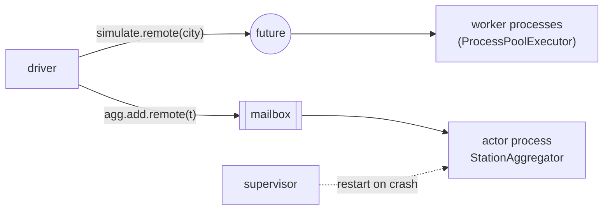

# 20 · Actor model and distributed futures (Ray-style)

> **Slides:** new · **Code:** [`demo.py`](demo.py) · **Back to:** [main README](../../README.md)

## 1. The idea

Frameworks such as **Ray**, Dask, Akka, Orleans and Erlang offer two primitives. **Remote tasks** return **futures**, and futures can
be passed to other tasks to form a **dataflow graph**. **Actors** are stateful objects in their own process that handle **one message at a time**
from a mailbox, so they need no locks. **Supervisors** restart actors that crash ("let it crash"). A mini runtime with Ray's API makes the
mechanics visible, and the same code then runs on the real Ray if it is installed.

## 2. The picture



## 3. Run it

```bash
python examples/20_actor_model/demo.py        # the whole story
python run_all.py 20                                  # same, through the runner
```

Install / tools (same block as in the `demo.py` docstring):

```text
(nothing: Python standard library only)
pip install "ray[default]"  # optional bonus part (large download)
ray start --head            # start a real multi-node cluster head (then: ray stop)
```

## 4. Walkthrough: what happens, step by step

Each step corresponds to one `▶` section of the console output. The excerpt is from a real run; timings and ports differ between runs.

### Step 1 · Remote tasks: sequential vs parallel on 2 worker processes

`remote(climate_simulation)` gives a `RemoteFunction`; `.remote()` returns an `ObjectRef` immediately and `get()` waits.
**Point out:** the measured speed-up (~×1.8 on 2 cores) and the different worker pids.

```text
  0.51s [      driver] got 4 ObjectRefs immediately, work runs in the background
  0.85s [      driver] sequential 0.50s vs parallel 0.34s -> speed-up x1.5; pids=[16181, 16182]
```

### Step 2 · Dataflow: pass futures to other tasks, the runtime resolves dependencies

`combine_r.remote(*refs)` receives **futures**; `RemoteFunction.remote()` resolves them before submitting (dependency resolution).

```text
  0.88s [      driver] combined 2 simulations from pids [16181, 16182]
```

### Step 3 · Actors: stateful, one process each, mailbox => no locks even with concurrent callers

`Aggregator.remote("bilbao")` spawns a process (`_actor_loop`) with a mailbox (`mp.Queue`). Concurrent `add.remote()` calls are
processed in mailbox order: 1, 2, 3, 4.

```text
  0.88s [      driver] add() replies (in mailbox order): [1, 2, 3, 4]; mean=18.7
```

### Step 4 · Supervision: 'let it crash' - a supervisor restarts the failed actor

`add(999)` makes the actor crash hard (`os._exit`). `ActorHandle._on_crash()` fails the pending futures and, because the actor is
supervised, **respawns** it.
**Point out:** the restarted actor has lost its state (1 reading), so persist anything that must survive.

```text
  0.98s [  supervisor] actor StationAggregator (pid 16196) died with exit code 3
  0.99s [      driver] call failed: actor died
  0.99s [  supervisor] restarted StationAggregator in new pid 16200 (state reset!)
  1.29s [      driver] actor alive again: add(7.5) -> 1 reading(s); mean=7.5 (state was lost: persist it if it matters)
```

### Step 5 · Bonus: the same program on the real Ray runtime

`real_ray_demo()` uses `ray.remote` on the same function and class, if Ray is installed.

```text
  5.13s [         ray] tasks ran in Ray worker pids -> [16348, 16349]
  5.58s [         ray] actor mean -> 25.2
```

## 5. Code map

Read the code in this order: the table follows the file from top to bottom.

| Where | Symbol | What it does |
|---|---|---|
| [`demo.py:62`](demo.py#L62) | class `ObjectRef` | A future for a value that may live in another process. |
| [`demo.py:70`](demo.py#L70) | function `get` | Block until the value(s) are ready (like ``ray.get``). |
| [`demo.py:77`](demo.py#L77) | class `Runtime` | Holds the worker pool used for remote tasks. |
| [`demo.py:83`](demo.py#L83) | &nbsp;&nbsp;↳ `init()` | Start the worker processes (like ``ray.init``). |
| [`demo.py:88`](demo.py#L88) | &nbsp;&nbsp;↳ `shutdown()` | Stop the workers. |
| [`demo.py:94`](demo.py#L94) | class `RemoteFunction` | Result of decorating a function with :func:`remote`. |
| [`demo.py:101`](demo.py#L101) | &nbsp;&nbsp;↳ `remote()` | Schedule the task; ObjectRef arguments are resolved first (dataflow). |
| [`demo.py:115`](demo.py#L115) | function `_actor_loop` | Process hosting one actor: handle mailbox messages sequentially. |
| [`demo.py:126`](demo.py#L126) | class `ActorHandle` | Client-side handle; ``handle.method.remote(...)`` sends a message. |
| [`demo.py:137`](demo.py#L137) | &nbsp;&nbsp;↳ `_spawn()` |  |
| [`demo.py:144`](demo.py#L144) | &nbsp;&nbsp;↳ `_pump()` |  |
| [`demo.py:156`](demo.py#L156) | &nbsp;&nbsp;↳ `_on_crash()` |  |
| [`demo.py:168`](demo.py#L168) | &nbsp;&nbsp;↳ `__getattr__()` |  |
| [`demo.py:181`](demo.py#L181) | &nbsp;&nbsp;↳ `kill()` | Stop the actor for good. |
| [`demo.py:187`](demo.py#L187) | function `remote` | Decorator turning a function into a remote task or a class into an actor. |
| [`demo.py:201`](demo.py#L201) | function `climate_simulation` | CPU-heavy pure function (stateless task). |
| [`demo.py:209`](demo.py#L209) | function `combine` | Task that depends on the outputs of other tasks. |
| [`demo.py:214`](demo.py#L214) | class `StationAggregator` | Actor: owns mutable state; messages are processed one at a time. |
| [`demo.py:221`](demo.py#L221) | &nbsp;&nbsp;↳ `add()` | Add a reading (no lock needed: the mailbox serialises calls). |
| [`demo.py:228`](demo.py#L228) | &nbsp;&nbsp;↳ `mean()` | Average of the stored readings. |
| [`demo.py:240`](demo.py#L240) | function `mini_runtime_demo` | Tasks, dataflow, actors and supervision on the mini runtime. |
| [`demo.py:284`](demo.py#L284) | function `real_ray_demo` | Same ideas on Ray, if installed. |
| [`demo.py:303`](demo.py#L303) | function `main` | Run the actor/task demos. |

## 6. Points to stress in class

- Futures let you write sequential-looking code that runs in parallel.
- Actors encapsulate state; concurrency comes from many actors, not threads with locks.
- Failure isolation + supervision trees (Erlang/Akka) = self-healing.
- Ray powers large-scale AI training/serving and reinforcement learning.

## 7. Discussion questions

1. Why are actors free of data races even with many concurrent callers?
2. What happens to messages in the mailbox when the actor crashes?
3. When is a task better than an actor, and vice versa?

## 8. Try it yourself

- Increase `STEPS` and the number of cities; plot speed-up vs workers.
- Make the supervisor restore state from a snapshot file.
- `pip install "ray[default]"` and open the Ray dashboard.

## 9. Further reading

- [What's Ray Core? (tasks, actors, objects)](https://docs.ray.io/en/latest/ray-core/walkthrough.html)
- [Installing Ray](https://docs.ray.io/en/latest/ray-overview/installation.html)
- [Ray actors](https://docs.ray.io/en/latest/ray-core/actors.html)
- [concurrent.futures (futures, process pools)](https://docs.python.org/3/library/concurrent.futures.html)
- [Erlang supervision principles ('let it crash')](https://www.erlang.org/doc/system/sup_princ.html)
- [Pykka: actor model for Python](https://pykka.readthedocs.io/)
- [Akka](https://akka.io/)

## 10. Full console output of a real run

<details><summary>Show / hide</summary>

```text
==============================================================================
 20 · Actor model & distributed futures (Ray/Akka/Orleans style)  [NEW: not in slides]
==============================================================================

▶ Remote tasks: sequential vs parallel on 2 worker processes
  0.51s [      driver] got 4 ObjectRefs immediately, work runs in the background
  0.85s [      driver] sequential 0.50s vs parallel 0.34s -> speed-up x1.5; pids=[16181, 16182]

▶ Dataflow: pass futures to other tasks, the runtime resolves dependencies
  0.88s [      driver] combined 2 simulations from pids [16181, 16182]

▶ Actors: stateful, one process each, mailbox => no locks even with concurrent callers
  0.88s [      driver] add() replies (in mailbox order): [1, 2, 3, 4]; mean=18.7

▶ Supervision: 'let it crash' - a supervisor restarts the failed actor
  0.98s [  supervisor] actor StationAggregator (pid 16196) died with exit code 3
  0.99s [      driver] call failed: actor died
  0.99s [  supervisor] restarted StationAggregator in new pid 16200 (state reset!)
  1.29s [      driver] actor alive again: add(7.5) -> 1 reading(s); mean=7.5 (state was lost: persist it if it matters)

▶ Bonus: the same program on the real Ray runtime
  5.13s [         ray] tasks ran in Ray worker pids -> [16348, 16349]
  5.58s [         ray] actor mean -> 25.2

Key takeaways:
  • Tasks + futures: write sequential-looking code, get parallel/distributed execution and dataflow.
  • Actors encapsulate state and process one message at a time: concurrency without locks.
  • Failures are isolated per actor; supervisors restart them ('let it crash').
  • Ray is how today's LLM training/serving and RL pipelines scale Python across clusters.
```

</details>
