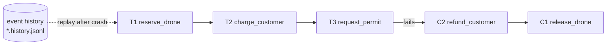

# 21 · Durable workflows and the Saga pattern

> **Slides:** new · **Code:** [`demo.py`](demo.py) · **Back to:** [main README](../../README.md)

## 1. The idea

A business process spanning several services cannot use one ACID transaction. A **Saga** runs local steps and, when one
fails, runs **compensating actions** in reverse order. **Durable execution** (Temporal, Step Functions, Durable Functions,
Restate) records every completed step in an **event history**. If the worker crashes, another worker **replays** the history,
skips the steps already done and continues. Activities also get **automatic retries with backoff**.

## 2. The picture



## 3. Run it

```bash
python examples/21_durable_workflows_saga/demo.py        # the whole story
python run_all.py 21                                  # same, through the runner
```

Install / tools (same block as in the `demo.py` docstring):

```text
(nothing: Python standard library only)
Real durable execution with Temporal:
  pip install temporalio
  Temporal CLI: https://docs.temporal.io/cli/setup-cli   (brew install temporal)
  temporal server start-dev      # local dev server + web UI on http://localhost:8233
```

## 4. Walkthrough: what happens, step by step

Each step corresponds to one `▶` section of the console output. The excerpt is from a real run; timings and ports differ between runs.

### Step 1 · 1) Happy path

`drone_mission()` looks like ordinary sequential code; each `wf.activity()` executes a step and **appends** its result to the
history (fsync'd).

```text
  0.00s [worker-16443] ✓ reserve_drone -> drone-17
  0.00s [worker-16443] ✓ charge_customer -> payment-4990
  0.00s [worker-16443] ✓ request_permit -> permit-bilbao
  0.00s [      client] COMPLETED: drone-17, payment-4990, permit-bilbao
```

### Step 2 · 2) Saga: the last step fails permanently -> compensations run in reverse

Oslo's permit is always denied. After the retries, `ActivityFailed` triggers `compensate_all()`, which runs `refund_customer` and
then `release_drone` (**reverse** order).
**Point out:** the side-effect log shows charge, refund, reserve and release, so the system is back in a consistent state.

```text
  0.00s [worker-16443] ✓ reserve_drone -> drone-45
  0.00s [worker-16443] ✓ charge_customer -> payment-4990
  0.00s [worker-16443] ✗ request_permit attempt 1 failed: airspace closed (storm)
  0.05s [worker-16443] ✗ request_permit attempt 2 failed: airspace closed (storm)
  0.05s [worker-16443] saga step failed (request_permit: airspace closed (storm)) -> compensating in reverse order
  0.05s [worker-16443] ✓ undo_charge_customer -> refunded
  0.05s [worker-16443] ✓ undo_reserve_drone -> released
  0.05s [      client] COMPENSATED (rolled back)
  0.05s [       audit] side effects for wf-oslo: ['drone reserved for oslo', 'customer charged 49.9€', 'refund of payment-4990', 'drone drone-45 released']
```

### Step 3 · 3) Durable execution: the worker CRASHES mid-workflow, another worker resumes it

A worker **process** reserves the drone and then `os._exit(1)`. A new worker runs the same workflow: `activity()` finds the
event in the history and **replays** it ("not executed again").
**Point out:** the side effects show the drone reserved **once**.

```text
  0.06s [worker-16444] ✓ reserve_drone -> drone-25
  0.06s [worker-16444] 💥 worker process crashes (power cut)!
  0.06s [orchestrator] worker exited with code 1; history has 1 event(s). Rescheduling...
  0.07s [worker-16445] ↺ replay reserve_drone -> drone-25 (not executed again)
  0.07s [worker-16445] ✓ charge_customer -> payment-4990
  0.07s [worker-16445] ✓ request_permit -> permit-madrid
  0.07s [      client] COMPLETED: drone-25, payment-4990, permit-madrid
  0.07s [       audit] side effects for wf-madrid: ['drone reserved for madrid', 'customer charged 49.9€', 'permit granted for madrid']  <- drone reserved ONCE
```

### Step 4 · 4) Transient failures: automatic retries with exponential backoff

The payment gateway fails twice (`FLAKY_PAYMENTS`); the retry loop waits 50 ms, then 100 ms, and then succeeds.

```text
  0.07s [worker-16443] ✓ reserve_drone -> drone-35
  0.07s [worker-16443] ✗ charge_customer attempt 1 failed: payment gateway 503
  0.12s [worker-16443] ✗ charge_customer attempt 2 failed: payment gateway 503
  0.22s [worker-16443] ✓ charge_customer -> payment-4990
  0.22s [worker-16443] ✓ request_permit -> permit-barcelona
  0.22s [      client] COMPLETED: drone-35, payment-4990, permit-barcelona
```

## 5. Code map

Read the code in this order: the table follows the file from top to bottom.

| Where | Symbol | What it does |
|---|---|---|
| [`demo.py:62`](demo.py#L62) | class `ActivityFailed` | Raised when an activity keeps failing after all retries. |
| [`demo.py:66`](demo.py#L66) | class `Workflow` | Durable workflow context backed by an append-only JSON-lines history file. |
| [`demo.py:79`](demo.py#L79) | &nbsp;&nbsp;↳ `_record()` |  |
| [`demo.py:85`](demo.py#L85) | &nbsp;&nbsp;↳ `effect()` | Simulate an external side effect (API call, payment, e-mail...). |
| [`demo.py:91`](demo.py#L91) | &nbsp;&nbsp;↳ `activity()` | Run (or replay) one activity. |
| [`demo.py:121`](demo.py#L121) | &nbsp;&nbsp;↳ `compensate_all()` | Saga rollback: run compensations in reverse order (durably, too). |
| [`demo.py:131`](demo.py#L131) | function `reserve_drone` | Reserve a drone in the fleet service. |
| [`demo.py:137`](demo.py#L137) | function `release_drone` | Compensation of :func:`reserve_drone`. |
| [`demo.py:143`](demo.py#L143) | function `charge_customer` | Charge via the payment service (flaky: fails the first 2 times in some runs). |
| [`demo.py:152`](demo.py#L152) | function `refund_customer` | Compensation of :func:`charge_customer`. |
| [`demo.py:158`](demo.py#L158) | function `request_permit` | Ask the aviation authority for a permit (always denied for Oslo). |
| [`demo.py:166`](demo.py#L166) | function `drone_mission` | THE WORKFLOW: ordinary-looking sequential code, made durable by the context. |
| [`demo.py:183`](demo.py#L183) | function `effects` | Side effects actually performed for one workflow. |
| [`demo.py:189`](demo.py#L189) | function `main` | Run the four scenarios. |

## 6. Points to stress in class

- Sagas trade isolation for availability: intermediate states are visible.
- Compensations must themselves be idempotent and retryable.
- Replay requires deterministic workflow code; side effects only inside activities.
- Durable execution makes long-running processes (days) survive deploys and crashes.

## 7. Discussion questions

1. Why must the workflow function be deterministic for replay to work?
2. What if a compensation fails? How do real systems handle it?
3. Why is a Saga not the same as a distributed transaction (2PC)?

## 8. Try it yourself

- Crash after `charge_customer` instead of after the reservation.
- Add a durable timer: wait for a customer confirmation that survives crashes.
- Rewrite the workflow with the Temporal Python SDK and `temporal server start-dev`.

## 9. Further reading

- [microservices.io: Saga pattern](https://microservices.io/patterns/data/saga.html)
- [Garcia-Molina & Salem, Sagas (SIGMOD 1987)](https://dl.acm.org/doi/10.1145/38713.38742)
- [Temporal Python SDK developer guide](https://docs.temporal.io/develop/python)
- [Temporal: set up your local environment (Python)](https://docs.temporal.io/develop/python/set-up-your-local-python)
- [Temporal: run a development server](https://docs.temporal.io/develop/run-a-development-server)
- [Azure Durable Functions](https://learn.microsoft.com/azure/azure-functions/durable/durable-functions-overview)
- [AWS Step Functions](https://docs.aws.amazon.com/step-functions/)

## 10. Full console output of a real run

<details><summary>Show / hide</summary>

```text
==============================================================================
 21 · Durable workflows + Saga pattern (Temporal-style)  [NEW: not in slides]
==============================================================================

▶ 1) Happy path
  0.00s [worker-16443] ✓ reserve_drone -> drone-17
  0.00s [worker-16443] ✓ charge_customer -> payment-4990
  0.00s [worker-16443] ✓ request_permit -> permit-bilbao
  0.00s [      client] COMPLETED: drone-17, payment-4990, permit-bilbao

▶ 2) Saga: the last step fails permanently -> compensations run in reverse
  0.00s [worker-16443] ✓ reserve_drone -> drone-45
  0.00s [worker-16443] ✓ charge_customer -> payment-4990
  0.00s [worker-16443] ✗ request_permit attempt 1 failed: airspace closed (storm)
  0.05s [worker-16443] ✗ request_permit attempt 2 failed: airspace closed (storm)
  0.05s [worker-16443] saga step failed (request_permit: airspace closed (storm)) -> compensating in reverse order
  0.05s [worker-16443] ✓ undo_charge_customer -> refunded
  0.05s [worker-16443] ✓ undo_reserve_drone -> released
  0.05s [      client] COMPENSATED (rolled back)
  0.05s [       audit] side effects for wf-oslo: ['drone reserved for oslo', 'customer charged 49.9€', 'refund of payment-4990', 'drone drone-45 released']

▶ 3) Durable execution: the worker CRASHES mid-workflow, another worker resumes it
  0.06s [worker-16444] ✓ reserve_drone -> drone-25
  0.06s [worker-16444] 💥 worker process crashes (power cut)!
  0.06s [orchestrator] worker exited with code 1; history has 1 event(s). Rescheduling...
  0.07s [worker-16445] ↺ replay reserve_drone -> drone-25 (not executed again)
  0.07s [worker-16445] ✓ charge_customer -> payment-4990
  0.07s [worker-16445] ✓ request_permit -> permit-madrid
  0.07s [      client] COMPLETED: drone-25, payment-4990, permit-madrid
  0.07s [       audit] side effects for wf-madrid: ['drone reserved for madrid', 'customer charged 49.9€', 'permit granted for madrid']  <- drone reserved ONCE

▶ 4) Transient failures: automatic retries with exponential backoff
  0.07s [worker-16443] ✓ reserve_drone -> drone-35
  0.07s [worker-16443] ✗ charge_customer attempt 1 failed: payment gateway 503
  0.12s [worker-16443] ✗ charge_customer attempt 2 failed: payment gateway 503
  0.22s [worker-16443] ✓ charge_customer -> payment-4990
  0.22s [worker-16443] ✓ request_permit -> permit-barcelona
  0.22s [      client] COMPLETED: drone-35, payment-4990, permit-barcelona

Key takeaways:
  • No distributed ACID transactions across services: use Sagas (local steps + compensations).
  • Durable execution persists every step, so workflows survive crashes and restarts transparently.
  • Replay requires deterministic workflow code; side effects live only in activities.
  • Retries/backoff/timeouts become platform concerns (Temporal, Step Functions, Durable Functions, Restate).
```

</details>
