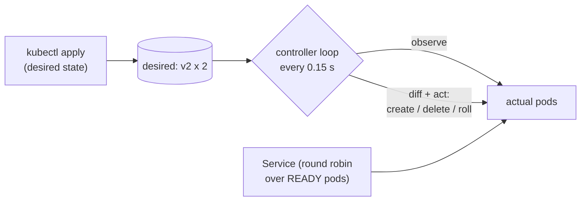

# 22 · Orchestration: desired state and reconciliation loops (Kubernetes-style)

> **Slides:** new · **Code:** [`demo.py`](demo.py) · **Back to:** [main README](../../README.md)

## 1. The idea

Modern platforms are **declarative**: you store the **desired state** ("3 replicas of weather-api:v1") and
**controllers** run a **reconciliation loop** forever: *observe actual state → diff → act*. That single pattern gives
**self-healing**, **scaling** and **zero-downtime rolling updates**. Pods here are real processes running an HTTP server,
and a round-robin **Service** sends traffic only to ready pods.

## 2. The picture



## 3. Run it

```bash
python examples/22_orchestration_reconciliation/demo.py        # the whole story
python run_all.py 22                                  # same, through the runner
```

Install / tools (same block as in the `demo.py` docstring):

```text
(nothing: Python standard library only)
Try it on real Kubernetes: kubectl https://kubernetes.io/docs/tasks/tools/
  kind https://kind.sigs.k8s.io/docs/user/quick-start/  (go install sigs.k8s.io/kind@latest | brew install kind)
  kind create cluster
  kubectl create deployment weather-api --image=nginx:1.27 --replicas=3
  kubectl delete pod <one-pod>      # watch it being recreated: kubectl get pods -w
  kubectl set image deployment/weather-api nginx=nginx:1.28 && kubectl rollout status deployment/weather-api
```

## 4. Walkthrough: what happens, step by step

Each step corresponds to one `▶` section of the console output. The excerpt is from a real run; timings and ports differ between runs.

### Step 1 · Declare: 3 replicas of weather-api:v1 (we never start processes ourselves)

`apply()` only writes the desired state; `_control_loop()` → `_reconcile()` creates the pods. `wait_converged()` waits until
every pod passes the **readiness probe** (`Pod.ready()`), and the Service load-balances 6 requests round-robin.

```text
  0.00s [     kubectl] apply deployment/weather-api: v1 x3
  0.15s [  controller] + create pod weather-api-v1-1
  0.15s [  controller] + create pod weather-api-v1-2
  0.16s [  controller] + create pod weather-api-v1-3
  0.46s [     kubectl] get pods -> weather-api-v1-1(Ready), weather-api-v1-2(Ready), weather-api-v1-3(Ready)
  0.47s [     service] 6 requests load-balanced over pods: ['weather-api-v1-1', 'weather-api-v1-2', 'weather-api-v1-3', 'weather-api-v1-1', 'weather-api-v1-2', 'weather-api-v1-3']
```

### Step 2 · Chaos: a pod is killed -> the controller notices the drift and heals it

A pod process is killed. The next loop iteration observes a dead pod and creates a replacement (**self-healing**).

```text
  0.47s [       chaos] 💥 killed weather-api-v1-1
  0.61s [  controller] ! observed pod weather-api-v1-1 is dead -> will replace
  0.61s [  controller] + create pod weather-api-v1-4
  0.92s [     kubectl] get pods -> weather-api-v1-2(Ready), weather-api-v1-3(Ready), weather-api-v1-4(Ready)
```

### Step 3 · Scale: just change the number in the desired state

Changing the number to 5 and then 2 is enough; the controller creates or deletes the difference.

```text
  0.92s [     kubectl] apply deployment/weather-api: v1 x5
  1.06s [  controller] + create pod weather-api-v1-5
  1.06s [  controller] + create pod weather-api-v1-6
  1.37s [     kubectl] get pods -> weather-api-v1-2(Ready), weather-api-v1-3(Ready), weather-api-v1-4(Ready), weather-api-v1-5(Ready), weather-api-v1-6(Ready)
  1.37s [     kubectl] apply deployment/weather-api: v1 x2
  1.51s [  controller] - delete pod weather-api-v1-4 (scale down)
  1.51s [  controller] - delete pod weather-api-v1-5 (scale down)
  1.51s [  controller] - delete pod weather-api-v1-6 (scale down)
  1.52s [     kubectl] get pods -> weather-api-v1-2(Ready), weather-api-v1-3(Ready)
```

### Step 4 · Rolling update v1 -> v2 while traffic keeps flowing (zero downtime)

Desired version v2: surge one new pod, delete an old one only when the new one is ready, repeat. Traffic keeps flowing.
**Point out:** `failed=0` and the version timeline `111…212121…222`.

```text
  1.53s [     kubectl] apply deployment/weather-api: v2 x2
  1.66s [  controller] + create pod weather-api-v2-7
  2.11s [  controller] - delete pod weather-api-v1-2 (rolling update to v2)
  2.27s [  controller] + create pod weather-api-v2-8
  2.72s [  controller] - delete pod weather-api-v1-3 (rolling update to v2)
  2.89s [     kubectl] get pods -> weather-api-v2-7(Ready), weather-api-v2-8(Ready)
  2.89s [     service] 45 requests during rollout, failed=0
  2.89s [     service] version that answered each request, in order: 111111111111111112121212121212121222122222222
```

## 5. Code map

Read the code in this order: the table follows the file from top to bottom.

| Where | Symbol | What it does |
|---|---|---|
| [`demo.py:63`](demo.py#L63) | function `pod_main` | The 'container': a weather API returning who served the request. |
| [`demo.py:81`](demo.py#L81) | class `Pod` | Actual state of one pod. |
| [`demo.py:89`](demo.py#L89) | &nbsp;&nbsp;↳ `ready()` | Readiness probe: does it accept connections? |
| [`demo.py:98`](demo.py#L98) | class `Cluster` | API server (desired state store) + deployment controller + service. |
| [`demo.py:112`](demo.py#L112) | &nbsp;&nbsp;↳ `apply()` | Declare the desired state. Nothing is started here! |
| [`demo.py:119`](demo.py#L119) | &nbsp;&nbsp;↳ `_control_loop()` |  |
| [`demo.py:125`](demo.py#L125) | &nbsp;&nbsp;↳ `_start_pod()` |  |
| [`demo.py:132`](demo.py#L132) | &nbsp;&nbsp;↳ `_delete_pod()` |  |
| [`demo.py:138`](demo.py#L138) | &nbsp;&nbsp;↳ `_reconcile()` |  |
| [`demo.py:160`](demo.py#L160) | &nbsp;&nbsp;↳ `request()` | Round-robin over READY pods only (like a ClusterIP Service). |
| [`demo.py:173`](demo.py#L173) | &nbsp;&nbsp;↳ `get_pods()` | ``kubectl get pods`` output. |
| [`demo.py:178`](demo.py#L178) | &nbsp;&nbsp;↳ `wait_converged()` | Block until actual == desired and all pods are ready. |
| [`demo.py:191`](demo.py#L191) | &nbsp;&nbsp;↳ `shutdown()` | Stop the controller and all pods. |
| [`demo.py:200`](demo.py#L200) | function `main` | Run the orchestration scenarios. |

## 6. Points to stress in class

- Declarative vs imperative: state WHAT, not HOW.
- Level-triggered loops fix any drift, whatever caused it.
- Readiness probes are what make rolling updates safe.
- Kubernetes, Argo CD/Flux (GitOps), and the ECS service of the capstone deployment.

## 7. Discussion questions

1. Why is a level-triggered loop more robust than reacting to events only?
2. What happens if v2 never becomes ready? How does Kubernetes protect you?
3. Where is the desired state stored in Kubernetes, and why does that need consensus (example 18)?

## 8. Try it yourself

- Make v3 never ready (e.g. `time.sleep(1000)` in `pod_main` for v3) and roll out: the rollout must stall.
- Add `max_surge`/`max_unavailable` parameters.
- Reproduce with real Kubernetes using kind (see the Install block).

## 9. Further reading

- [Kubernetes: controllers (control loops)](https://kubernetes.io/docs/concepts/architecture/controller/)
- [Kubernetes: Deployments](https://kubernetes.io/docs/concepts/workloads/controllers/deployment/)
- [Kubernetes basics: performing a rolling update](https://kubernetes.io/docs/tutorials/kubernetes-basics/update/update-intro/)
- [Liveness, readiness and startup probes](https://kubernetes.io/docs/tasks/configure-pod-container/configure-liveness-readiness-startup-probes/)
- [Burns et al., Borg, Omega, and Kubernetes (ACM Queue 2016)](https://queue.acm.org/detail.cfm?id=2898444)
- [Kopf: Kubernetes operators in Python](https://kopf.readthedocs.io/)

## 10. Full console output of a real run

<details><summary>Show / hide</summary>

```text
==============================================================================
 22 · Orchestration: desired state + reconciliation loop (Kubernetes-style)  [NEW: not in slides]
==============================================================================

▶ Declare: 3 replicas of weather-api:v1 (we never start processes ourselves)
  0.00s [     kubectl] apply deployment/weather-api: v1 x3
  0.15s [  controller] + create pod weather-api-v1-1
  0.15s [  controller] + create pod weather-api-v1-2
  0.16s [  controller] + create pod weather-api-v1-3
  0.46s [     kubectl] get pods -> weather-api-v1-1(Ready), weather-api-v1-2(Ready), weather-api-v1-3(Ready)
  0.47s [     service] 6 requests load-balanced over pods: ['weather-api-v1-1', 'weather-api-v1-2', 'weather-api-v1-3', 'weather-api-v1-1', 'weather-api-v1-2', 'weather-api-v1-3']

▶ Chaos: a pod is killed -> the controller notices the drift and heals it
  0.47s [       chaos] 💥 killed weather-api-v1-1
  0.61s [  controller] ! observed pod weather-api-v1-1 is dead -> will replace
  0.61s [  controller] + create pod weather-api-v1-4
  0.92s [     kubectl] get pods -> weather-api-v1-2(Ready), weather-api-v1-3(Ready), weather-api-v1-4(Ready)

▶ Scale: just change the number in the desired state
  0.92s [     kubectl] apply deployment/weather-api: v1 x5
  1.06s [  controller] + create pod weather-api-v1-5
  1.06s [  controller] + create pod weather-api-v1-6
  1.37s [     kubectl] get pods -> weather-api-v1-2(Ready), weather-api-v1-3(Ready), weather-api-v1-4(Ready), weather-api-v1-5(Ready), weather-api-v1-6(Ready)
  1.37s [     kubectl] apply deployment/weather-api: v1 x2
  1.51s [  controller] - delete pod weather-api-v1-4 (scale down)
  1.51s [  controller] - delete pod weather-api-v1-5 (scale down)
  1.51s [  controller] - delete pod weather-api-v1-6 (scale down)
  1.52s [     kubectl] get pods -> weather-api-v1-2(Ready), weather-api-v1-3(Ready)

▶ Rolling update v1 -> v2 while traffic keeps flowing (zero downtime)
  1.53s [     kubectl] apply deployment/weather-api: v2 x2
  1.66s [  controller] + create pod weather-api-v2-7
  2.11s [  controller] - delete pod weather-api-v1-2 (rolling update to v2)
  2.27s [  controller] + create pod weather-api-v2-8
  2.72s [  controller] - delete pod weather-api-v1-3 (rolling update to v2)
  2.89s [     kubectl] get pods -> weather-api-v2-7(Ready), weather-api-v2-8(Ready)
  2.89s [     service] 45 requests during rollout, failed=0
  2.89s [     service] version that answered each request, in order: 111111111111111112121212121212121222122222222

Key takeaways:
  • Declarative: you state WHAT you want; controllers work out HOW (and keep doing it).
  • Level-triggered reconciliation makes the system self-healing: any drift is corrected.
  • Rolling updates + readiness probes give zero-downtime deployments.
  • This is how Kubernetes (and GitOps tools like Argo CD/Flux) run the microservices of example 15.
```

</details>
