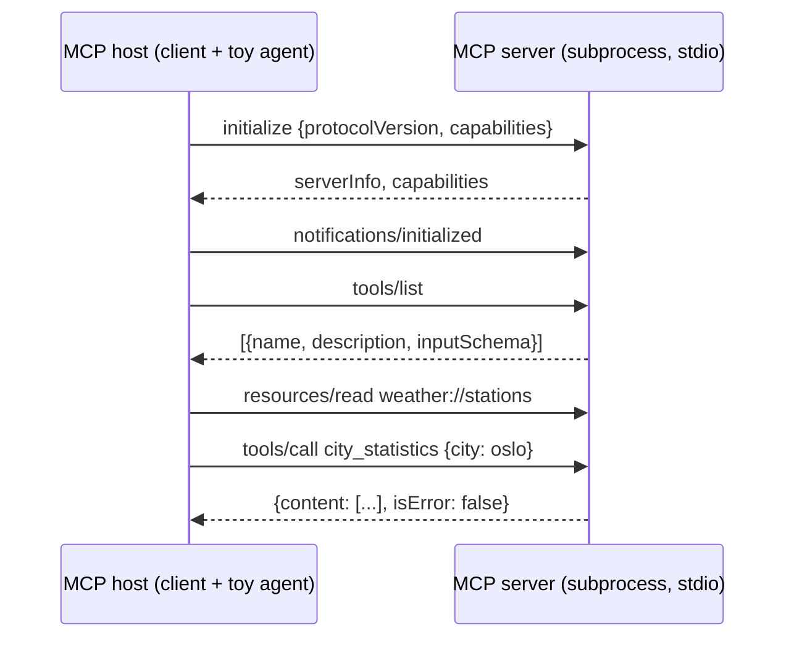

# 23 · AI-agent protocols: the Model Context Protocol (MCP)

> **Slides:** new · **Code:** [`demo.py`](demo.py) · **Back to:** [main README](../../README.md)

## 1. The idea

**MCP** connects LLM applications (*hosts*) to tools and data (*servers*). Underneath it is **JSON-RPC 2.0** (example 05) over
a transport (**stdio** or Streamable HTTP/**SSE**, example 13), with a capability **handshake** and **runtime discovery**: `tools/list`
returns each tool's description and JSON Schema so the model can decide what to call. Part A uses a server written by hand; part B uses a
server built with the **official SDK**, both driven by the same client, which shows interoperability.

## 2. The picture



## 3. Run it

```bash
python examples/23_ai_agent_protocols_mcp/demo.py        # the whole story
python run_all.py 23                                  # same, through the runner
```

Install / tools (same block as in the `demo.py` docstring):

```text
(nothing for part A: Python standard library only)
pip install "mcp[cli]"     # official SDK, used by fastmcp_server.py (part B)
npx @modelcontextprotocol/inspector python examples/23_ai_agent_protocols_mcp/fastmcp_server.py
                            # MCP Inspector: browse/call the tools in a web UI (needs Node.js)
```

## 4. Walkthrough: what happens, step by step

Each step corresponds to one `▶` section of the console output. The excerpt is from a real run; timings and ports differ between runs.

### Step 1 · A) Hand-written MCP server (stdlib only) running as a subprocess

`serve_stdio()` reads JSON-RPC lines from stdin and writes replies to stdout (logs must never go to stdout!).
`MCPClient` spawns it with `subprocess.Popen`, performs `initialize()` and discovers the `TOOLS`.
**Point out:** a bad input returns `isError: true` **inside** the result, so the model can read the error and react.

```text
  0.05s [  mcp-client] initialize -> server='weather-mcp (hand-written)', protocol=2025-11-25, capabilities=['resources', 'tools']
  0.05s [  mcp-client] tool get_temperature  'Get the latest temperature in Celsius for a city.' args=['city']
  0.05s [  mcp-client] tool report_reading   'Store a new temperature reading (Celsius) for a city.' args=['city', 'celsius']
  0.05s [  mcp-client] tool city_statistics  'Get statistics (mean, min, max, count) of the temperatures o' args=['city']
  0.05s [  mcp-client] tools/call report_reading -> {"city": "bilbao", "count": 4, "last": 23.5, "mean": 19.55, "min": 17.5, "max": 23.5}
  0.05s [  mcp-client] tools/call with bad input -> isError=True (errors go back to the model)
  0.05s [       agent] goal: 'What is the average temperature in Oslo?'
  0.05s [       agent] plan: city='oslo' (from resource), tool='city_statistics' (best description match)
  0.05s [       agent] observation: {"city": "oslo", "count": 3, "last": 9.1, "mean": 8.4, "min": 7.9, "max": 9.1}
  0.05s [       agent] goal: 'How hot is it right now in Madrid? latest temperature please'
  0.05s [       agent] plan: city='madrid' (from resource), tool='get_temperature' (best description match)
  0.05s [       agent] observation: {"city": "madrid", "celsius": 25.0}
```

### Step 2 · Toy agent

`toy_agent()` reads the stations resource and picks the tool whose **description** best matches the goal ("average" →
`city_statistics`, "latest" → `get_temperature`), which is what an LLM does with tool descriptions.

```text
  0.05s [       agent] goal: 'What is the average temperature in Oslo?'
  0.05s [       agent] plan: city='oslo' (from resource), tool='city_statistics' (best description match)
  0.05s [       agent] observation: {"city": "oslo", "count": 3, "last": 9.1, "mean": 8.4, "min": 7.9, "max": 9.1}
  0.05s [       agent] goal: 'How hot is it right now in Madrid? latest temperature please'
  0.05s [       agent] plan: city='madrid' (from resource), tool='get_temperature' (best description match)
  0.05s [       agent] observation: {"city": "madrid", "celsius": 25.0}
```

### Step 3 · B) Same client vs. a server built with the official SDK (FastMCP) - interoperability

`fastmcp_server.py` declares the same tools with decorators; the SDK derives the schemas from type hints and docstrings.
The same client works unchanged. The file supports mcp 1.x (`FastMCP`) and 2.x (`MCPServer`) and deliberately avoids string annotations.

```text
  0.46s [  mcp-client] initialize -> server='weather-mcp (FastMCP)', protocol=2025-11-25, capabilities=['experimental', 'prompts', 'resources', 'tools']
  0.46s [  mcp-client] tool get_temperature  'Get the latest temperature in Celsius for a city.' args=['city']
  0.46s [  mcp-client] tool report_reading   'Store a new temperature reading (Celsius) for a city.' args=['city', 'celsius']
  0.46s [  mcp-client] tool city_statistics  'Get statistics (mean, min, max, count) of the temperatures o' args=['city']
  0.47s [  mcp-client] tools/call report_reading -> {"city": "bilbao", "count": 4, "last": 23.5, "mean": 19.55, "min": 17.5, "max": 23.5}
  0.47s [  mcp-client] tools/call with bad input -> isError=True (errors go back to the model)
  0.47s [       agent] goal: 'What is the average temperature in Oslo?'
  0.47s [       agent] plan: city='oslo' (from resource), tool='city_statistics' (best description match)
  0.47s [       agent] observation: {"city": "oslo", "count": 3, "last": 9.1, "mean": 8.4, "min": 7.9, "max": 9.1}
  0.47s [       agent] goal: 'How hot is it right now in Madrid? latest temperature please'
  0.47s [       agent] plan: city='madrid' (from resource), tool='get_temperature' (best description match)
  0.48s [       agent] observation: {"city": "madrid", "celsius": 25.0}
```

## 5. Code map

Read the code in this order: the table follows the file from top to bottom.

| Where | Symbol | What it does |
|---|---|---|
| [`demo.py:88`](demo.py#L88) | function `serve_stdio` | Minimal MCP server: newline-delimited JSON-RPC 2.0 on stdin/stdout. Logs go to stderr. |
| [`demo.py:132`](demo.py#L132) | class `MCPClient` | Spawns an MCP server subprocess and talks JSON-RPC over its stdio. |
| [`demo.py:143`](demo.py#L143) | &nbsp;&nbsp;↳ `_send()` |  |
| [`demo.py:148`](demo.py#L148) | &nbsp;&nbsp;↳ `request()` | Send a request and wait for the response with the same id. |
| [`demo.py:168`](demo.py#L168) | &nbsp;&nbsp;↳ `notify()` | Send a notification (no id, no response). |
| [`demo.py:173`](demo.py#L173) | &nbsp;&nbsp;↳ `initialize()` | Capability negotiation handshake. |
| [`demo.py:180`](demo.py#L180) | &nbsp;&nbsp;↳ `close()` | Terminate the server. |
| [`demo.py:187`](demo.py#L187) | function `compact` | Re-serialise JSON text on one line (servers may pretty-print). |
| [`demo.py:196`](demo.py#L196) | function `toy_agent` | Pick tools by matching the goal against tool DESCRIPTIONS (what an LLM does, but dumber). |
| [`demo.py:215`](demo.py#L215) | function `session` | Handshake, discovery, calls and a toy agent against one server. |
| [`demo.py:232`](demo.py#L232) | function `main` | Run the client against the hand-written server, then against FastMCP if available. |
| [`fastmcp_server.py:41`](fastmcp_server.py#L41) | function `get_temperature` | Get the latest temperature in Celsius for a city. |
| [`fastmcp_server.py:47`](fastmcp_server.py#L47) | function `report_reading` | Store a new temperature reading (Celsius) for a city. |
| [`fastmcp_server.py:53`](fastmcp_server.py#L53) | function `city_statistics` | Get statistics (mean, min, max, count) of the temperatures of a city. |
| [`fastmcp_server.py:59`](fastmcp_server.py#L59) | function `stations` | List of cities with a weather station. |

## 6. Points to stress in class

- MCP = JSON-RPC + transports + capability negotiation + discovery.
- The LLM becomes the 'client stub': it reads schemas and chooses calls at runtime.
- stdio servers: stdout is the protocol channel, so log to stderr.
- Security: tools act on real systems, so use least privilege, authentication (OAuth) and human approval.

## 7. Discussion questions

1. Which older paradigm does tool discovery resemble (examples 05, 06, 08)?
2. Why is returning errors as tool results better than JSON-RPC errors for an LLM?
3. What should a host ask the user before calling a tool that deletes data?

## 8. Try it yourself

- Open the SDK server in the MCP Inspector (`npx @modelcontextprotocol/inspector ...`).
- Add a tool `compare_cities(a, b)` to both servers.
- Register `fastmcp_server.py` in an MCP host (e.g. Claude Desktop) and ask questions in natural language.

## 9. Further reading

- [Model Context Protocol: specification 2025-11-25](https://modelcontextprotocol.io/specification/2025-11-25)
- [MCP: lifecycle (initialize handshake)](https://modelcontextprotocol.io/specification/2025-11-25/basic/lifecycle)
- [MCP: tools](https://modelcontextprotocol.io/specification/2025-11-25/server/tools)
- [MCP Python SDK documentation](https://py.sdk.modelcontextprotocol.io/)
- [MCP Inspector](https://modelcontextprotocol.io/docs/tools/inspector)
- [Agent2Agent (A2A) protocol](https://a2a-protocol.org/latest/)
- [JSON-RPC 2.0 specification](https://www.jsonrpc.org/specification)

## 10. Full console output of a real run

<details><summary>Show / hide</summary>

```text
==============================================================================
 23 · AI-agent protocols: Model Context Protocol (JSON-RPC over stdio)  [NEW: not in slides]
==============================================================================

▶ A) Hand-written MCP server (stdlib only) running as a subprocess
  0.05s [  mcp-client] initialize -> server='weather-mcp (hand-written)', protocol=2025-11-25, capabilities=['resources', 'tools']
  0.05s [  mcp-client] tool get_temperature  'Get the latest temperature in Celsius for a city.' args=['city']
  0.05s [  mcp-client] tool report_reading   'Store a new temperature reading (Celsius) for a city.' args=['city', 'celsius']
  0.05s [  mcp-client] tool city_statistics  'Get statistics (mean, min, max, count) of the temperatures o' args=['city']
  0.05s [  mcp-client] tools/call report_reading -> {"city": "bilbao", "count": 4, "last": 23.5, "mean": 19.55, "min": 17.5, "max": 23.5}
  0.05s [  mcp-client] tools/call with bad input -> isError=True (errors go back to the model)
  0.05s [       agent] goal: 'What is the average temperature in Oslo?'
  0.05s [       agent] plan: city='oslo' (from resource), tool='city_statistics' (best description match)
  0.05s [       agent] observation: {"city": "oslo", "count": 3, "last": 9.1, "mean": 8.4, "min": 7.9, "max": 9.1}
  0.05s [       agent] goal: 'How hot is it right now in Madrid? latest temperature please'
  0.05s [       agent] plan: city='madrid' (from resource), tool='get_temperature' (best description match)
  0.05s [       agent] observation: {"city": "madrid", "celsius": 25.0}

▶ B) Same client vs. a server built with the official SDK (FastMCP) - interoperability
  0.46s [  mcp-client] initialize -> server='weather-mcp (FastMCP)', protocol=2025-11-25, capabilities=['experimental', 'prompts', 'resources', 'tools']
  0.46s [  mcp-client] tool get_temperature  'Get the latest temperature in Celsius for a city.' args=['city']
  0.46s [  mcp-client] tool report_reading   'Store a new temperature reading (Celsius) for a city.' args=['city', 'celsius']
  0.46s [  mcp-client] tool city_statistics  'Get statistics (mean, min, max, count) of the temperatures o' args=['city']
  0.47s [  mcp-client] tools/call report_reading -> {"city": "bilbao", "count": 4, "last": 23.5, "mean": 19.55, "min": 17.5, "max": 23.5}
  0.47s [  mcp-client] tools/call with bad input -> isError=True (errors go back to the model)
  0.47s [       agent] goal: 'What is the average temperature in Oslo?'
  0.47s [       agent] plan: city='oslo' (from resource), tool='city_statistics' (best description match)
  0.47s [       agent] observation: {"city": "oslo", "count": 3, "last": 9.1, "mean": 8.4, "min": 7.9, "max": 9.1}
  0.47s [       agent] goal: 'How hot is it right now in Madrid? latest temperature please'
  0.47s [       agent] plan: city='madrid' (from resource), tool='get_temperature' (best description match)
  0.48s [       agent] observation: {"city": "madrid", "celsius": 25.0}

Key takeaways:
  • MCP = JSON-RPC 2.0 + transports (stdio, Streamable HTTP/SSE) + capability negotiation.
  • Tools are discovered at runtime with JSON-Schema signatures: the LLM becomes the 'client stub'.
  • One protocol, many hosts (Claude, IDEs, agents) and many servers (GitHub, DBs, SaaS...).
  • Related: agent-to-agent protocols (A2A) for agents delegating tasks to other remote agents.
  • Security matters: tools act on real systems -> auth (OAuth), least privilege, human approval.
```

</details>
