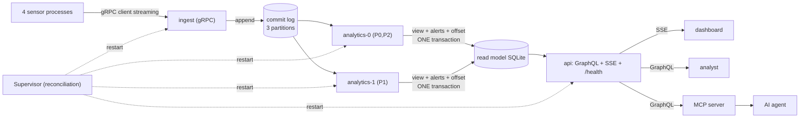

# 24 · CAPSTONE: event-driven Smart Weather Alert Platform

> **Slides:** combines 10-13, 15, 17, 22, 23 · **Code:** [`demo.py`](demo.py) · **Back to:** [main README](../../README.md)

## 1. The idea

The capstone combines several paradigms, each used where it fits best, into a small but realistic **event-driven IoT
platform** following **CQRS**. Commands and events come in through **gRPC** and a **partitioned commit log**. A **consumer group** projects them
into a **read model**. Queries go out through **GraphQL**, pushes through **SSE**, and AI access through **MCP**. A **supervisor** keeps every
process alive. Updating the view and committing the offset in **one transaction** gives effectively-once processing even when a worker is
killed. The folder `deploy/capstone/` runs the same code in Docker and on AWS ECS Fargate.

## 2. The picture



## 3. Run it

```bash
python examples/24_capstone_smart_weather_platform/demo.py        # the whole story
python run_all.py 24                                  # same, through the runner
```

Install / tools (same block as in the `demo.py` docstring):

```text
pip install grpcio grpcio-tools fastapi uvicorn strawberry-graphql httpx
Each component can be started by hand (see its docstring), e.g.:
  python examples/24_capstone_smart_weather_platform/api_service.py --data /tmp/wx --port 8080
  open http://127.0.0.1:8080/graphql  and  curl -N http://127.0.0.1:8080/alerts/stream
```

## 4. Walkthrough: what happens, step by step

Each step corresponds to one `▶` section of the console output. The excerpt is from a real run; timings and ports differ between runs.

### Step 1 · 1) Deploy: the supervisor starts every component as its own process (desired state)

`Supervisor.declare()` stores the desired components and `_reconcile()` starts each one as a separate `subprocess.Popen`
(`ingest_service.py`, `api_service.py`, two `analytics_worker.py`).

```text
  0.38s [  supervisor] started ingest (pid 16631)
  0.39s [  supervisor] started api (pid 16632)
  0.39s [  supervisor] started analytics-0 (pid 16633)
  0.39s [  supervisor] started analytics-1 (pid 16634)
  0.47s [ analytics-0] started, partitions [0, 2], resuming from committed offsets {0: 0, 2: 0}
  0.48s [ analytics-1] started, partitions [1], resuming from committed offsets {1: 0}
  0.53s [      ingest] gRPC ingest service listening on 127.0.0.1:57713
  0.82s [         api] GraphQL on http://127.0.0.1:55195/graphql, SSE on /alerts/stream
  0.97s [      deploy] health check -> {'status': 'up'}
```

### Step 2 · 2) Traffic: 4 edge sensors stream readings over gRPC; a dashboard listens via SSE

Four `sensor.py` processes open a **client-streaming** `UploadReadings` call (the contract of example 12). `IngestServicer`
appends every reading to `CommitLog` (key = city). The dashboard thread subscribes to `/alerts/stream` (SSE).

```text
  1.52s [ analytics-0] p0: processed offsets 0..0 + committed
  1.52s [ analytics-1] p1: processed offsets 0..0 + committed
  1.60s [ analytics-0] p2: processed offsets 0..1 + committed
  …
```

### Step 3 · 3) Chaos: kill analytics-0 mid-stream -> supervisor restarts it -> resumes from committed offsets

`chaos_kill("analytics-0")` sends SIGKILL. The supervisor loop sees the exit, restarts the worker, and the worker logs
"resuming from committed offsets". `ReadModel.apply_batch()` updates stats, alerts and the offset in **one** SQLite transaction, so
a crash can never apply a batch twice or lose one.

```text
  2.38s [       chaos] 💥 killed analytics-0 (pid 16633)
  2.39s [  supervisor] analytics-0 is down (exit -9) -> restarting
  2.39s [  supervisor] started analytics-0 (pid 16680)
  2.43s [ analytics-0] started, partitions [0, 2], resuming from committed offsets {0: 5, 2: 8}
  …
  2.63s [ analytics-0] ⚠ ORANGE alert: sevilla 36.0°C
  2.63s [ analytics-0] ⚠ ORANGE alert: sevilla 36.7°C
  …
  2.71s [   dashboard] 🔔 SSE push: ORANGE sevilla 36.0°C
  2.71s [   dashboard] 🔔 SSE push: ORANGE sevilla 36.7°C
  2.75s [ analytics-0] ⚠ ORANGE alert: sevilla 38.3°C
  …
  2.91s [   dashboard] 🔔 SSE push: ORANGE sevilla 38.3°C
  …
  2.97s [ analytics-0] ⚠ ORANGE alert: sevilla 39.3°C
  …
  3.11s [   dashboard] 🔔 SSE push: ORANGE sevilla 39.3°C
  …
```

### Step 4 · 4) Analyst: GraphQL queries over the read model (only the fields needed, one round trip)

GraphQL queries over the read model (`api_service.py`): stations, nested `station { alerts }`, and `pipeline { lag }`
for observability.

```text
  4.54s [     analyst] bilbao   count=12 mean= 18.6 max=20.1
  4.54s [     analyst] madrid   count=12 mean=29.76 max=32.4
  4.54s [     analyst] oslo     count=12 mean= 8.46 max=9.2
  4.54s [     analyst] sevilla  count=12 mean=37.51 max=42.8
  4.57s [     analyst] station(sevilla) with nested alerts -> {'city': 'sevilla', 'last': 42.8, 'alerts': [{'level': 'ORANGE', 'celsius': 36.0}, {'level': 'ORANGE', 'celsius': 36.7}, {'level': 'ORANGE', 'celsius': 38.3}]}
```

### Step 5 · 5) Correctness check: nothing lost, nothing counted twice despite the crash

48 readings sent = 48 counted, and every stored alert was pushed via SSE.

```text
  4.63s [       check] readings in read model = 48 / sent = 48 -> OK
  4.63s [       check] alerts stored = 8, pushed to dashboard via SSE = 8; supervisor restarts = {'analytics-0': 1}
```

### Step 6 · 6) AI agent: uses the platform through MCP tools (which call the GraphQL API)

`MCPClient` spawns `mcp_weather_server.py`, whose tools call the GraphQL API; the agent writes a heat briefing.

```text
  4.67s [       agent] connected to MCP server 'smart-weather-platform'
  4.67s [       agent] discovered tools: ['list_stations', 'station_report', 'active_alerts']
  4.68s [       agent] active_alerts(level=RED) -> 3 alert(s) in ['sevilla']
  4.68s [       agent] station_report(sevilla) -> max 42.8°C, mean 37.51°C over 12 readings
  4.68s [       agent] BRIEFING: RED heat alerts in sevilla; coolest refuge: oslo (mean 8.46°C).
```

## 5. Code map

Read the code in this order: the table follows the file from top to bottom.

| Where | Symbol | What it does |
|---|---|---|
| [`demo.py:83`](demo.py#L83) | class `Supervisor` | Keeps the declared components running (reconciliation loop, like example 22). |
| [`demo.py:95`](demo.py#L95) | &nbsp;&nbsp;↳ `declare()` | Add a component to the desired state and reconcile immediately. |
| [`demo.py:101`](demo.py#L101) | &nbsp;&nbsp;↳ `_reconcile()` |  |
| [`demo.py:112`](demo.py#L112) | &nbsp;&nbsp;↳ `_loop()` |  |
| [`demo.py:117`](demo.py#L117) | &nbsp;&nbsp;↳ `chaos_kill()` | Kill a component abruptly (SIGKILL): no cleanup, no goodbye. |
| [`demo.py:125`](demo.py#L125) | &nbsp;&nbsp;↳ `shutdown()` | Stop reconciling and terminate everything. |
| [`demo.py:139`](demo.py#L139) | function `gql` | Run a GraphQL query against the platform API. |
| [`demo.py:148`](demo.py#L148) | function `dashboard` | A live dashboard subscribed to the SSE alert stream. |
| [`demo.py:163`](demo.py#L163) | class `MCPClient` | Minimal MCP host talking to the platform's MCP server over stdio. |
| [`demo.py:175`](demo.py#L175) | &nbsp;&nbsp;↳ `call()` | JSON-RPC request/response. |
| [`demo.py:182`](demo.py#L182) | &nbsp;&nbsp;↳ `tool()` | Call a tool and decode its JSON text content. |
| [`demo.py:186`](demo.py#L186) | &nbsp;&nbsp;↳ `close()` | Stop the server. |
| [`demo.py:192`](demo.py#L192) | function `ai_agent` | A rule-based stand-in for an LLM agent: discover tools, gather facts, write a briefing. |
| [`demo.py:209`](demo.py#L209) | function `main` | Deploy the platform, generate traffic, inject a failure, query it every way. |
| [`store.py:29`](store.py#L29) | function `partition_for` | Stable key -> partition mapping (same city, same partition, per-city ordering). |
| [`store.py:34`](store.py#L34) | function `alert_level` | Return the alert level for a temperature, or None. |
| [`store.py:39`](store.py#L39) | class `CommitLog` | Partitioned append-only log stored as JSON-lines files. |
| [`store.py:51`](store.py#L51) | &nbsp;&nbsp;↳ `append()` | Append a record (single-writer). Returns (partition, offset). |
| [`store.py:60`](store.py#L60) | &nbsp;&nbsp;↳ `read()` | Read up to ``max_records`` complete records starting at ``offset``. |
| [`store.py:66`](store.py#L66) | &nbsp;&nbsp;↳ `end_offset()` | Number of records in a partition. |
| [`store.py:72`](store.py#L72) | class `ReadModel` | SQLite-backed CQRS read model + offsets + alerts. |
| [`store.py:95`](store.py#L95) | &nbsp;&nbsp;↳ `committed()` | Next offset to process for (group, partition). |
| [`store.py:102`](store.py#L102) | &nbsp;&nbsp;↳ `apply_batch()` | Update views, record alerts and commit the offset - atomically. |
| [`store.py:133`](store.py#L133) | &nbsp;&nbsp;↳ `stations()` | All station statistics. |
| [`store.py:138`](store.py#L138) | &nbsp;&nbsp;↳ `station()` | Statistics of one city. |
| [`store.py:144`](store.py#L144) | &nbsp;&nbsp;↳ `_stat()` |  |
| [`store.py:148`](store.py#L148) | &nbsp;&nbsp;↳ `alerts()` | Alerts newer than ``after_id``, optionally filtered. |
| [`store.py:159`](store.py#L159) | &nbsp;&nbsp;↳ `pipeline()` | Consumer lag per partition (observability). |
| [`store.py:168`](store.py#L168) | function `now_ms` | Wall-clock time in milliseconds. |
| [`proto_stubs.py:19`](proto_stubs.py#L19) | function `_compile` |  |
| [`ingest_service.py:30`](ingest_service.py#L30) | class `IngestServicer` | Implements only the ingestion RPC of the shared contract. |
| [`ingest_service.py:39`](ingest_service.py#L39) | &nbsp;&nbsp;↳ `UploadReadings()` | Client-streaming RPC: append every reading to the log. |
| [`ingest_service.py:50`](ingest_service.py#L50) | function `main` | Serve forever. |
| [`sensor.py:30`](sensor.py#L30) | function `readings` | Generate ``n`` readings following a temperature profile. |
| [`sensor.py:40`](sensor.py#L40) | function `main` | Open one client-streaming call and push all readings through it. |
| [`analytics_worker.py:29`](analytics_worker.py#L29) | function `main` | Poll the assigned partitions forever. |
| [`api_service.py:38`](api_service.py#L38) | class `Alert` | A heat alert raised by the analytics workers. |
| [`api_service.py:49`](api_service.py#L49) | class `Station` | Materialised statistics of one city. |
| [`api_service.py:60`](api_service.py#L60) | &nbsp;&nbsp;↳ `alerts()` | Alerts of this station (graph edge). |
| [`api_service.py:66`](api_service.py#L66) | class `PartitionLag` | Consumer-group progress on one log partition. |
| [`api_service.py:76`](api_service.py#L76) | class `Query` | Read-only API: commands enter through gRPC ingestion, queries through GraphQL (CQRS). |
| [`api_service.py:80`](api_service.py#L80) | &nbsp;&nbsp;↳ `stations()` | All stations, optionally only those with mean >= ``min_mean``. |
| [`api_service.py:85`](api_service.py#L85) | &nbsp;&nbsp;↳ `station()` | One station. |
| [`api_service.py:91`](api_service.py#L91) | &nbsp;&nbsp;↳ `alerts()` | Latest alerts. |
| [`api_service.py:96`](api_service.py#L96) | &nbsp;&nbsp;↳ `pipeline()` | Consumer lag per partition (is the read model up to date?). |
| [`api_service.py:101`](api_service.py#L101) | function `create_app` | Build the FastAPI app. |
| [`api_service.py:128`](api_service.py#L128) | function `main` | Serve with uvicorn. |
| [`mcp_weather_server.py:22`](mcp_weather_server.py#L22) | function `graphql` | POST a GraphQL query to the platform API. |
| [`mcp_weather_server.py:31`](mcp_weather_server.py#L31) | function `build_tools` | Tool descriptors (for tools/list) and their implementations. |
| [`mcp_weather_server.py:53`](mcp_weather_server.py#L53) | function `main` | Serve MCP over stdio. |

## 6. Points to stress in class

- Use each paradigm where it fits: gRPC in, log in the middle, GraphQL/SSE/MCP out.
- CQRS: the write path (events) and the read path (projections) scale and evolve separately.
- Effectively-once = at-least-once delivery + idempotent/transactional processing.
- Consumer lag is THE health metric of event-driven systems.
- The same code runs as processes, in containers and on AWS (deploy/capstone).

## 7. Discussion questions

1. What would break if the worker committed the offset in a separate transaction?
2. Which component would you scale first under 100× more sensors, and what blocks it today?
3. Map each component to a managed AWS service (see deploy/capstone/README.md).

## 8. Try it yourself

- Add a third analytics worker (`--workers 3`) and change the partition count.
- Add a GraphQL mutation that registers a user threshold and a FaaS-style notifier (example 16).
- Deploy it: `docker compose -f deploy/capstone/docker-compose.yml up -d --build`, then AWS with `deploy.py up`.

## 9. Further reading

- [M. Fowler: CQRS](https://martinfowler.com/bliki/CQRS.html)
- [microservices.io: Transactional outbox / idempotent consumer](https://microservices.io/patterns/data/transactional-outbox.html)
- [Kafka design: delivery semantics (exactly-once)](https://kafka.apache.org/documentation/#semantics)
- [SQLite: write-ahead logging](https://www.sqlite.org/wal.html)
- [SQLite: UPSERT](https://www.sqlite.org/lang_upsert.html)
- [Kleppmann, Designing Data-Intensive Applications](https://dataintensive.net/)
- Also: the references of examples 10-13, 17, 22 and 23

## 10. Full console output of a real run

<details><summary>Show / hide</summary>

```text
==============================================================================
 24 · CAPSTONE: event-driven Smart Weather Alert Platform (gRPC + log + CQRS + GraphQL + SSE + MCP)  [NEW: not in slides]
==============================================================================

▶ 1) Deploy: the supervisor starts every component as its own process (desired state)
  0.38s [  supervisor] started ingest (pid 16631)
  0.39s [  supervisor] started api (pid 16632)
  0.39s [  supervisor] started analytics-0 (pid 16633)
  0.39s [  supervisor] started analytics-1 (pid 16634)
  0.47s [ analytics-0] started, partitions [0, 2], resuming from committed offsets {0: 0, 2: 0}
  0.48s [ analytics-1] started, partitions [1], resuming from committed offsets {1: 0}
  0.53s [      ingest] gRPC ingest service listening on 127.0.0.1:57713
  0.82s [         api] GraphQL on http://127.0.0.1:55195/graphql, SSE on /alerts/stream
  0.97s [      deploy] health check -> {'status': 'up'}

▶ 2) Traffic: 4 edge sensors stream readings over gRPC; a dashboard listens via SSE
  1.52s [ analytics-0] p0: processed offsets 0..0 + committed
  1.52s [ analytics-1] p1: processed offsets 0..0 + committed
  1.60s [ analytics-0] p2: processed offsets 0..1 + committed
  1.67s [ analytics-1] p1: processed offsets 1..1 + committed
  1.75s [ analytics-0] p0: processed offsets 1..1 + committed
  1.83s [ analytics-0] p2: processed offsets 2..3 + committed
  1.87s [ analytics-0] p0: processed offsets 2..2 + committed
  1.91s [ analytics-1] p1: processed offsets 2..2 + committed
  1.95s [ analytics-0] p2: processed offsets 4..5 + committed
  2.09s [ analytics-0] p0: processed offsets 3..3 + committed
  2.15s [ analytics-1] p1: processed offsets 3..3 + committed
  2.17s [ analytics-0] p2: processed offsets 6..7 + committed
  2.29s [ analytics-1] p1: processed offsets 4..4 + committed
  2.31s [ analytics-0] p0: processed offsets 4..4 + committed

▶ 3) Chaos: kill analytics-0 mid-stream -> supervisor restarts it -> resumes from committed offsets
  2.38s [       chaos] 💥 killed analytics-0 (pid 16633)
  2.39s [  supervisor] analytics-0 is down (exit -9) -> restarting
  2.39s [  supervisor] started analytics-0 (pid 16680)
  2.43s [ analytics-0] started, partitions [0, 2], resuming from committed offsets {0: 5, 2: 8}
  2.47s [ analytics-0] p0: processed offsets 5..5 + committed
  2.53s [ analytics-1] p1: processed offsets 5..5 + committed
  2.63s [ analytics-0] ⚠ ORANGE alert: sevilla 36.0°C
  2.63s [ analytics-0] ⚠ ORANGE alert: sevilla 36.7°C
  2.63s [ analytics-0] p2: processed offsets 8..11 + committed
  2.67s [ analytics-0] p0: processed offsets 6..6 + committed
  2.67s [ analytics-1] p1: processed offsets 6..6 + committed
  2.71s [   dashboard] 🔔 SSE push: ORANGE sevilla 36.0°C
  2.71s [   dashboard] 🔔 SSE push: ORANGE sevilla 36.7°C
  2.75s [ analytics-0] ⚠ ORANGE alert: sevilla 38.3°C
  2.75s [ analytics-0] p2: processed offsets 12..13 + committed
  2.89s [ analytics-0] p0: processed offsets 7..7 + committed
  2.91s [   dashboard] 🔔 SSE push: ORANGE sevilla 38.3°C
  2.91s [ analytics-1] p1: processed offsets 7..7 + committed
  2.97s [ analytics-0] ⚠ ORANGE alert: sevilla 39.3°C
  2.97s [ analytics-0] p2: processed offsets 14..15 + committed
  3.06s [ analytics-1] p1: processed offsets 8..8 + committed
  3.11s [   dashboard] 🔔 SSE push: ORANGE sevilla 39.3°C
  3.12s [ analytics-0] p0: processed offsets 8..8 + committed
  3.20s [ analytics-0] ⚠ ORANGE alert: sevilla 39.8°C
  3.20s [ analytics-0] p2: processed offsets 16..17 + committed
  3.30s [ analytics-1] p1: processed offsets 9..9 + committed
  3.32s [   dashboard] 🔔 SSE push: ORANGE sevilla 39.8°C
  3.34s [ analytics-0] p0: processed offsets 9..9 + committed
  3.42s [ analytics-0] ⚠ RED alert: sevilla 41.4°C
  3.42s [ analytics-0] p2: processed offsets 18..19 + committed
  3.46s [ analytics-0] ⚠ RED alert: sevilla 42.2°C
  3.46s [ analytics-0] p2: processed offsets 20..20 + committed
  3.50s [ analytics-0] p0: processed offsets 10..10 + committed
  3.52s [   dashboard] 🔔 SSE push: RED sevilla 41.4°C
  3.52s [   dashboard] 🔔 SSE push: RED sevilla 42.2°C
  3.54s [ analytics-1] p1: processed offsets 10..10 + committed
  3.54s [ analytics-0] p2: processed offsets 21..21 + committed
  3.62s [      ingest] stream from sensor-bilbao closed: 12 readings appended to the log
  3.62s [sensor-bilbao] done: server acknowledged 12 readings (mean 18.6°C)
  3.62s [      ingest] stream from sensor-sevilla closed: 12 readings appended to the log
  3.62s [sensor-sevilla] done: server acknowledged 12 readings (mean 37.51°C)
  3.63s [      ingest] stream from sensor-oslo closed: 12 readings appended to the log
  3.63s [      ingest] stream from sensor-madrid closed: 12 readings appended to the log
  3.63s [sensor-madrid] done: server acknowledged 12 readings (mean 29.76°C)
  3.64s [ sensor-oslo] done: server acknowledged 12 readings (mean 8.46°C)
  3.68s [ analytics-1] p1: processed offsets 11..11 + committed
  3.69s [ analytics-0] p0: processed offsets 11..11 + committed
  3.77s [ analytics-0] ⚠ RED alert: sevilla 42.8°C
  3.77s [ analytics-0] p2: processed offsets 22..23 + committed
  3.92s [   dashboard] 🔔 SSE push: RED sevilla 42.8°C
  4.00s [observability] consumer lag per partition: [(0, 0), (1, 0), (2, 0)] -> caught up

▶ 4) Analyst: GraphQL queries over the read model (only the fields needed, one round trip)
  4.54s [     analyst] bilbao   count=12 mean= 18.6 max=20.1
  4.54s [     analyst] madrid   count=12 mean=29.76 max=32.4
  4.54s [     analyst] oslo     count=12 mean= 8.46 max=9.2
  4.54s [     analyst] sevilla  count=12 mean=37.51 max=42.8
  4.57s [     analyst] station(sevilla) with nested alerts -> {'city': 'sevilla', 'last': 42.8, 'alerts': [{'level': 'ORANGE', 'celsius': 36.0}, {'level': 'ORANGE', 'celsius': 36.7}, {'level': 'ORANGE', 'celsius': 38.3}]}

▶ 5) Correctness check: nothing lost, nothing counted twice despite the crash
  4.63s [       check] readings in read model = 48 / sent = 48 -> OK
  4.63s [       check] alerts stored = 8, pushed to dashboard via SSE = 8; supervisor restarts = {'analytics-0': 1}

▶ 6) AI agent: uses the platform through MCP tools (which call the GraphQL API)
  4.67s [       agent] connected to MCP server 'smart-weather-platform'
  4.67s [       agent] discovered tools: ['list_stations', 'station_report', 'active_alerts']
  4.68s [       agent] active_alerts(level=RED) -> 3 alert(s) in ['sevilla']
  4.68s [       agent] station_report(sevilla) -> max 42.8°C, mean 37.51°C over 12 readings
  4.68s [       agent] BRIEFING: RED heat alerts in sevilla; coolest refuge: oslo (mean 8.46°C).

Key takeaways:
  • Each paradigm does the job it is best at: gRPC for device->cloud ingestion, a partitioned log for decoupling and replay, GraphQL for flexible reads, SSE for push, MCP for AI agents.
  • CQRS: writes enter as events (gRPC -> log), reads come from projections (GraphQL over the read model).
  • Updating the projection and committing the offset in ONE transaction = effectively-once processing.
  • Supervision + durable offsets turn a crash into a delay, not data loss (self-healing, like Kubernetes).
  • Consumer lag is the key health metric of an event-driven system.
```

</details>
