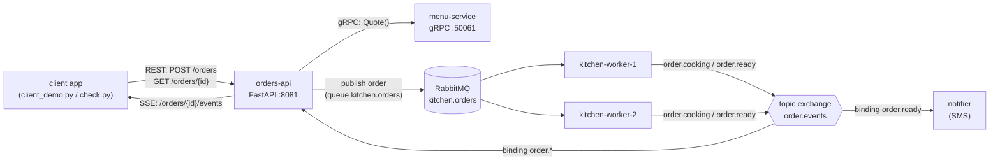

# Home exercise · DeustoEats: a campus food-ordering system

**Unit 0 – Distributed Computing** · Máster en Computación y Sistemas Inteligentes – Cloud Computing
**Work:** individually or in pairs · **Estimated effort:** 4–6 h · **Deliverable:** your `starter/` folder + `REPORT.md`

---

## 1. The scenario

The university cafeteria wants students to order *pintxos*, sandwiches and coffee from their phones and to be
told when the order is ready. You will build the backend as a small **distributed system of five processes**. Each
process uses one of the **conventional distributed-computing approaches** seen in Unit 0, in the role where it is
normally used in industry:

| Approach (Unit 0) | Where you use it | Seen in example |
|---|---|---|
| **Client/server over HTTP: REST API** | public `orders-api` used by the mobile app | 10 |
| **Remote Procedure Call: gRPC** | `orders-api` → `menu-service.Quote()` to validate and price an order | 12 (05) |
| **Message queue, point-to-point** | `orders-api` → `kitchen.orders` work queue → competing `kitchen-worker`s | 04, 14 |
| **Publish/subscribe** | kitchen publishes `order.cooking` / `order.ready` on a topic exchange; two subscribers | 04, 14 |
| **Server push: Server-Sent Events** | the app follows its order in real time | 13 |



**Life of an order:** `POST /orders` → gRPC `Quote` (validate + price) → stored as `PENDING` → message on the
`kitchen.orders` queue → exactly one worker takes it → publishes `order.cooking` → cooks for `prep_ms` →
publishes `order.ready` → **acks** the message → `orders-api` updates the order and pushes it through SSE → the
notifier "sends an SMS".

---

## 2. Setup

```bash
cd starter
python -m venv .venv && source .venv/bin/activate       # Windows: .venv\Scripts\activate
pip install -r requirements.txt                          # fastapi uvicorn httpx grpcio grpcio-tools pika

# RabbitMQ (message broker) - with Docker:
docker run -d --name rabbitmq -p 5672:5672 -p 15672:15672 rabbitmq:4-management
#   management UI: http://localhost:15672  (guest / guest) - watch queues, exchanges and bindings live!
#   without Docker: https://www.rabbitmq.com/docs/download
```

Files in `starter/`:

| File | Status | What it is |
|---|---|---|
| `menu.proto` | **given, do not change** | gRPC contract of the menu-service |
| `common.py` | given | configuration, menu data, queue/exchange names, helpers |
| `run_local.py` | given | starts the 5 processes (`--check` also runs the tests) |
| `check.py` | given | **automatic acceptance tests**: your target |
| `client_demo.py` | given | places an order and follows it with SSE |
| `menu_service.py` | **TO DO** | Part A |
| `orders_api.py` | **TO DO** | Parts B, E, F |
| `kitchen_worker.py` | **TO DO** | Part C |
| `notifier.py` | **TO DO** | Part D |

Every place you must complete is marked with `TODO <id>` (e.g. `TODO B2`). The given code already runs: from the
first minute you can execute `python run_local.py --check` and watch the score grow as you finish each part.

---

## 3. Contracts (fixed: the tests rely on them)

### 3.1 Menu data (in `common.py`)

| sku | price (cents) | stock | prep_ms |
|---|---|---|---|
| `pintxo-tortilla` | 250 | 50 | 300 |
| `bocadillo-jamon` | 450 | 20 | 500 |
| `cafe` | 120 | 100 | 100 |
| `ensalada` | 550 | 5 | 400 |
| `gilda` | 200 | **0 (sold out)** | 100 |

### 3.2 gRPC: `menu.proto`

* `Quote(QuoteRequest{lines}) → QuoteReply{total_cents, prep_ms}` with
  `total_cents = Σ price_cents·qty` and `prep_ms = min(2500, Σ prep_ms·qty)`.
  Errors are gRPC **status codes**: `INVALID_ARGUMENT` (empty order or qty ≤ 0), `NOT_FOUND` (unknown sku) and
  `FAILED_PRECONDITION` (qty > stock). `Quote` does **not** reserve stock.
* `ListItems(Empty) → stream Item` (server streaming): one message per menu item.

### 3.3 REST: `orders-api` on `http://127.0.0.1:8081`

| Method and path | Success | Errors |
|---|---|---|
| `POST /orders` body `{"student_id": "s042", "lines": [{"sku": "cafe", "qty": 2}]}` optional header `Idempotency-Key` | **201** + `Location: /orders/{id}` + order JSON. Retry with the same key → **200** + the same order | **422** invalid body · **404** unknown sku · **409** out of stock · **503** menu or broker unavailable |
| `GET /orders/{id}` | 200 order | 404 |
| `GET /orders?status=READY&student_id=s042` | 200 list (filters optional) | 422 invalid status |
| `GET /orders/{id}/events` | 200 `text/event-stream`: `event: status` / `data: {"id", "status", "cooked_by"}` on every change; the stream **ends** after `READY` | 404 |
| `GET /health` | 200 `{"status": "up"}` | – |

Order representation:

```json
{"id": "1a2b3c4d", "student_id": "s042", "status": "PENDING",
 "lines": [{"sku": "cafe", "qty": 2}], "total_cents": 240, "prep_ms": 200,
 "cooked_by": null, "created_at": 1790339022.76,
 "history": [{"status": "PENDING", "at": 1790339022.76, "by": "orders-api", "redelivered": false}],
 "links": {"self": "/orders/1a2b3c4d", "events": "/orders/1a2b3c4d/events"}}
```

### 3.4 Messaging (RabbitMQ, AMQP 0-9-1)

| Entity | Type | Message body (JSON) |
|---|---|---|
| `kitchen.orders` | durable **queue**, published through the default exchange | `{"order_id", "student_id", "lines", "prep_ms"}` |
| `order.events` | durable **topic exchange**, routing keys `order.cooking` / `order.ready` | `{"order_id", "student_id", "status", "worker", "redelivered", "ts"}` |
| `notifier.sms` | durable queue of the notifier, bound to `order.events` | – |

All messages are **persistent** (`delivery_mode=2`). Workers use **manual acknowledgements**.

---

## 4. Tasks

### Part A · gRPC menu-service (`menu_service.py`) · tested by t02, t05
* **A1** Implement `Quote` following §3.2, and report errors only with `context.abort(<StatusCode>, msg)`.
* **A2** Implement `ListItems` as a generator (`yield`).

### Part B · REST orders-api (`orders_api.py`) · t02–t05, t10
* **B1** Add the Pydantic validation constraints to `Line` and `OrderIn` (they give 422 for free).
* **B2** `quote()`: gRPC client with a **deadline** of 1 s. Map the gRPC status codes to HTTP (404/409/422/503).
* **B3** `create_order()`: quote, store as `PENDING`, publish to the kitchen, `201` + `Location`. If publishing
  fails, delete the order and answer 503.
* **B4** `KitchenPublisher.publish()`: persistent message to `kitchen.orders` (default exchange).
* **B5** `GET /orders` (filters) and `GET /orders/{id}` (404).

### Part C · Kitchen workers (`kitchen_worker.py`) · t07–t09
* **C1** Fair dispatch: `basic_qos(prefetch_count=1)`.
* **C2** `publish_event()` on the topic exchange with routing key `order.<status>`.
* **C3** Cook: publish COOKING, sleep `prep_ms`, publish READY and **only then** `basic_ack`.
* **C4** `basic_consume` with `auto_ack=False`.
* `run_local.py` starts **two** workers, and `worker-2` **crashes on its 3rd order before acking**. Your system must still
  cook every order (t09 checks that one order was *redelivered*).

### Part D · Notifier (`notifier.py`) · t11
* **D1** Declare `notifier.sms` and bind it so that it receives **only** READY events.
* **D2** Append **exactly one** line per READY order to `notifications.log` (it must contain the order id), then ack.

### Part E · Events and real time (`orders_api.py`) · t07–t10
* **E1** `listen_events()`: private exclusive queue bound with a pattern that matches **all** order events.
* **E2** `OrderStore.apply_event()`: **idempotent**. The status only moves forward, so duplicates and late events are ignored.
* **E3** `GET /orders/{id}/events`: SSE stream that ends after READY.

### Part F · Idempotent POST · t06
* **F1** With `Idempotency-Key`, a retried POST returns the **same** order with 200 and **does not** enqueue it again.

### Run and test

```bash
python run_local.py --check        # start everything, run the 11 tests, stop  (expected at the end: 7.5 / 7.5)
python run_local.py                # keep it running; in another terminal:
python client_demo.py              # place an order and watch the SSE events
python check.py                    # tests against the running system
```

---

## 5. Report (`REPORT.md`, max. 2 pages) · 1.5 points

Answer briefly, with arguments and, when useful, references to your code or to the logs:

1. Why is gRPC a good choice between `orders-api` and `menu-service`, and why is the public API REST and not gRPC?
2. The kitchen uses a **queue**, while notifications use a **topic exchange**. What would go wrong if you swapped them?
3. What delivery guarantee do manual ACKs give? Describe what happens, step by step, when `worker-2` crashes. What
   happens if a worker crashes **after** publishing READY but **before** acking, and why does your system still behave correctly?
4. Why does `POST /orders` need an `Idempotency-Key` while `GET`, `PUT` and `DELETE` do not?
5. Why SSE for order tracking instead of polling or WebSocket?
6. `Quote` does not reserve stock. Show a race condition that sells more `ensalada`s than exist, and propose a design that avoids it.
7. What does the client see if the menu-service is slow or down? Why is the 1 s deadline important? What would you add
   (see example 15)?
8. Identify the single points of failure and explain how you would scale each component to 10× more students.

## 6. Grading

| Item | Points |
|---|---|
| `check.py` automatic tests (t01–t11, points per test printed by the script) | 7.5 |
| Report (§5) | 1.5 |
| Code quality: type hints, Google-style docstrings, clear logs, no busy waiting, no dead code | 1.0 |
| **Total** | **10** |

Rules: do not change `menu.proto`, `common.py`, `check.py` or `run_local.py` (the teacher runs the originals).
You may add helper functions. Cite any AI assistance you used in the report.

## 7. Hints and useful references

* Examples **10** (FastAPI), **12** (gRPC), **13** (SSE), **14** (AMQP + pika) and **04** (acks and redelivery) of the course repository.
* Watch RabbitMQ at <http://localhost:15672>: **Queues** (ready/unacked messages) and **Exchanges → order.events → Bindings**.
* gRPC Python basics: <https://grpc.io/docs/languages/python/basics/> · FastAPI: <https://fastapi.tiangolo.com/tutorial/> ·
  RabbitMQ tutorials 2 (work queues) and 5 (topics): <https://www.rabbitmq.com/tutorials> · MDN SSE:
  <https://developer.mozilla.org/en-US/docs/Web/API/Server-sent_events/Using_server-sent_events>
* **pika** connections are *not* thread-safe: use one connection per thread (the given code already does).
* If the tests hang, look at the logs of the 5 processes (all printed by `run_local.py`), and at the RabbitMQ UI.
